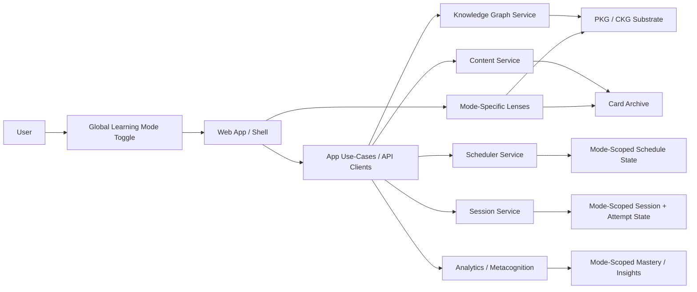

# Noema Mode-Aware Dual-Use Architecture

- **Date:** 2026-03-27
- **Status:** Proposed architecture baseline for implementation implementation
  with active rollout in progress
- **Scope:** Shared graph, content, scheduler, session, analytics, and frontend
  shell

## Summary

Noema now needs to support two equally important product uses without forking
the platform:

- `language_learning`
- `knowledge_gaining`

The system will keep one shared PKG/CKG substrate, one card archive, one
scheduler/session architecture, and one authenticated app shell. The
distinguishing feature is a first-class `LearningMode` that propagates through
all layers of the hexagonal architecture.

This architecture does **not** split Noema into two apps and does **not** force
language learning into the current concept-heavy graph semantics. Instead, it
introduces a mode-aware core:

- one identity substrate
- one graph substrate
- one content substrate
- one study engine
- mode-scoped progress, scheduling, mastery, and UI lensing

The architectural center of gravity is:

> Shared item identity is allowed. Shared memory state across modes is not.

## Current Implementation Status

The architecture is no longer only aspirational. The current repository now has
working mode-aware behavior across multiple hexagonal layers.

Implemented baseline:

- global active mode toggle in the authenticated shell
- mode-aware user settings and persistence
- mode-aware node and card membership metadata
- mode-aware PKG node reads and knowledge-map lensing
- mode-aware card creation and batch creation defaults
- mode-aware scheduler/session/streak/reporting reads
- explicit PKG mastery summary read model
- explicit scheduler progress/readiness summary read model
- explicit scheduler card-focus summary read model
- agent-facing scheduler and graph tools for mode-scoped readiness/memory reads

Still evolving:

- richer cross-service comparative summaries
- more prescriptive next-session planning across graph mastery plus card
  fragility
- broader adoption of the new read models across all learner-facing surfaces

## Mode-Specific Reality in the Current App

### `knowledge_gaining`

Currently emphasized through:

- conceptual graph relations and graph health
- concept-oriented card creation and batch defaults
- PKG mastery summaries and weakest-domain rollups
- scheduler readiness summaries for conceptual decks

### `language_learning`

Currently emphasized through:

- active mode lensing across card, graph, review, goals, dashboard, and session
  surfaces
- language-aware content/batch defaults
- separate schedule, streak, and reporting context
- separate graph and mastery interpretation even when identity is shared

The current implementation goal is not to fork the product experience into two
apps. It is to let the same substrate behave differently under a clearly
selected pedagogical lens.

## Problem Statement

The current architecture already assumes a mostly unified learning topology:

- cards link to PKG nodes through `knowledgeNodeIds`
- the knowledge graph favors conceptual and pedagogical relations
- scheduler and session planning assume one effective memory trajectory per item
- graph views are oriented around concept structure and canonical comparison

That works well for sciences, facts, and conceptual domains, but it is
insufficient for language learning:

- the same surface label can represent distinct study targets depending on mode
- language learning needs lexical, grammatical, phonological, and interference
  relations
- the same item may participate in multiple learning contexts while requiring
  separate schedule state and mastery interpretations

At the same time, sciences, facts, and broader knowledge acquisition remain
first-class. The platform therefore needs a generalized architecture that can:

- preserve the current PKG/CKG and content architecture
- support different domain lenses and study semantics
- keep scheduling and mastery distinct by context
- avoid duplicating whole subsystems

## Core Architecture Decision

Noema will use a **mode-aware shared core**.

### Shared core remains

- `PKG/CKG` remain the structural substrate
- `content-service` remains the source of card identity and card content
- `scheduler-service` remains the source of schedule state and planning logic
- `session-service` remains the runtime for deck execution and attempt capture
- frontend shell remains one authenticated application

### New first-class concept

Introduce:

```ts
type LearningMode = 'language_learning' | 'knowledge_gaining';
```

This becomes a first-class domain concept in:

- shared types
- validation schemas
- API contracts
- event payloads
- repositories
- scheduling state
- mastery/analytics state
- app shell and UI routing context

## Architectural Invariants

### Invariant 1. Shared identity, separate memory state

The same node or card may be relevant to both modes, but:

- attempts are stored per mode
- schedule state is stored per mode
- node mastery is computed per mode
- remediation and misconception tracking are mode-scoped
- dashboard and analytics views must not merge mode state unless explicitly
  requested

### Invariant 2. One graph substrate, multiple lenses

There is one underlying PKG/CKG substrate, not separate graph systems.

Mode changes affect:

- which relations are emphasized
- which authoring actions are enabled
- which batch-generation defaults apply
- which analytics are shown

Mode changes do **not** imply:

- separate graph databases
- duplicate nodes by default
- separate frontend apps

### Invariant 3. Global sticky active mode

The user has one app-wide active mode in the authenticated shell. It:

- persists across reloads
- drives defaults for pages and APIs
- can be overridden explicitly in advanced flows where the API contract allows
  it

### Invariant 4. Backward compatibility is additive first

Legacy data and older clients must continue to work during rollout:

- old records default to `knowledge_gaining`
- missing `learningMode` is resolved by application defaults and compatibility
  rules
- new fields are additive before stricter enforcement begins

## System Model

### Learning mode

`LearningMode` is the active pedagogical and computational context used to:

- interpret graph semantics
- generate cards and batches
- plan sessions
- score attempts
- compute mastery and readiness

### Supported modes

Items can declare the modes in which they participate:

- graph nodes: `supportedModes: LearningMode[]`
- cards: `supportedModes: LearningMode[]`

This supports:

- items specific to one mode
- items shared across both modes
- later extension into richer domain packs without changing the core shape

### Mode-scoped state

Progress-bearing records include `learningMode` as part of their identity or
filter semantics.

Examples:

- scheduler state key: `(userId, cardId, learningMode)`
- mastery state key: `(userId, nodeId, learningMode)`
- attempt record: `(attemptId, sessionId, cardId, learningMode)`

## Hexagonal Architecture Impact

### UI / Frontend Layer

The UI becomes mode-aware through a global shell toggle and mode-lensed
workflows.

Key consequences:

- authenticated shell exposes a central mode toggle
- dashboards and summaries are filtered by active mode
- knowledge map applies a mode lens rather than opening a separate graph tool
- card creation and card batch import derive defaults from the active mode
- session setup and study surfaces declare and display the selected mode

### Application Layer

Application services become responsible for:

- defaulting omitted mode parameters from the active user preference
- enforcing no-cross-mode state reuse
- selecting mode-aware strategies for batch creation and session planning
- applying graph lensing rules before returning UI-friendly DTOs

### Domain Layer

Domain services remain mode-agnostic where possible, but mode-aware where
behavior diverges.

Examples:

- graph domain keeps a universal substrate and relation policy registry
- content domain keeps universal card identity with mode-aware generation
  strategies
- scheduler domain chooses different policies and features by mode

### Adapters / Infrastructure Layer

Adapters must carry `learningMode` through:

- persistence
- events
- REST routes
- API clients
- read models and analytics queries

The infrastructure layer must never infer shared schedule/mastery state across
modes from shared item identity alone.

## Mode-Specific Product Behavior

### Knowledge gaining

Primary characteristics:

- conceptual learning
- fact retention
- procedural and structural understanding
- prerequisite-aware planning
- concept comparison and canonical alignment

Primary graph emphasis:

- `prerequisite`
- `derived_from`
- `part_of`
- `causes`
- `contrasts_with`
- `has_property`

Typical card/batch behavior:

- concept extraction
- fact/procedure/principle linking
- definition/comparison/cause-effect cards
- concept graph cards

### Language learning

Primary characteristics:

- vocabulary acquisition
- grammar and syntax acquisition
- listening/reading/production practice
- interference management
- confusable-set and false-friend remediation

Primary graph emphasis:

- lexical relations
- grammar/construction relations
- phonological or orthographic confusability
- pedagogical pairing/drill relations

Illustrative additive relation families:

- `translation_equivalent`
- `false_friend_of`
- `minimal_pair_with`
- `collocates_with`
- `governs`
- `inflected_form_of`
- `used_in_construction`
- `practice_together`

Typical card/batch behavior:

- vocabulary import
- grammar import
- text/dialogue extraction of study targets
- minimal-pair, false-friend, confusable-set, and rule-scope cards

## Data Flow



## Phase 6 Read-Model Expansion

This conversation extended the architecture most deeply in learner-facing and
agent-facing read models.

New explicit read models now exist for:

- node mastery summary
- scheduler progress/readiness summary
- scheduler card-focus summary

Why this matters:

- frontends no longer need to reconstruct progress from loosely related APIs
- agents can ask for readiness and focus directly
- learner surfaces stay aligned on one interpretation of each active mode

## Example: Shared identity, separate trajectories

The label `cell` illustrates the architecture.

### In `language_learning`

`cell` may be:

- a German lexical item
- linked to pronunciation/audio and lexical relations
- scheduled with language-appropriate features and review patterns

### In `knowledge_gaining`

`cell` may be:

- a biology concept
- linked to scientific concept structure and canonical graph comparison
- scheduled with conceptual and structural learning policies

The label may overlap. The memory trajectory does not.

## Service Responsibilities

### Knowledge Graph Service

Responsibilities:

- maintain universal graph identity and structure
- store mode membership for nodes and expose mode-filtered graph queries
- support lens-based relation filtering
- preserve current knowledge-mode semantics
- extend language-specific semantics additively

### Content Service

Responsibilities:

- store cards and card batches
- store `supportedModes` on cards
- provide mode-aware batch preview and execution contracts
- keep card identity stable while allowing separate schedule state downstream

### Scheduler Service

Responsibilities:

- key schedule state by mode
- expose mode-aware planning contracts
- support different policy families and features by mode

### Session Service

Responsibilities:

- require mode in session creation and execution paths
- store attempts with mode context
- ensure sessions do not silently mix active modes

### Current Rollout Snapshot

The repository now has a stable first implementation of the dual-use design:

- the authenticated shell owns the active study-mode toggle and shares that
  state with settings and learner-facing pages
- content creation, batch import, knowledge-map reads, scheduler read models,
  misconceptions, and structural analytics all accept or derive a `studyMode`
  lens
- the scheduler exposes list-shaped guidance with ordered recommendations rather
  than a single forced next step
- the graph enum and KG edge policies now include an initial language-edge pack
  (`translation_equivalent`, `false_friend_of`, `minimal_pair_with`,
  `collocates_with`, `governs`, `inflected_form_of`)

### Analytics / Metacognition

Responsibilities:

- compute reports per mode
- allow explicit cross-mode comparison only as a deliberate reporting feature
- avoid accidental aggregation across contexts

## Migration Strategy

Rollout must happen in additive steps:

1. add `LearningMode` to shared contracts
2. add persistence fields and mode-aware repository support
3. backfill old records to `knowledge_gaining`
4. introduce frontend toggle and mode-aware API defaults
5. enable richer mode-specific batch and graph behavior
6. tighten enforcement once all critical paths propagate mode correctly

## Risks and Mitigations

### Risk: Mode contamination

If any service forgets to propagate `learningMode`, state may bleed across
contexts.

Mitigation:

- explicit field in all key write/read contracts
- integration tests around same-item dual-mode trajectories
- analytics assertions against unscoped aggregation

### Risk: Overcomplicating the graph

If language-specific semantics replace the current graph ontology, science and
facts become second-class.

Mitigation:

- additive relation families
- mode lenses rather than mode-specific graph silos
- preserve current knowledge-mode behavior as the baseline

### Risk: UI confusion

A toggle that behaves inconsistently across surfaces will feel like two
competing apps.

Mitigation:

- global sticky toggle
- visible active mode badge
- deterministic defaults
- page-level messaging when a surface filters or changes behavior by mode

## Related Documents

- `module-graph.md`
- `docs/architecture/decisions/ADR-0053-mode-aware-dual-use-learning-core.md`
- `docs/architecture/decisions/ADR-0054-global-learning-mode-toggle-and-ux-lenses.md`
- `docs/architecture/decisions/ADR-0055-mode-scoped-scheduling-sessions-and-mastery.md`
- `docs/architecture/decisions/ADR-0056-domain-lensed-graph-semantics-and-multi-mode-membership.md`
- `docs/architecture/decisions/ADR-0057-mode-aware-batch-creation-and-card-generation.md`
- `docs/architecture/decisions/ADR-0058-mode-aware-migration-and-backward-compatibility.md`
- `docs/plans/2026-03-27-mode-aware-dual-use-learning-architecture.md`
