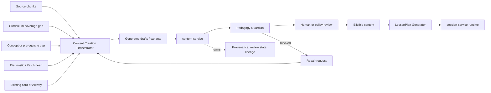

# Content Creation Orchestrator

**Functional name:** Content Creation Orchestrator  
**Possible display label:** Practice Builder  
**Family:** Creation and learning interaction  
**Primary surface:** Content Workbench; occasionally Step/session preparation
surfaces  
**Authority class:** Drafting and transformation agent  
**Primary truth owner:** `content-service`  
**Primary validator:** `pedagogy-guardian-service`  
**Related services:** `curriculum-service`, `knowledge-graph-service`,
`metacognition-service`, `scheduler-service`, `session-service`

## Purpose

The Content Creation Orchestrator creates and transforms cards, Step Activities,
RAG-grounded exercises, examples, hints, contrast tasks, and remediation
material. It turns "what should be learned" into "what the learner can
practice."

It is the agent that gives Noema generative breadth, but it must also be one of
the most constrained agents in the system. Generated learning material can
mislead, leak answers, duplicate weak patterns, or drift away from the source.
For that reason, this agent drafts and repairs content; `content-service` owns
persistence and provenance, and Pedagogy Guardian owns validation decisions.

The product promise is:

> "Noema can create practice material from your sources, goals, and learning
> history, while showing where it came from and checking it before it reaches a
> session."

## Product Role

The Practice Builder helps users and internal services answer:

- What practice is missing for this curriculum node?
- Can this source become a good exercise?
- Can this card be transformed into a different epistemic mode?
- Can we create a repair task for a diagnosed reasoning issue?
- Is there enough variety to avoid rote repetition?
- Which generated items are source-grounded, autonomous, or derived from a
  parent card?
- Why is this generated item eligible or blocked?

The agent should feel like an authoring assistant, not a hidden factory. In
learner-facing contexts, the generated artifact should be foregrounded more than
the agent persona. In creator/admin contexts, provenance and review controls
should be prominent.

## Creation Loop Position

The Content Creation Orchestrator receives needs from many places, but its
outputs always flow through content ownership and validation gates.



## Generation Contexts

The agent should support several distinct generation contexts. These should not
be collapsed into a single generic "make content" action.

| Context                        | Typical trigger                                            | Product output                                        |
| ------------------------------ | ---------------------------------------------------------- | ----------------------------------------------------- |
| Source-derived generation      | Ingestion creates source chunks and concepts               | Source-linked card/activity drafts                    |
| Curriculum coverage generation | Curriculum node has weak or missing practice coverage      | Draft batch for a specific node                       |
| Graph-gap generation           | Concept or prerequisite is undercovered                    | Concept-targeted exercises                            |
| Repair generation              | Mental Debugger/Patch Planner identifies a reasoning issue | Remediation tasks, contrast cards, calibration drills |
| Transformation generation      | Scheduler or mode logic needs variety                      | Variant of an existing card/activity                  |
| Authoring assistance           | User is manually creating content                          | Suggested prompts, distractors, hints, rubrics        |
| Session preparation            | LessonPlan needs an eligible payload candidate             | Candidate activity draft, if policy allows            |

Each context should have its own review defaults, provenance requirements, and
UI framing.

Content prompt routing is now explicit. The runtime resolves a content
`operationName` before prompt rendering and layers:

- wrapper instructions
- operation-specific instructions
- deterministic `ContentCreationPromptV2` assembly
- typed output schema metadata

Current content operation profiles include:

- `source_derived_generation`
- `curriculum_coverage_generation`
- `graph_gap_generation`
- `repair_generation`
- `transformation_generation`
- `authoring_assistance`
- `session_preparation`

## Layered Prompt

The orchestrator prompt should be assembled in layers rather than flattened:

1. Stable role instructions for orchestration and readiness gating.
2. Operation-profile instructions for the resolved content operation.
3. Preflight outputs from Content Intent Normalizer, Learner State Summarizer,
   Content Pedagogy Planner, and graph-readiness checks.
4. Live service context from curriculum, content, graph, scheduler, and
   metacognition sources.
5. Final `ContentCreationPromptV2` handoff for the drafting agent.

This keeps the content-creation role explicit: it proves the request is ready
before drafting, instead of treating readiness and generation as one step.

## Live Context Pack

Every run receives a templated live context pack. The prompt should be explicit
about which facts are service-owned, which inputs are proposed, and which output
constraints are mandatory.

Graph context is not resolved by this agent. The content-creation orchestrator
first invokes `graph-intervention-orchestrator`, requires
`GraphReadinessReportV1.status = finalized` for graph-anchored generation, and
maps `GraphAgentPromptV1.pedagogicalContext.targetConcepts`,
`GraphAgentPromptV1.pedagogicalContext.relationCandidates`, and
`GraphAgentPromptV1.serviceContract.identityMap.concepts` into
`ContentCreationPromptV2`. IDs such as `conceptId`, `pkgNodeId`, and `ckgNodeId`
remain in `serviceContract` for persistence handoff; human-readable labels and
summaries remain in `pedagogicalContext` for model reasoning.

### User and Intent Context

- user id or scoped learner reference
- study mode and current epistemic mode
- audience level
- target difficulty
- language/format preferences
- accessibility constraints
- creator role, if authoring in admin/teacher mode
- current session/curriculum context, if applicable

### Content Context

- existing cards and activities for the target concept/node
- parent card/activity for transformations
- transformation history
- content coverage summary
- duplicate/similarity signals
- review states
- prior Guardian blocks and repair reasons
- content type schemas and allowed activity formats

### Source and Provenance Context

- source document ids
- chunk ids and excerpts
- citation requirements
- RAG retrieval results
- source confidence
- source license/usage constraints when known
- whether the generation is source-grounded, mixed, or autonomous

### Curriculum and Graph Context

- curriculum id/version/node
- stable node key
- concept anchors
- proposed concepts
- prerequisite relations
- misconception/confusable relations
- graph review status

### Learning Evidence Context

- metacognitive trigger summary
- repeated failure pattern
- calibration signal
- scheduler due-state or freshness signal
- recent transformation exposure
- learner performance band for the target concept

### Policy Context

- Guardian rules
- factuality threshold
- review policy by content type
- maximum batch size
- answer leakage rules
- age/safety/domain constraints if relevant
- allowed auto-commit rules by artifact type

The prompt must not flatten these inputs into undifferentiated context. For
example, "source says X" is different from "agent inferred X" and different from
"graph has canonical concept X."

## Inputs

The agent may use:

- source chunks and citations
- content type schemas
- existing content and coverage summaries
- parent content and lineage data
- curriculum node requirements
- concept anchors and graph relation summaries
- metacognitive and calibration summaries
- desired activity type and epistemic mode
- user or curator instructions
- Guardian block reasons for repair

The agent should not receive:

- unbounded learner history
- raw private traces unrelated to the task
- permission to persist final content
- permission to activate session runtime Steps
- canonical authority over facts not present in source or graph

## Outputs

The agent produces reviewable content artifacts:

- card drafts
- Step Activity drafts
- generated variants
- transformed cards or activities
- hint sets
- distractor sets
- explanation/rationale fields
- source citation summaries
- repair drafts after Guardian blocks
- batch generation proposals

More concretely:

| Output                  | Purpose                                                     | Stored by                                  |
| ----------------------- | ----------------------------------------------------------- | ------------------------------------------ |
| Card draft              | Reusable content payload                                    | `content-service`                          |
| Activity draft          | Candidate Step activity payload                             | `content-service`                          |
| Variant                 | Avoid repetition while preserving learning target           | `content-service`                          |
| Transformation lineage  | Explain parent, transform type, and reason                  | `content-service`                          |
| Source citation bundle  | Ground source-derived content                               | `content-service` provenance               |
| Guardian repair attempt | Fix blocked generated content                               | `content-service` plus Guardian validation |
| Content seed request    | Ask for human/agent authoring when evidence is insufficient | Content Workbench                          |

Generated content should always carry:

- origin mode: source-grounded, RAG-grounded, transformed, repair-generated,
  autonomous, human-assisted
- target concept or curriculum node
- confidence/uncertainty notes
- review state
- validation state
- authoring run id
- provenance and lineage

## Content Workbench

The Content Workbench should make generation feel powerful but inspectable.

### Batch Review

Used for source-derived or curriculum coverage generation.

Recommended layout:

```text
Header: source/node/concept, generation mode, batch state
Main: generated item table with compact labels
Side: selected item preview, answer, rationale, citations, Guardian result
Footer/actions: accept selected, send selected for repair, edit item, discard batch
```

### Item Review

Used for individual cards, activities, repairs, and high-risk autonomous
content.

Recommended layout:

```text
Preview: learner-facing prompt/activity
Answer: expected response, rubric, explanation
Why: target concept, generation reason, source/curriculum link
Provenance: citations, parent lineage, graph anchors, agent run
Validation: schema result, Guardian result, review state
Actions: accept, edit, repair, reject, request variant
```

### Transformation Review

Used when an existing item is transformed into another mode.

Show:

- parent content
- transformed content
- transformation type
- what changed
- what stayed invariant
- why this transformation is useful now
- exposure/repetition guardrails

## UI Labels

Use minimal labels in list/card views:

- `Draft`
- `Source-linked`
- `RAG-grounded`
- `Autonomous`
- `Variant`
- `Repair draft`
- `Needs metadata`
- `Needs review`
- `Guardian accepted`
- `Guardian blocked`
- `Needs stronger evidence`
- `Duplicate risk`
- `Ready for session`

Labels should not explain the whole artifact. They should help users sort and
decide what to inspect.

## Friendly Why Layer

One click deeper, show plain explanations:

- "This card was generated from section 2.1 and targets the curriculum node
  `photosynthesis inputs`."
- "This is a comparison variant because the learner recently confused two
  related concepts."
- "This batch fills missing practice types for a concept with low coverage."
- "This repair task asks for an explanation before calculation because the
  diagnostic signal pointed to procedural guessing."
- "This item is blocked because the answer is visible in the prompt."
- "This generated example is autonomous, so it needs review before it can be
  used in a session."

## Technical Provenance Layer

Technical details belong below the friendly why:

- content id or draft id
- source document/chunk ids
- origin mode
- generation prompt/template version
- anchored CKG/PKG ids
- curriculum id/version/stable node key
- parent content id and transformation lineage
- retrieval ids or source evidence ids
- agent run id
- schema validation result
- Guardian validation id
- reviewer id/action when applicable

The learner-facing view should not expose noisy internal IDs by default, but
creator/admin views should make them available for audit.

## User Actions

The Content Workbench should support concrete actions:

- generate from selected source
- generate for curriculum node
- generate missing practice types
- generate repair task
- generate variant
- transform to another epistemic mode
- accept selected drafts
- edit draft
- request repair
- discard draft
- compare with parent
- inspect citations
- flag duplicate
- send concept issue to Graph Workbench
- mark needs human author
- approve for session eligibility

Actions should produce provenance events. Even when a human edits generated
content, the system should preserve the generated origin and human modification
history.

## Review and Handoff Rules

Generated content should flow through a reviewable path:

```text
draft -> schema/content-service review state -> Guardian validation -> human/policy review -> eligible
```

Guardian-blocked content returns to the Content Creation Orchestrator for repair
when the block is repairable.

| Artifact                   | Review model                         | Downstream path                                            |
| -------------------------- | ------------------------------------ | ---------------------------------------------------------- |
| Source-grounded card batch | Batch review with item drilldown     | `content-service` stores accepted drafts                   |
| Single activity draft      | Item review                          | Guardian validation before session eligibility             |
| Variant/transformation     | Parent comparison review             | Stored with lineage in `content-service`                   |
| Repair content             | Review linked to diagnostic evidence | Patch Planner / LessonPlan Generator may use when eligible |
| Autonomous factual content | Stricter review                      | Usually requires human acceptance                          |
| Guardian-blocked content   | Repair loop                          | Returns to generator with block reason                     |

Configurable auto-commit may be allowed for low-risk artifact types only after
schema validation, provenance completeness, and Guardian acceptance. High-risk
factual, learner-facing, or autonomous content should stay draft until reviewed.

## Authority Boundaries

The agent may:

- draft cards and activities
- transform existing cards into variants
- suggest metadata
- generate hints, distractors, rubrics, and explanations
- generate remediation content
- propose batches
- repair Guardian-blocked drafts
- explain why content was generated

The agent must never:

- persist active content directly
- activate content without review/validation
- omit provenance
- mutate parent cards during transformation
- use generated content in session before eligibility
- present low-confidence autonomous content as trustworthy fact
- claim a concept is canonical
- claim a learner has mastered or failed a concept
- decide schedule or session state
- bypass Pedagogy Guardian

## Validation and Review Gates

| Gate                       | Applied to                              | Owner                                    |
| -------------------------- | --------------------------------------- | ---------------------------------------- |
| Schema validation          | Card/activity shape and required fields | `content-service`                        |
| Provenance validation      | origin, source, lineage, run metadata   | `content-service`                        |
| Duplicate/similarity check | repeated or near-identical content      | `content-service` or supporting index    |
| Graph anchor check         | concept references                      | `knowledge-graph-service`                |
| Pedagogical validation     | leakage, fit, step/activity constraints | `pedagogy-guardian-service`              |
| Human review               | high-risk or user-visible content       | learner, teacher, or curator             |
| Session eligibility        | only reviewed/validated payloads        | `session-service` / LessonPlan Generator |

The Pedagogy Guardian should return structured block reasons that are usable by
the generator:

- answer leakage
- unsupported factual claim
- weak source grounding
- wrong activity type
- mismatch with target concept
- unsafe or inappropriate wording
- ambiguous prompt
- invalid scoring/rubric

## States

Suggested content states:

```text
draft
needs_metadata
needs_review
guardian_pending
guardian_accepted
guardian_blocked
human_review_pending
eligible
archived
rejected
```

Suggested generation origin labels:

```text
source_grounded
rag_grounded
transformed
repair_generated
autonomous
human_assisted
```

Suggested transformation labels:

```text
recall_to_explanation
example_to_counterexample
definition_to_application
single_step_to_multi_step
direct_to_socratic
calculation_to_conceptual
near_transfer
far_transfer
contrast_pair
```

These are product-language suggestions, not final wire schemas.

## Failure Modes

| Failure mode                   | Product risk                               | Mitigation                                                |
| ------------------------------ | ------------------------------------------ | --------------------------------------------------------- |
| Hallucinated fact              | Learner absorbs false material             | Require source grounding or autonomous review             |
| Weak citation                  | False confidence in source-derived content | Citation completeness check and reviewer drilldown        |
| Answer leakage                 | Exercise becomes invalid                   | Guardian leakage rule and item preview                    |
| Duplicate content              | Repetition becomes rote                    | Similarity and transformation history checks              |
| Wrong target concept           | Practice does not serve curriculum         | Require concept/node target and rationale                 |
| Too many similar variants      | Content library gets noisy                 | Batch limits and diversity constraints                    |
| Ignoring parent lineage        | Transformation mutates meaning             | Parent comparison review                                  |
| Overpersonalized remediation   | Learner feels judged                       | Use diagnostic signals as contextual, not identity claims |
| Autonomous content overtrusted | User cannot tell what was sourced          | Clear origin labels and stricter review                   |

## Example UI Copy

Batch:

- "6 drafts generated. 4 are ready for review; 2 need stronger source evidence."
- "This batch fills missing application practice for `quadratic functions`."
- "3 items look similar to existing cards and are flagged for duplicate review."

Guardian:

- "Guardian blocked this Activity because the prompt leaks the answer."
- "This draft needs repair: the expected answer is not supported by the cited
  source."
- "Guardian accepted the structure, but human review is still required before
  session use."

Transformation:

- "This variant changes the task from recall to comparison to avoid repeating
  the same transformation."
- "The parent card tests definition recall. This version asks the learner to
  apply the idea in a new context."
- "The target concept stayed the same; only the activity mode changed."

Repair:

- "This repair draft asks for a contrast explanation because recent work
  confused two related ideas."
- "This card is pending review because autonomous factuality confidence is below
  threshold."
- "This remediation item can be used only after its source link is reviewed."

Session handoff:

- "This item is eligible for sessions, but LessonPlan Generator still decides
  whether it fits the next Step."
- "Ready for session use after Guardian acceptance and content review."

## Open Design Notes

- Decide exactly which artifact types can use configurable auto-commit after
  Guardian acceptance.
- Define batch-size limits by source length, concept complexity, and review
  burden.
- Decide how much generation history should be visible to learners versus
  curators.
- Define the UX for comparing generated variants against parent cards at scale.
- Decide whether repair generation can happen during an active session or only
  between Steps/sessions.
