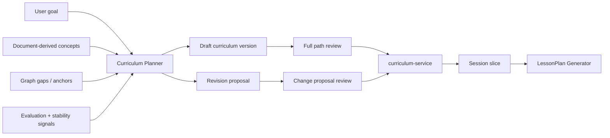

# Curriculum Planner

**Functional name:** Curriculum Planner  
**Possible display label:** Path Builder  
**Family:** Creation  
**Primary surface:** Curriculum Workbench / Vault  
**Authority class:** Drafting and revision agent  
**Primary truth owner:** `curriculum-service`  
**Related services:** `knowledge-graph-service`, `scheduler-service`, `metacognition-service`, `session-service`, `content-service`

## Purpose

The Curriculum Planner designs durable learning paths that outlive any single session. It turns goals, source-derived concepts, graph gaps, learner history, and schedule/readiness signals into versioned curriculum DAGs and reviewable revisions.

It does not own graph truth, session runtime, schedule state, or content. It owns the product act of shaping a path for review.

The product promise is:

> "Noema can propose a learning path, explain why it is ordered that way, preserve your progress as the path changes, and show what changed before you accept it."

## Product Role

The Path Builder helps the learner answer:

- What am I trying to learn?
- What should come first?
- What can wait?
- What prerequisites are missing?
- What is ready for a session now?
- What changed since this curriculum was created?
- Will accepting this revision disturb my progress?

It should make long-range structure visible without pretending that a curriculum is destiny. A curriculum is a durable plan with revision memory, not a fixed script.

## Where It Sits in the Creation Loop



## Lifecycle Model

The planner has two primary lifecycle modes.

### New Curriculum

New curricula are reviewed as full versioned paths.

The user should see:

- title and goal
- path outline
- nodes/concepts
- prerequisites and branches
- estimated sessions
- source documents or goal origin
- missing anchors or proposed concepts
- what is ready now
- what is locked

### Existing Curriculum

Existing curricula are revised through change proposals, not silent mutation.

Revision change types include:

- insert prerequisite
- reorder nodes
- add remediation path
- split node
- add node
- remove edge
- retarget edge
- relabel node
- adjust threshold
- flag for skip

The user should see what changed and whether progress is preserved.

## When It Appears

- User creates a curriculum from a goal.
- Ingestion seeds a curriculum from a document.
- User opens the curriculum vault.
- A graph gap suggests missing prerequisites.
- Metacognition signals repeated failure or confusion in a curriculum node.
- Scheduler/readiness signals show a path is stuck.
- Research / Evaluator flags poor outcomes from the current path structure.
- User asks for a new session from a curriculum frontier.

## Live Context Pack

Every run receives a live context pack. The prompt must distinguish curriculum facts, graph facts, schedule facts, and agent inferences.

### User and Intent Context

- user id
- study mode
- user goal
- target horizon
- desired intensity/pacing
- preferred difficulty curve
- exam/deadline context when provided
- existing active curricula
- relevant user overrides and accepted/rejected revisions

### Curriculum Context

- current curriculum id/version, if revising
- active version state
- node list and stable node keys
- current progress by stable node key
- locked/unlocked/in-progress/completed/skipped states
- previous revision proposals and decisions

### Graph Context

- accepted CKG anchors
- proposed concepts
- prerequisite candidates
- misconception/confusable relations
- graph gaps
- mode-sensitive relation notes

### Learning Evidence Context

- concept stability summaries
- reasoning-quality summaries
- scheduler readiness and due-state summaries
- metacognitive Triggers relevant to the path
- repeated failure/confusion patterns

### Policy Context

- revision review policy
- stable node identity rules
- canonical graph proposal policy
- session-slice constraints
- Guardian constraints for downstream LessonPlans

## Inputs

The planner may use:

- user goals
- document-derived concept sets
- graph anchors and proposed concepts
- curriculum versions
- curriculum progress
- schedule/readiness summaries
- metacognition summaries
- content coverage summaries
- user pacing/preferences

The planner should not receive:

- unrelated private source material
- raw full graph dumps
- unbounded evaluation histories
- authority to commit sessions
- authority to canonize proposed concepts

## Outputs

The planner produces reviewable curriculum artifacts:

- draft curriculum version
- curriculum node sequence
- DAG edges
- prerequisite rationale
- estimated sessions
- locked/unlocked frontier explanation
- revision proposal
- per-change rationale
- session slice recommendation
- friendly path explanation

## Curriculum Workbench

The Curriculum Workbench should support two modes.

### Full Path Review

Used for new curricula.

Recommended layout:

```text
Header: goal, source, state, estimated effort
Main: path graph / ordered outline
Side: selected node details, anchors, prerequisites, evidence
Footer/actions: accept path, edit path, regenerate section, save draft
```

### Revision Proposal Review

Used for existing curricula.

Recommended layout:

```text
Summary: what changed and why
Change list: each insert/reorder/split/threshold change
Impact: progress preserved, nodes relocked, new prerequisites
Actions: accept all, accept selected, reject, request revision
```

## UI Labels

Use minimal labels in list/card views:

- `Draft path`
- `Active version`
- `Revision proposed`
- `Change proposal`
- `Prerequisite inserted`
- `Node blocked`
- `Node unlocked`
- `Progress preserved`
- `Needs graph anchor`
- `Ready for session`
- `Session slice available`

## Friendly Why Layer

One click deeper, show plain explanations:

- "This node comes first because three later concepts use it as a prerequisite."
- "I proposed a repair branch because recent evaluations point to a missing foundation."
- "This curriculum revision preserves your progress by using stable node identity."
- "This node is locked because its prerequisite is not stable yet."
- "This source-derived concept has no canonical anchor, so it stays proposed until graph review."

## Technical Provenance Layer

Technical details belong below the friendly why:

- curriculum id/version id
- stable node keys
- CKG node ids and proposed concept ids
- source document ids
- scheduler/readiness references
- metacognition evidence references
- revision proposal id
- agent run id
- accepted/rejected change ids

## User Actions

For new curricula:

- accept path
- save draft
- edit node
- reorder node
- remove node
- request more prerequisites
- request simpler/harder path
- generate supporting cards
- start session from frontier

For revisions:

- accept all changes
- accept selected changes
- reject proposal
- request revision
- inspect impact
- preserve current path
- mark node skipped
- send graph issue to Graph Workbench

## Review and Handoff Rules

| Artifact | Review model | Downstream path |
| --- | --- | --- |
| New curriculum | full path review | persisted/versioned by `curriculum-service` |
| Existing curriculum change | change proposal review | accepted changes produce new version |
| Proposed concept in curriculum | graph review | canonical anchoring through KG path |
| Session slice | generated from active version/progress | handed to LessonPlan Generator |
| Missing practice coverage | content recommendation | handed to Content Creation Orchestrator |

The planner may prepare a session slice recommendation, but LessonPlan Generator produces the session LessonPlan and `session-service` owns activation.

## Authority Boundaries

The agent may:

- draft curriculum DAGs
- propose revisions
- explain path ordering
- suggest session slices
- use graph anchors and proposed concepts
- recommend content generation for uncovered nodes
- recommend graph review for unanchored nodes

The agent must never:

- store curriculum inside KG
- silently revise active paths
- claim proposed concepts are canonical
- erase progress when revising nodes
- activate a session plan directly
- mutate scheduler state
- create content directly
- re-lock completed nodes without an explicit reviewable reason

## Validation and Review Gates

- `curriculum-service` owns durable curricula, versions, progress, and revision proposals.
- `knowledge-graph-service` owns CKG/PKG anchors and graph proposals.
- `scheduler-service` owns readiness and due-state facts.
- `metacognition-service` owns Evaluation and Trigger facts.
- `session-service` owns session runtime and LessonPlans.
- Pedagogy Guardian validates downstream LessonPlans, Steps, Activities, and replans.

## States

Suggested curriculum states:

```text
draft
review_ready
active
revision_proposed
revision_partially_accepted
superseded
archived
```

Suggested node runtime labels:

```text
locked
unlocked
in_progress
completed
blocked
skipped
needs_anchor
```

Suggested revision states:

```text
proposed
needs_user_review
accepted
partially_accepted
needs_revision
rejected
applied
```

## Failure Modes

| Failure mode | Product risk | Mitigation |
| --- | --- | --- |
| Overplanning too far ahead | user gets an intimidating, brittle path | show horizon, allow draft save, keep revision lightweight |
| Treating document order as prerequisite order | wrong sequence | require graph/source rationale for hard prerequisite edges |
| Ignoring readiness/stability | sessions start from wrong frontier | inject scheduler/KG summaries |
| Reordering progress invisibly | learner trust loss | stable node identity and visible impact summary |
| Too many repair branches | curriculum becomes cluttered | require evidence threshold and user review |
| Proposed concepts treated as canonical | bad anchors downstream | explicit `needs graph anchor` label |

## Example UI Copy

New curriculum:

- "This is a draft path. Review the ordering before using it for sessions."
- "The first 4 nodes are ready now. 3 later nodes need graph anchors before automated planning."
- "This path is source-derived from `Chapter 2` and `Chapter 3`."

Revision:

- "I inserted `linear equations basics` as a prerequisite because two planned nodes depend on it."
- "This revision changes ordering only. Your completed nodes remain completed."
- "Accepting this change will relock one downstream node until the new prerequisite is stable."

Session handoff:

- "A session slice is available from 2 in-progress nodes and 1 new node."
- "LessonPlan Generator will turn this slice into Steps before the session starts."

Blocked:

- "This node has no canonical graph anchor yet, so it cannot be used for automated session planning until reviewed."
- "Revision blocked: the proposed prerequisite is not connected to the active curriculum version."

## Open Design Notes

- Curriculum should feel alive and revisable, but never unstable or arbitrary.
- The planner should explain why a path changed before asking the user to accept it.
- Stable node identity is central to preserving trust.
- The planner should consume graph and schedule summaries, not invent graph or schedule truth.
- Full pre-session LessonPlan review belongs to LessonPlan Generator, not this agent.
