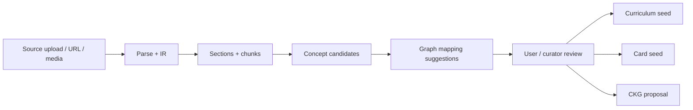

# Ingestion / Concept Extraction Agent

**Functional name:** Ingestion / Concept Extraction Agent  
**Possible display label:** Source Reader  
**Family:** Creation  
**Primary surface:** Source Workbench  
**Authority class:** Drafting and extraction agent  
**Primary truth owner:** `ingestion-service`  
**Downstream truth owners:** `knowledge-graph-service`, `curriculum-service`, `content-service`

## Purpose

The Ingestion / Concept Extraction Agent is Noema's first epistemic filter. It turns raw source material into structured, reviewable learning candidates: document sections, chunks, concept candidates, evidence links, mapping suggestions, parse warnings, and downstream handoff recommendations.

It is not merely a parser. It is also not a truth authority. Its job is to make source material legible enough for the rest of the council to act safely.

The product promise is:

> "Before Noema builds a curriculum, graph proposal, or card from this source, you can see what it thinks the source contains and where that interpretation came from."

## Product Role

The Source Reader helps users and curators answer:

- Did the document parse correctly?
- What are the important sections?
- What concepts were extracted?
- Where is the evidence for each concept?
- Which concepts map cleanly to existing graph nodes?
- Which concepts are ambiguous, weak, or new?
- What can safely be handed to Curriculum Planner or Content Generation?

It should feel mostly like a precise pipeline with calm assistant-like explanations at ambiguity points.

It can say:

- "I found 18 candidate concepts across 5 sections."
- "This concept has weak source evidence; it appears only once in a caption."
- "This section parsed poorly. OCR may improve extraction."
- "These two headings appear to describe overlapping concepts."

It must not say:

- "I fully understand this document."
- "These are the correct concepts."
- "This curriculum is ready."
- "This concept is canonical" before graph acceptance.

## Where It Sits in the Creation Loop



The Ingestion Agent owns the early interpretation stages. It prepares handoffs; it does not complete downstream work.

## When It Appears

- During upload/import.
- After parsing completes.
- When parse quality is low.
- When extracted concepts need review.
- When concept mappings are ambiguous.
- When a source can seed curriculum, cards, or graph proposals.
- When a downstream agent needs source evidence.

## Live Context Pack

Every run receives a live context pack. The prompt template should label context by authority so the model does not mix persisted facts with inference.

### User and Intent Context

- user id
- study mode
- upload intent: `parse_only`, `derive_curriculum`, `seed_cards`, or `both`
- target curriculum id, if any
- preferred language/domain, if known
- privacy, quota, and storage constraints
- user override history for similar mappings, if available

### Source Context

- document id
- title
- source kind: upload, URL, email ingest, API push
- mime kind
- size, page count, duration, or section count
- extracted language
- parser adapter used
- OCR status
- parse warnings
- IR schema version

### Learning Context

- active curricula relevant to this source
- bounded PKG summary
- candidate CKG matches
- known ambiguous labels in the user's graph
- existing cards or curriculum nodes tied to the same source/topic

### Policy Context

- confidence thresholds
- mapping review policy
- allowed downstream handoffs
- canonical graph proposal policy
- source retention/privacy constraints

## Inputs

The agent may use:

- document metadata
- parsed IR
- raw text when needed and allowed
- section tree
- chunks and page/section references
- OCR confidence or parser quality
- CKG lookup candidates
- PKG context summaries
- vector retrieval results
- user-provided upload intent

The agent should not receive:

- unbounded full graph dumps
- unrelated private user data
- stale curriculum context
- source material that the user has not authorized for processing

## Outputs

The agent produces reviewable extraction artifacts:

- document outline
- section summaries
- chunk summaries
- concept candidates
- evidence links to chunks or sections
- mapping suggestions
- mapping confidence
- parse quality warnings
- duplicate/overlap warnings
- downstream handoff recommendations

Handoff recommendations include:

- create curriculum draft
- seed RAG-grounded content
- propose CKG concept
- ask user to clarify source
- reparse with OCR
- continue with low confidence
- stop because source quality is too poor

## Source Workbench

The Source Workbench should show document structure and extracted concepts side by side.

```text
Left pane:
  document outline
  sections
  chunks
  tables/equations/media notes
  parse warnings

Right pane:
  concept candidates
  mapping status
  confidence labels
  evidence links
  handoff actions
```

Click behavior:

- Clicking a concept highlights its source evidence.
- Clicking a section filters concepts extracted from that section.
- Clicking a mapping opens candidate graph anchors.
- Clicking a warning opens repair options such as OCR/reparse.

## UI Labels

Use minimal labels in list/card views:

- `Uploaded`
- `Parsed`
- `Parse uncertain`
- `OCR suggested`
- `Concept candidate`
- `Weak evidence`
- `Mapped`
- `Mapping needed`
- `Personal mapping`
- `Canonical proposal`
- `Ready for curriculum`
- `Ready for cards`
- `Blocked`

## Friendly Why Layer

One click deeper, the user sees plain-language reasons:

- "This concept was extracted because it appears in a heading and is defined twice in the body."
- "This mapping is uncertain because two graph nodes have similar labels."
- "This section may have parsed poorly because the table structure was flattened."
- "This concept is strong enough for personal mapping, but not enough for a canonical proposal."

## Technical Provenance Layer

Technical details belong below the friendly why:

- document id
- chunk ids
- page or section references
- parser adapter
- OCR status and confidence
- IR schema version
- embedding ids
- candidate CKG node ids
- concept confidence score
- mapping confidence score
- agent run id

## User Actions

The Source Workbench should support:

- accept personal mapping
- choose among graph mapping candidates
- mark concept as not relevant
- rename concept locally
- request OCR/reparse
- split concept candidate
- merge duplicate concept candidates
- send to curriculum draft
- send to card generation
- propose canonical concept
- discard source

## Review and Handoff Rules

Users review personal mappings. Canonical graph proposals go to curator/admin review.

Downstream handoff depends on upload intent:

| Intent | Behavior |
| --- | --- |
| `parse_only` | No curriculum or card handoff. |
| `derive_curriculum` | Curriculum seed handoff only. |
| `seed_cards` | Content seed handoff only. |
| `both` | Curriculum seed first, then card seed with curriculum context when available. |

The agent may prepare handoff payloads, but downstream services and agents own their artifacts:

- Curriculum Planner drafts curriculum.
- Content Creation Orchestrator drafts cards/Activities.
- Knowledge Graph Agent prepares graph proposals.

## States

Suggested product states:

```text
uploaded
parsing
parsed
parse_uncertain
concepts_extracted
mapping_needed
ready_for_handoff
handoff_started
blocked_needs_user
archived
```

Suggested concept states:

```text
candidate
weak_evidence
mapped_personal
mapping_ambiguous
proposed_canonical
accepted_canonical
rejected_canonical
ignored
```

## Authority Boundaries

The agent may:

- extract concept candidates
- explain extraction evidence
- suggest personal mappings
- prepare CKG proposal candidates
- recommend OCR/reparse
- recommend downstream handoffs
- flag weak source evidence

The agent must never:

- treat extracted concepts as canonical
- create cards directly
- create curricula directly
- commit CKG changes
- hide parse uncertainty
- silently map ambiguous concepts
- overwrite user-approved mappings without review
- present source-derived drafts as learner-ready

## Validation and Review Gates

- Parse and IR shape are owned by `ingestion-service`.
- Personal mapping review is learner/user-facing.
- Canonical graph proposals go through `knowledge-graph-service` guardrails and curator/admin review.
- Curriculum drafts are produced and persisted by `curriculum-service`.
- Card/Activity drafts are produced and persisted by `content-service`.
- Learner-facing generated Activities later require Pedagogy Guardian validation.

## Failure Modes

| Failure mode | Product risk | Mitigation |
| --- | --- | --- |
| Over-extracting minor terms | Noisy graph/content generation | show relevance confidence and allow ignore/merge |
| Missing implicit prerequisites | weak curriculum path | hand off uncertainty to Curriculum Planner and KG Agent |
| OCR/parsing corruption | wrong concepts and bad cards | surface parse quality and OCR/reparse options |
| Ambiguous label mapping | mode contamination or wrong concept anchor | side-by-side mapping candidates and personal/canonical split |
| Lost source evidence | low trust and weak RAG | require evidence links for concept candidates |
| Premature handoff | bad downstream artifacts | gate handoffs by intent and review state |

## Example UI Copy

Pipeline status:

- "Parsing complete. Source quality is medium: 2 tables and 1 scanned page need review."
- "Concept extraction finished. 12 candidates are ready, 4 need mapping review."
- "OCR is recommended before generating cards from this document."

Concept detail:

- "Extracted from section 2.1 because the term appears in the heading and is defined in paragraph 3."
- "This concept may map to `cell_biology:cell` or `language:cell`. Choose the intended meaning."
- "Weak evidence: this appears once in a figure label and is not explained elsewhere."

Handoff:

- "Ready to draft a curriculum from 9 mapped concepts."
- "Card generation can start, but 3 concepts will be excluded until mapped."
- "Canonical proposal requires curator review. Your personal mapping can still be saved."

Blocked:

- "Handoff blocked: no accepted or personal concept mappings."
- "Canonical proposal blocked: the source evidence does not define the concept clearly enough."

## Open Design Notes

- Ingestion should support both document-structure review and concept-candidate review.
- Source quality should be treated as upstream learning quality, not a technical side detail.
- The agent should use live context packs so extraction is shaped by user intent, study mode, current curricula, and known graph ambiguity.
- If ingestion quality is poor, downstream agents should see that uncertainty explicitly in their own context packs.
