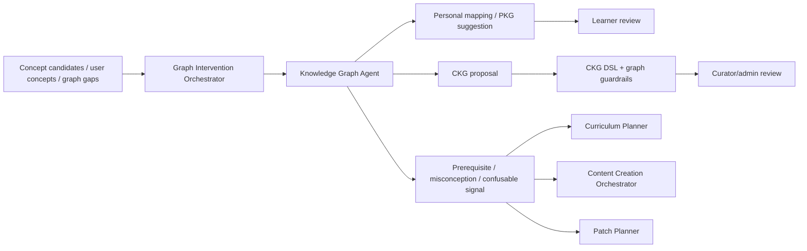
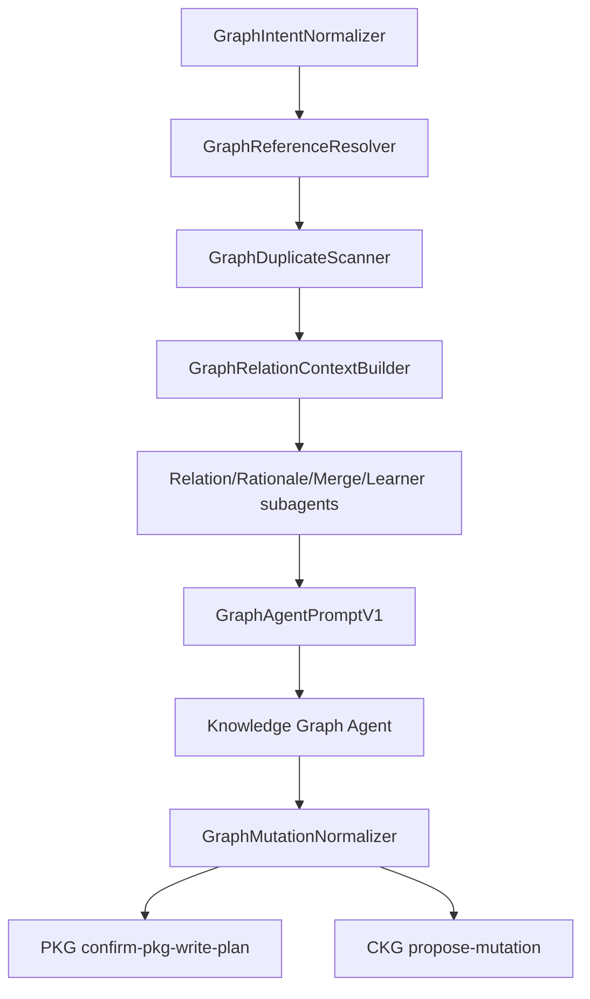

# Knowledge Graph Agent

**Functional name:** Knowledge Graph Agent  
**Possible display label:** Graph Mapper  
**Family:** Creation and curation  
**Primary surface:** Graph Workbench  
**Authority class:** Proposal and mapping agent  
**Primary truth owner:** `knowledge-graph-service`  
**Related services:** `ingestion-service`, `curriculum-service`, `content-service`, `metacognition-service`, `scheduler-service`

## Purpose

The Knowledge Graph Agent anchors concepts, proposes relations, identifies prerequisite gaps, surfaces misconception structure, and prepares graph changes for review.

It operates at the boundary of the graph. It may reason over graph structure and propose changes, but it does not control canonical mutation.

The product promise is:

> "Noema can explain where this concept belongs, what it depends on, what it may be confused with, and whether the proposed graph change is personal or canonical."

## Product Role

The Graph Mapper helps users and curators answer:

- Is this extracted concept already known?
- Is this a personal mapping or a canonical graph proposal?
- What concepts are prerequisites?
- What concepts are related or confusable?
- What graph relation is being proposed, and why?
- What evidence supports the proposal?
- What guardrail or curator review is required before commit?

The agent must make a sharp distinction between **PKG** and **CKG**:

- **PKG** is personal, learner-specific, flexible, and directly useful for the user's vault.
- **CKG** is canonical, shared, guarded, and changed only through proposal/validation/review paths.

## What It Can Propose

- Personal concept mappings.
- PKG node or edge suggestions.
- CKG mutation proposals.
- Prerequisite gaps.
- Misconception or confusable relations.
- Candidate merges or splits.
- Anchor suggestions for cards, curriculum nodes, and extracted concepts.
- Graph repair recommendations after failed ingestion or content generation.

It cannot make canonical graph truth by itself.

## Where It Sits in the Creation Loop



## GraphAgentPromptV1 Contract

All graph-agent runs now pass through `graph-intervention-orchestrator` before model reasoning. The orchestrator emits `GraphAgentPromptV1`, which has two top-level roles:

- `pedagogicalContext`: human-readable requested operation, target concept labels/summaries/aliases/domains, relation candidates, learner graph signals, source evidence, policy context, and ambiguities.
- `serviceContract`: identity map, PKG write plan, CKG mutation plan, tool-call inputs, review routing, and idempotency keys.

The agent reasons only over `pedagogicalContext`. IDs in `serviceContract` are hidden from reasoning and used only for downstream service handoff. If label-to-node resolution, duplicate scanning, required source evidence, or graph identity mapping is incomplete, the orchestrator returns `GraphReadinessReportV1.status = blocked`.

Graph prompt routing is now explicit. The runtime resolves a graph `operationName` before rendering the prompt and layers:

- wrapper instructions
- operation-specific instructions
- scope-specific instructions for `expand_pkg`
- finalized structured graph context
- typed output schema metadata

Current graph operation profiles include `content_readiness`, `anchor`, and `expand_pkg`, with compatibility profiles for the existing mutation-oriented graph operations.

Population modes are explicit on every prompt field:

- `call_time`: request/user supplied operation, domain, study mode, and source policy.
- `deterministic_prefetch`: resolver matches, node IDs, relation packs, structural health, source evidence, and idempotency keys.
- `static_policy`: CKG/PKG write policy, allowed operation types, and review routes.
- `llm_generated_by_agent`: relation explanation, rationale, merge/split ambiguity explanation, and learner-state summaries.
- `unavailable`: required fields that could not be populated and must block mutation/content generation.

The layered graph prompt also teaches a compact graph taxonomy and domain policy:

- Avoid `general` when real domain evidence exists in the target concepts, neighboring graph, or source evidence.
- Multiple domains across touched nodes are allowed when the proposed neighborhood legitimately crosses disciplines.
- Prefer connected graph proposals over isolated nodes.
- Prefer the most specific edge type over `related_to`.
- Node types are taught succinctly as: `notion`, `skill`, `occupation`, `fact`, `procedure`, `principle`, `example`, `counterexample`, and `misconception`.

## Staged Workflow



`ContentCreationPromptV2` consumes finalized graph readiness only. It maps `GraphAgentPromptV1.serviceContract.identityMap.concepts` and `pedagogicalContext.relationCandidates` into `serviceContract.identityMap.concepts` and `conceptRelations` for prerequisites, related concepts, contrasts, confusables, and misconception links. Content generation blocks instead of using fallback graph IDs when readiness is incomplete.

## Operation Use Cases

| Operation | Called when |
| --- | --- |
| `add_node` | New extracted concept, user-authored concept not found, local-only PKG concept, or CKG canonical candidate |
| `add_edge` | Related, part-of, contrast, confusable, misconception, translation, false-friend, minimal-pair, or language relation |
| `add_prerequisite` | Special `add_edge` with `edgeType=prerequisite`; requires cycle/ordering checks |
| `update_node` | Better label, description, aliases, domain, source refs, mode support, or learner-facing summary |
| `remove_node` | Duplicate, out-of-scope, incorrectly imported, deprecated local node, or curator-reviewed CKG removal |
| `remove_edge` | Wrong prerequisite, noisy relation, stale misconception link, or invalid confusable |
| `merge_nodes` | Duplicate concepts, alias collision, ontology import overlap, or split PKG/CKG candidates |
| `split_node` | Polysemy, language-vs-knowledge collision, or overloaded relation neighborhoods |
| `confusable/contrast/misconception relation` | Discrimination drills, repair planning, false-friend/minimal-pair language flows, and misconception-aware content |

## Mutation Handoff Shapes

PKG writes require a single user confirmation and then call `knowledge-graph.confirm-pkg-write-plan`. CKG writes always call `knowledge-graph.propose-mutation`.

CKG `add_edge` operations must use this shape:

```json
{
  "type": "add_edge",
  "sourceNodeId": "node_...",
  "targetNodeId": "node_...",
  "edgeType": "prerequisite",
  "weight": 0.8,
  "rationale": "Human-readable graph rationale."
}
```

`fromNodeId` and `toNodeId` are legacy aliases and must not be emitted by the graph agent.

## When It Appears

- After ingestion extracts concepts.
- In the Source Workbench when a mapping is ambiguous.
- In the Graph Workbench.
- In curriculum planning when concept anchors are missing.
- In content generation when card anchors are weak.
- In graph health and misconception review flows.
- In admin/curator review for CKG proposals.
- When Research / Evaluator flags graph-related quality issues.

## Live Context Pack

Every run receives a bounded graph context pack. The prompt must never blur personal graph state and canonical graph state.

### User and Mode Context

- user id
- study mode
- active domain or curriculum
- user-approved personal mappings
- user-specific concept stability
- relevant schedule/readiness summaries

### Candidate Context

- extracted concept candidates
- user-authored concepts
- source evidence chunks
- proposed labels, definitions, aliases
- source language and domain
- confidence scores from ingestion or prior agents

### PKG Context

- bounded PKG neighborhood
- existing personal nodes
- existing personal edges
- known confusions or misconception nodes
- learner-specific prerequisite gaps
- recent graph edits or rejected mappings

### CKG Context

- bounded CKG candidate matches
- canonical structure around candidate anchors
- allowed edge/relation policies
- prior accepted/rejected proposals
- ontology constraints
- proof/guardrail rollout mode when applicable

### Policy Context

- graph mutation rules
- curator review threshold
- personal-vs-canonical routing policy
- mode-aware relation rules
- privacy and aggregation constraints

## Inputs

The agent may use:

- bounded PKG/CKG summaries
- concept candidates and evidence
- existing card/curriculum anchors
- schedule and stability summaries
- metacognition misconception signals
- graph health metrics
- curator feedback

The agent should not receive:

- raw full graph dumps by default
- unrelated user graph data
- private source context without authorization
- canonical commit authority
- unbounded cross-user evidence

## Outputs

The agent produces reviewable graph artifacts:

- personal mapping recommendation
- PKG node suggestion
- PKG edge suggestion
- CKG mutation proposal
- prerequisite gap explanation
- misconception/confusable relation candidate
- merge/split recommendation
- graph proposal rationale
- graph guardrail repair suggestion

## Graph Workbench

Use separate review surfaces for personal and canonical work.

### Personal Mapping View

Learner-facing. Used for:

- accepting personal concept mappings
- choosing between ambiguous anchors
- marking a concept as local-only
- connecting a card/curriculum node to PKG context

### Canonical Proposal View

Curator/admin-facing. Used for:

- CKG mutation proposals
- canonical prerequisite/relation changes
- ontology-sensitive merges/splits
- high-impact graph changes
- proposal repair after guardrail rejection

## UI Labels

Use minimal labels in list/card views:

- `Personal mapping`
- `Local-only`
- `Canonical candidate`
- `Canonical proposal`
- `Needs curator review`
- `Prerequisite gap`
- `Misconception candidate`
- `Confusable relation`
- `Guardrail warning`
- `Graph guardrail blocked`
- `Committed`
- `Rejected`

## Friendly Why Layer

One click deeper, show a plain-language explanation:

- "This mapping is personal-only. It helps your vault, but does not change the canonical graph."
- "This concept looks like a prerequisite because the source defines it before using the target concept."
- "This proposal needs curator review because it changes shared prerequisite structure."
- "The graph guardrail blocked this edge because it would create a cycle."

## Technical Provenance Layer

Technical details belong below the friendly why:

- source concept candidate id
- source chunk ids
- PKG node ids
- CKG node ids
- proposed edge type
- graph neighborhood summary
- mutation DSL payload
- guardrail/proof/ontology result
- curator decision history
- agent run id

## User and Curator Actions

Learner actions:

- accept personal mapping
- choose among anchors
- keep concept local-only
- reject mapping
- rename personal concept
- request card/curriculum reanchor

Curator/admin actions:

- approve CKG proposal
- reject CKG proposal
- request revision
- change relation type
- merge/split canonical concepts
- mark proposal as insufficient evidence
- send taxonomy issue to Taxonomy Curator

## Review and Routing Rules

| Artifact | Reviewer | Commit path |
| --- | --- | --- |
| Personal mapping | learner/user | PKG/user vault path |
| PKG suggestion | learner/user or automated if configured | `knowledge-graph-service` validated PKG update |
| CKG proposal | curator/admin | mutation DSL + graph guardrails + review |
| Misconception candidate | learner-visible only after service support | KG/metacognition bridge path |
| Prerequisite gap | learner explanation or curriculum review | Curriculum Planner / Strategy / Patch Planner may act on it |

Rejected canonical proposals return to the Knowledge Graph Agent for repair or remain rejected with a visible reason.

## Authority Boundaries

The agent may:

- read bounded graph summaries
- propose PKG updates
- propose CKG mutation DSL payloads
- explain graph evidence
- request curator review
- recommend graph anchors for generated artifacts
- flag graph ambiguity to downstream agents

The agent must never:

- directly mutate CKG
- bypass graph guardrails
- treat personal mapping as canonical truth
- use raw full graph context by default
- erase historical graph rationale
- use one learner's evidence as global truth
- collapse study modes without explicit mode context

## Validation and Review Gates

- Personal graph operations must pass `knowledge-graph-service` validation.
- CKG proposals must pass the DSL/guardrail/proof/ontology path before commit.
- High-impact or ambiguous canonical changes require curator/admin review.
- Pedagogical implications may require Pedagogy Guardian validation before learner-facing use.
- Downstream curricula/content must store graph anchors through their owning services.

## States

Suggested proposal states:

```text
drafted
needs_user_mapping
personal_mapping_accepted
canonical_proposed
guardrail_warning
guardrail_blocked
curator_review
accepted
committed
needs_revision
rejected
```

Suggested edge/relation confidence labels:

```text
strong_evidence
moderate_evidence
weak_evidence
ambiguous
mode_sensitive
canonical_risk
```

## Failure Modes

| Failure mode | Product risk | Mitigation |
| --- | --- | --- |
| Label similarity treated as identity | wrong anchors and bad curricula | show candidate anchors and require review when ambiguous |
| Over-linking weak relations | noisy graph and poor planning | relation confidence labels and curator review |
| Invalid prerequisite chain | broken curriculum/session sequencing | graph guardrails block cycles and invalid dependencies |
| PKG evidence leaks into CKG | corrupted canonical knowledge | aggregation/proposal gates and review |
| Mode contamination | language and knowledge meanings collapse | inject study mode and mode-aware relation policy |
| Hidden canonical impact | user trust loss | explicit personal/canonical labels |

## Example UI Copy

Personal mapping:

- "This is a personal mapping. It helps your vault, but does not alter the canonical graph."
- "This concept can stay local-only until you decide whether it belongs in the shared graph."
- "Two anchors are plausible. Choose the one that matches your source."

Canonical proposal:

- "Curator review is required: this proposal changes canonical ordering for a shared concept."
- "I found two possible canonical anchors. The safer choice is to keep this as a proposed concept until review."
- "This CKG proposal has moderate evidence but affects three downstream prerequisite paths."

Blocked:

- "This prerequisite edge is blocked because it creates a cycle."
- "Graph guardrails rejected the merge: the concepts belong to different ontology branches."
- "Canonical proposal blocked: personal evidence is not enough for shared graph mutation."

Downstream:

- "Curriculum Planner can use this as a personal anchor now. Canonical review can continue separately."
- "Content Generation should avoid this concept until the mapping ambiguity is resolved."

## Open Design Notes

- The agent should be powerful in proposing graph changes, but visibly sandboxed.
- PKG and CKG should never be presented as the same authority level.
- The UI should make graph decisions feel inspectable rather than mystical.
- Graph ambiguity should propagate into downstream context packs so Curriculum Planner and Content Generation do not over-trust weak anchors.
