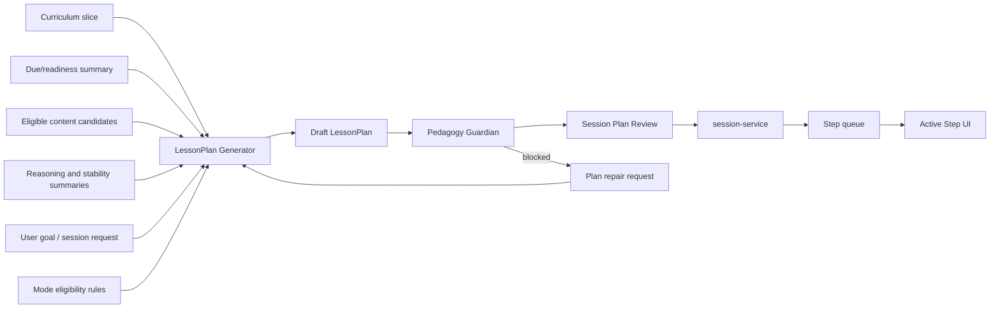

# LessonPlan Generator

**Functional name:** LessonPlan Generator  
**Possible display label:** Session Architect  
**Family:** Creation and planning  
**Primary surface:** Session Plan Review  
**Authority class:** Drafting agent  
**Primary truth owner:** `session-service`  
**Primary validator:** `pedagogy-guardian-service`  
**Related services:** `curriculum-service`, `content-service`,
`knowledge-graph-service`, `scheduler-service`, `metacognition-service`

## Purpose

The LessonPlan Generator turns curriculum slices, goals, learner state, content
candidates, and epistemic mode eligibility into a reviewable session plan.

Every Noema session has a LessonPlan. The generator makes that plan
understandable before the learner begins, and it preserves the Step-first
architecture by making Steps, goals, activities, assessment intent, and
adaptation rules explicit before runtime.

The product promise is:

> "Before a session starts, Noema can show what it plans to do, why those Steps
> are useful now, and how the plan has been validated."

## Product Role

The Session Architect helps the learner answer:

- Why this session?
- What goals will it serve?
- What Steps will happen?
- Which concepts and modes are involved?
- How will learning be assessed?
- What content sources will be used?
- What repair or adaptation rules may apply?
- What changed if the plan is revised?

This agent is not merely background. It should be visible during full
pre-session review, then mostly quiet during execution. During a session, the
learner should see only concise plan-change notices unless they open details.

The generator is the bridge between durable planning and runtime learning.
Curriculum Planner designs long-range paths; LessonPlan Generator builds the
session-specific LessonPlan. Strategy/Replanning may later alter the active
plan, but it must do so through session-service ownership and Guardian
validation.

## Step-First Position

The LessonPlan Generator should never regress Noema back to card-first session
design. Cards and generated content are payload candidates. Steps define the
learning intent.



## When It Appears

- Before starting a goal-driven session.
- Before starting a curriculum-bound session.
- Before starting a generated minimal review session.
- When a full replan is required.
- When a Strategy/Replanning action needs to explain a meaningful plan change.
- In the session timeline after plan changes.
- In teacher/admin review when inspecting why a session was constructed.

Minimal review sessions may be generated deterministically by `session-service`
where appropriate, but full LessonPlans and rich goal-driven sessions use this
agent behind an adapter boundary.

## Layered Prompt

The lesson-plan prompt should be assembled in layers:

1. Stable Step-first planning instructions.
2. Session-request inputs such as mode, duration, and repair context.
3. Curriculum scope with the explicit selected frontier node or selected node
   set, plus prerequisite and progress facts.
4. Candidate-content and readiness context from content, scheduler, and
   metacognition services.
5. Guardian and policy constraints.
6. Final output contract for LessonPlan draft, goals, Steps, rationale, and
   learner-facing summary.

## Live Context Pack

Every run receives a live context pack. The prompt must distinguish
service-owned facts from agent recommendations.

### Session Request Context

- session type
- requested goal
- target duration or effort
- selected study mode
- preferred pace
- learner constraints
- whether pre-session review is required
- whether this is a new plan or a repair of a blocked plan

### Curriculum Context

- selected curriculum id/version
- selected slice or frontier
- stable node keys
- prerequisites and blocked nodes
- current node progress
- curriculum rationale
- revision state, if relevant

### Scheduler and Readiness Context

- due concepts
- readiness summaries
- freshness/staleness signals
- spacing constraints
- transformation cycling recommendations
- excluded concepts and reasons

### Metacognition Context

- concept stability summaries
- recent reasoning-quality summaries
- relevant Triggers
- calibration signals
- repeated confusion or failure patterns
- repair priorities from Strategy/Patch Planner

### Content Context

- eligible card/activity candidates
- generated variants and lineage
- source decks/categories
- content review states
- source/provenance summaries
- activity type availability
- content exclusions

### Policy Context

- active goal cap
- Step count/duration constraints
- Guardian validation rules
- allowed epistemic modes
- assessment requirements
- learner overload/intrusion budget
- plan-change disclosure rules

The generator should be educated by current user data, but it must preserve
authority labels. For example, "metacognition-service observed repeated
confusion" is usable; "the learner is bad at this" is not.

## Inputs

The agent may use:

- curriculum slices
- user goals and session constraints
- due/readiness summaries
- concept anchors
- content candidates and content eligibility states
- mode eligibility groups
- transformation history
- metacognitive Trigger summaries
- prior LessonPlans and plan-change history
- Guardian block reasons for repair

The agent should not receive:

- authority to mutate sessions directly
- raw unbounded learner trace histories
- ineligible content payloads except as excluded context
- permission to exceed hard pedagogical constraints
- graph mutation privileges

## Outputs

The generator produces a reviewable LessonPlan draft:

- session goals
- ordered Steps
- Step objectives
- Step concept references
- candidate or selected Activities
- selected or eligible epistemic modes
- assessment strategy
- adaptation and repair rules
- source/content pool references
- plan rationale
- learner-facing summary
- Guardian repair response, when applicable

More concretely:

| Output              | Purpose                                         | Stored by                                                            |
| ------------------- | ----------------------------------------------- | -------------------------------------------------------------------- |
| LessonPlan draft    | Full session plan awaiting validation/review    | `session-service`                                                    |
| Goals               | Bound plan intent with active-goal cap          | `session-service`                                                    |
| Steps               | Atomic learning units                           | `session-service`                                                    |
| Activities          | Payload-bearing Step activity definitions       | `session-service`, with content payloads from `content-service`      |
| Assessment strategy | Defines how Step outcomes will be interpreted   | `session-service`, evaluation owned later by `metacognition-service` |
| Plan rationale      | Explain why this session is structured this way | `session-service` metadata/read model                                |
| Repair attempt      | Revised plan after Guardian block               | `session-service` and Guardian validation path                       |

The generator may reference cards, decks, templates, and generated variants, but
it should not make those items the runtime unit. Step intent comes first.

## Session Plan Review UI

Use a full plan review before session start, especially for goal-driven or
curriculum-bound sessions.

Recommended layout:

```text
Header: session goal, duration, status, Guardian state
Main: Step sequence with goals, concepts, modes, estimated time
Side: selected Step details, content/source pool, assessment intent
Footer/actions: start session, edit request, regenerate plan, save for later
```

The review should answer "why this session?" without requiring the learner to
inspect every internal detail.

### During Session

During execution, keep the generator mostly out of the way:

- show the current Step
- expose plan details on demand
- show a short notice when the plan changes
- link plan changes to Strategy/Replanning explanations
- avoid frequent interruptions

### Timeline and Audit

The session timeline should include important plan events:

- plan generated
- Guardian accepted
- plan started
- repair Step inserted
- full replan requested
- plan changed
- plan completed

Internal tool calls, prompt retries, and ordinary candidate scoring should not
clutter the learner timeline.

## UI Labels

Default labels:

- `Plan draft`
- `Guardian accepted`
- `Guardian blocked`
- `Needs review`
- `Ready to start`
- `Minimal review plan`
- `Full session plan`
- `Plan changed`
- `Repair inserted`
- `Replan required`

## Friendly Why Layer

One click deeper, show plain explanations:

- "This session starts with comparison because the target concept is unstable
  and recently confused with a sibling concept."
- "Step 3 is a transfer Step, included because the concept has been stable long
  enough to test a new context."
- "The plan includes one calibration checkpoint because recent self-ratings ran
  ahead of trace quality."
- "This Step uses a source-linked activity because the curriculum node came from
  an uploaded chapter."
- "This plan avoids new material because two prerequisite concepts are not
  stable yet."

## Technical Provenance Layer

Technical details belong below the friendly why:

- LessonPlan id
- session id
- curriculum id/version/stable node keys
- goal ids
- Step ids
- concept ids
- source deck/category references
- content payload candidate ids
- metacognition Trigger references
- scheduler readiness references
- mode eligibility output
- agent run id
- Guardian validation id
- plan revision id

The learner does not need this by default, but teacher/admin review and
debugging surfaces do.

## User Actions

Before starting:

- review plan
- start session
- shorten plan
- make plan deeper
- request fewer goals
- swap emphasis
- inspect source/content pool
- save for later
- regenerate plan
- reject plan

During session:

- open plan details
- inspect why this Step is next
- accept a visible plan change
- defer a repair Step, if policy allows
- end session early

After plan change:

- inspect what changed
- continue
- request a simpler repair
- stop and save progress

## Review and Handoff Rules

The normal full-plan path:

```text
session request -> LessonPlan draft -> Guardian validation -> pre-session review -> session-service activation
```

Guardian-blocked plans return to the LessonPlan Generator for repair when the
block is repairable.

| Artifact                   | Review model                         | Downstream path                                             |
| -------------------------- | ------------------------------------ | ----------------------------------------------------------- |
| Full LessonPlan            | Full pre-session review              | `session-service` activation after Guardian acceptance      |
| Minimal review LessonPlan  | May be deterministic, compact review | `session-service` activation                                |
| Guardian-blocked plan      | Repair loop                          | generator revises draft from block reason                   |
| Plan change during session | Timeline notice and details          | Strategy/session-service mutation after Guardian validation |
| Content candidate          | Eligibility check                    | comes from `content-service`, not generator-owned content   |

## Authority Boundaries

The agent may:

- draft LessonPlans
- propose goals
- propose Step order
- propose Step objectives
- select from eligible content candidates
- propose assessment strategy
- explain plan structure
- repair Guardian-blocked plans

The agent must never:

- activate a plan directly
- bypass Guardian
- exceed the active-goal cap
- mutate evaluated Steps
- invent concept stability
- silently change the plan during execution
- treat cards as the runtime learning unit
- use content before `content-service` marks it eligible
- own evaluation results
- own schedule state
- mutate graph state

## Validation and Review Gates

| Gate                            | Applied to                                     | Owner                           |
| ------------------------------- | ---------------------------------------------- | ------------------------------- |
| LessonPlan schema and lifecycle | plan, goals, Steps, Activities                 | `session-service`               |
| Active goal cap                 | LessonPlan goals                               | `session-service` / Guardian    |
| Step validity                   | concept references, objectives, activity shape | Pedagogy Guardian               |
| Content eligibility             | cards, templates, generated variants           | `content-service`               |
| Mode eligibility                | epistemic mode constraints                     | shared deterministic mode rules |
| Evaluation ownership            | post-Step interpretation                       | `metacognition-service`         |
| Runtime activation              | session start and Step queue                   | `session-service`               |

Pedagogy Guardian is the independent gate because plans can be produced by
multiple sources. The generator may repair blocked plans, but it does not decide
whether the repair is valid.

## States

Suggested LessonPlan states:

```text
draft
guardian_pending
guardian_accepted
guardian_blocked
needs_user_review
ready_to_start
active
changed
completed
abandoned
superseded
```

Suggested plan-change states:

```text
local_repair_proposed
repair_inserted
full_replan_requested
full_replan_applied
deferred
blocked
```

These states are product-language suggestions, not final wire schemas.

## Failure Modes

| Failure mode                     | Product risk                     | Mitigation                                        |
| -------------------------------- | -------------------------------- | ------------------------------------------------- |
| Overly long session              | Learner fatigue                  | Duration and Step-count constraints               |
| Too many active goals            | Diffuse learning intent          | Hard active-goal cap                              |
| Steps do not serve goals         | Session feels random             | Step-to-goal rationale and Guardian checks        |
| Weak assessment strategy         | System cannot interpret learning | Require assessment intent per Step                |
| Ignoring prerequisite gaps       | Frustration and false failure    | Inject curriculum/scheduler readiness constraints |
| Hidden plan changes              | Trust loss                       | Timeline notices and details                      |
| Ineligible generated content     | Bad content reaches session      | Content eligibility and Guardian validation       |
| Card-first regression            | Step-first architecture erodes   | Keep cards as payload candidates only             |
| Overconfident diagnosis language | Learner feels judged             | Use service-owned signals and careful copy        |

## Example UI Copy

Pre-session:

- "This plan has 3 goals and 7 Steps. Review before starting."
- "The first two Steps repair prerequisites; the remaining Steps apply the
  concept in a new context."
- "This is a minimal review plan. It checks due concepts without introducing new
  material."

Guardian:

- "Guardian blocked Step 4 because it has no concept reference."
- "This plan is blocked because one Activity uses content that is not eligible
  for sessions."
- "The repaired plan is ready for review."

During session:

- "I changed the session plan locally: one repair Step was inserted; the
  remaining plan is unchanged."
- "The next Step changed because the previous answer triggered a prerequisite
  repair."
- "This plan uses two source decks as content pools, but the Steps define the
  learning intent."

Plan details:

- "This Step measures explanation quality, not just whether the final answer is
  correct."
- "This transfer Step is included because recent evidence suggests the concept
  is stable in familiar contexts."
- "No new material is included because the current frontier is blocked by
  prerequisite readiness."

## Open Design Notes

- Decide which session types always require full pre-session review versus
  compact review.
- Define whether learners can edit Step order directly or only change
  goals/constraints and regenerate.
- Define how much Strategy/Replanning detail belongs in the same plan review
  versus a separate learner-loop spec.
- Decide whether Session Architect should have a visible display label in
  learner UI or remain an artifact author only.
- Define the precise policy for plan-change acceptance during active sessions.
