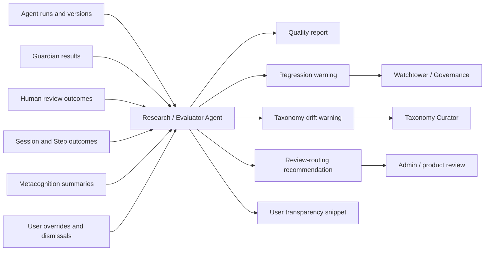

# Research / Evaluator Agent

**Functional name:** Research / Evaluator Agent  
**Possible display label:** Learning Systems Evaluator  
**Family:** Creation, governance, and research  
**Primary surface:** Admin evaluation dashboard; high-level user transparency surfaces  
**Authority class:** Audit and recommendation agent  
**Primary truth owners:** source facts remain with the services being evaluated  
**Primary validators:** admin/research review, Watchtower / Governance Layer  
**Main collaborators:** Taxonomy Curator, Pedagogy Guardian, Content Creation Orchestrator, Curriculum Planner, Strategy / Replanning Agent, AI Mirror / Cognitive Copilot

## Purpose

The Research / Evaluator Agent studies whether Noema's agents, prompts, validations, interventions, generated artifacts, and UI surfacing choices are actually improving learning.

It is the agent council's quality mirror. Its work is about system behavior, not one learner's immediate coaching moment.

The product promise is:

> "Noema can evaluate its own agent behavior, catch regressions, and explain adaptation choices without confusing evidence with certainty."

## Product Role

The Learning Systems Evaluator helps builders, admins, researchers, and governance reviewers answer:

- Are generated cards helping or hurting?
- Are Guardian rejections increasing after a prompt change?
- Are Socratic Steps improving reasoning quality?
- Are repair branches too intrusive?
- Are users rejecting certain curriculum proposals?
- Are taxonomy labels drifting?
- Are agent prompts producing more review burden than value?
- Are interventions improving reasoning, not just short-term correctness?
- Which agent should be reviewed after a regression?

Learners should not experience this agent as a coach. At most, they may see high-level transparency such as "Noema is using this repair style because similar interventions have recently helped your reasoning traces."

## System Position



## Evaluation Domains

The agent should evaluate the system at several levels.

| Domain | Questions |
|---|---|
| Content quality | Are drafts accepted, repaired, rejected, or used successfully? |
| Curriculum quality | Are path proposals accepted? Do revisions reduce stuck states? |
| LessonPlan quality | Are plans Guardian-accepted? Do Steps serve goals? |
| Intervention quality | Do repairs improve reasoning traces without overload? |
| Prompt/version quality | Did a prompt/template change increase regressions? |
| Taxonomy quality | Are labels stable, useful, and distinct? |
| UI surfacing quality | Are visible agents helpful or intrusive? |
| Governance quality | Are privacy, audit, and safety constraints holding? |

The evaluator should be explicitly reasoning-over-correctness aligned. A flashcard that improves correctness while degrading explanation quality may still be a warning.

## When It Appears

- Agent performance dashboards.
- Prompt/version audits.
- Experiment and rollout review.
- Guardian rejection trend review.
- Intervention effectiveness review.
- Taxonomy drift review.
- Content quality audits.
- Curriculum proposal acceptance review.
- High-level user transparency panels.
- Governance reviews of intrusiveness, privacy, or overload.

It should not interrupt an active learner session.

## Live Context Pack

Every run receives a bounded live context pack.

### Agent and Version Context

- agent name
- model/prompt/template version
- tool/template configuration
- rollout cohort
- deployment date range
- prior baseline
- experiment flags

### Artifact and Validation Context

- generated artifact counts
- Guardian rejection rates
- rejection categories
- content review outcomes
- curriculum review outcomes
- lesson plan validation outcomes
- repair loop counts
- human override patterns

### Learning Outcome Context

- reasoning-quality trend summaries
- Step completion trends
- concept stability trend summaries
- calibration changes
- session completion/dropoff
- intervention fatigue signals
- repeated failure or recovery patterns

### Taxonomy and Governance Context

- taxonomy version changes
- label drift warnings
- privacy policy constraints
- aggregation thresholds
- user transparency rules
- sensitive cohort handling

The evaluator should receive aggregated and minimized data where possible. It should not need raw private learner traces for ordinary system evaluation.

## Inputs

The agent may use:

- agent run logs
- prompt/template versions
- Guardian validation results
- generated artifact review outcomes
- user override and dismissal patterns
- aggregate metacognition summaries
- intervention frequency and fatigue signals
- session completion and reasoning trends
- taxonomy change history
- experiment flags and cohorts

The agent should not receive:

- unredacted private learner content unless necessary and authorized
- authority to change prompts in production
- authority to rewrite evaluation facts
- authority to alter learner state
- authority to silently change review routing

## Outputs

The evaluator produces reviewable system-quality artifacts:

- agent quality report
- prompt regression warning
- intervention effectiveness summary
- artifact quality trend
- taxonomy drift warning
- review-routing recommendation
- Guardian rejection trend
- experiment readout
- user-facing high-level transparency snippet

More concretely:

| Output | Purpose | Review path |
|---|---|---|
| Quality report | Summarize agent behavior over a time window | Admin/research dashboard |
| Regression warning | Flag likely degradation | Watchtower / product review |
| Prompt drift warning | Review prompt/template changes | prompt governance |
| Intervention summary | Evaluate repair/Socratic/calibration effects | strategy/product review |
| Taxonomy drift warning | Identify label instability | Taxonomy Curator |
| Review-routing recommendation | Adjust where drafts need human review | governance/product review |
| Transparency snippet | Explain adaptation at high level | privacy-safe learner UI |

## Admin Evaluation Dashboard

The dashboard should show trends, anomalies, and concrete review targets.

Recommended layout:

```text
Header: agent/domain, time window, version, status
Main: trend charts, before/after comparison, rejection/review outcomes
Side: top anomalies, affected prompts/artifacts/cohorts, recommended review
Footer/actions: open report, flag prompt, send to Taxonomy Curator, escalate to Watchtower
```

### Dashboard Views

| View | Purpose |
|---|---|
| Agent health | See per-agent quality and regression signals |
| Prompt/version comparison | Compare before/after behavior |
| Artifact outcomes | Track generated content/curriculum/plan quality |
| Intervention effectiveness | Evaluate repair/Socratic/calibration strategies |
| Taxonomy drift | Identify labels needing curation |
| Intrusiveness/overload | Check visible-agent interruption burden |

## User-Facing Transparency

Learner-facing transparency should be short, aggregated, and non-technical. It should explain adaptation without exposing private system internals or making causal claims that the evidence cannot support.

Examples:

- "This repair style is being used because it has recently helped similar reasoning patterns for you."
- "Noema is keeping generated content in review because recent drafts needed stronger source links."
- "This session uses fewer interruptions because previous repair-heavy sessions ran long."

The evaluator should never say "this is proven to work" unless an approved research review supports that claim.

## UI Labels

Default labels:

- `Regression risk`
- `Improving`
- `Needs review`
- `Prompt drift`
- `High rejection rate`
- `Intervention effective`
- `Too intrusive`
- `Evidence weak`
- `Privacy review`
- `Review routing suggested`

## Friendly Why Layer

Plain explanations:

- "Guardian rejections rose after prompt version 12, mostly for answer leakage."
- "Socratic repair Steps improved reasoning quality for this concept cluster, but increased session time."
- "Learners often dismissed this curriculum revision type, so it should be reviewed."
- "This generated-content path needs stricter review because source-link repairs increased."
- "This taxonomy label is drifting because reviewers use it for two different failure patterns."

## Technical Provenance Layer

Technical details should include:

- report id
- evaluated agent/domain
- time window
- prompt/template versions
- cohort/experiment flags
- aggregation thresholds
- source service metrics
- Guardian validation ids/categories in aggregate
- review outcome references
- privacy/minimization status
- evaluator run id
- confidence/uncertainty notes

## Review and Handoff Rules

Research findings route to human-owned review paths.

| Finding | Routed to | Default action |
|---|---|---|
| Prompt regression | Prompt/product review | Investigate before rollout |
| Guardian rejection spike | Pedagogy Guardian/product review | Inspect rejection categories |
| Taxonomy drift | Taxonomy Curator | Draft taxonomy proposal |
| Intrusiveness warning | Watchtower / Governance | Review interruption budgets |
| Content quality issue | Content Workbench | Tighten review or repair prompts |
| Curriculum acceptance issue | Curriculum Workbench/Product | Review planner prompt and UI framing |
| Positive intervention signal | Strategy/Product review | Consider broader rollout, with caveats |

The evaluator may recommend review-routing changes, but governance/product policy must approve them.

## Authority Boundaries

The agent may:

- evaluate system behavior
- flag regressions
- recommend prompt or policy review
- recommend review-routing changes
- summarize intervention effectiveness
- produce privacy-safe transparency snippets
- send drift reports to Taxonomy Curator

The agent must never:

- alter learner state directly
- rewrite evaluations
- silently change prompts in production
- silently change review policy
- claim causal certainty from weak data
- expose private learner data in aggregate reports
- optimize for short-term correctness over reasoning quality
- punish an agent or user based on noisy signals

## Validation and Review Gates

| Gate | Applied to | Owner |
|---|---|---|
| Metric ownership | source data used in reports | source service |
| Privacy/minimization | report inputs and examples | Watchtower / Governance |
| Statistical caution | causal/effectiveness claims | research/admin review |
| Prompt rollout | prompt/template changes | product/governance process |
| Review routing | policy changes | governance/product review |
| User transparency | learner-facing snippets | privacy and UX review |

## States

Suggested report states:

```text
draft
needs_review
watchtower_escalated
taxonomy_escalated
prompt_review_requested
accepted
dismissed
archived
```

Suggested finding labels:

```text
regression_risk
quality_improving
evidence_weak
prompt_drift
taxonomy_drift
high_rejection_rate
intervention_effective
too_intrusive
privacy_risk
review_routing_suggested
```

These are product-language suggestions, not final wire schemas.

## Failure Modes

| Failure mode | Product risk | Mitigation |
|---|---|---|
| Confusing correlation with causation | Bad product decisions | Use cautious language and research review |
| Optimizing correctness over reasoning | Noema loses its core principle | Include reasoning-quality outcomes |
| Ignoring selection bias | Misread user overrides | Show cohort/selection caveats |
| Leaking sensitive data | Privacy harm | Aggregation and minimization gates |
| Prompt churn from weak evidence | Instability | Require evidence thresholds |
| Over-penalizing experimental agents | Innovation slows without signal | Separate experiment and production baselines |
| Creating learner-facing anxiety | Transparency feels surveillance-like | Keep learner copy short and non-judgmental |

## Example UI Copy

Admin:

- "Content drafts from source-derived generation have a high citation repair rate this week."
- "Guardian rejections rose after prompt version 12. Review answer-leakage instructions."
- "Socratic repair Steps improved reasoning quality for this concept cluster, but increased session time by 18%."
- "Curriculum revision proposals that insert prerequisites are accepted often; proposals that reorder completed branches are frequently dismissed."

Taxonomy:

- "The label `boundary confusion` is drifting across two distinct remediation patterns."
- "Send this drift report to Taxonomy Curator for split/merge review."

Learner transparency:

- "This intervention appears helpful for you: similar repair Steps were followed by stronger reasoning traces in 4 of 5 recent sessions."
- "Noema is using fewer repair prompts this session because recent sessions ran long."

## Open Design Notes

- Define statistical thresholds for labeling an intervention effective.
- Decide which evaluator reports can be generated automatically and which need scheduled review.
- Define privacy-safe aggregation thresholds for learner-facing transparency.
- Decide how evaluator findings interact with release gates for prompt/template changes.
- Define whether this agent should evaluate UI surfacing separately from pedagogical artifact quality.
