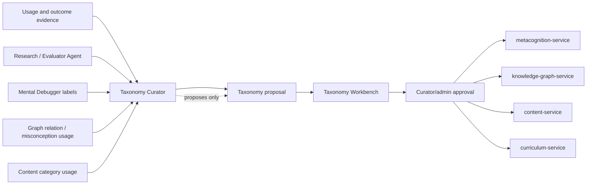

# Taxonomy Curator

**Functional name:** Taxonomy Curator  
**Possible display label:** Taxonomy Curator  
**Family:** Creation, curation, and research  
**Primary surface:** Taxonomy Workbench  
**Authority class:** Curation proposal agent  
**Primary truth owners:** varies by taxonomy; commonly `metacognition-service`, `knowledge-graph-service`, and `content-service`  
**Primary validators:** curator/admin review, service-specific validation rules  
**Main collaborators:** Research / Evaluator Agent, Mental Debugger, Knowledge Graph Agent, Content Creation Orchestrator, Watchtower / Governance Layer

## Purpose

The Taxonomy Curator evolves Noema's classification systems without breaking historical meaning. It works on failure taxonomy, misconception taxonomy, content/category ontology, graph relation language, teaching-mode labels, and agent-evaluation labels.

This agent gives Noema a way to improve its own conceptual language over time. It should help the system avoid stale labels, overlapping categories, noisy content classifications, and brittle diagnostic vocabularies.

The product promise is:

> "Noema can refine the labels it uses to understand learning, but global meaning changes are versioned, reviewable, and never silently rewritten."

## Product Role

The Taxonomy Curator helps admins, researchers, and advanced curators answer:

- Are these two failure labels being used interchangeably?
- Is this misconception subtype too broad?
- Are content categories drifting away from how creators use them?
- Does a graph relation label need clearer semantics?
- Would this new category improve repair planning, or just add noise?
- How many historical records would be affected by a change?
- Can old labels remain interpretable after a taxonomy version change?

It does not tune one learner in the moment. It improves the classification systems that other agents and services use.

## Taxonomy Domains

The curator should support multiple taxonomy domains while keeping ownership separate.

| Domain | Examples | Owner |
|---|---|---|
| Failure taxonomy | reasoning failure families, subtypes, attributes | `metacognition-service` |
| Misconception taxonomy | misconception types, confusable patterns | `knowledge-graph-service` / metacognition read models |
| Content taxonomy | card categories, activity families, modality labels | `content-service` |
| Curriculum taxonomy | domain tags, path archetypes, node types | `curriculum-service` |
| Agent evaluation taxonomy | rejection classes, prompt drift labels, intervention classes | Research/Evaluator + governance review |
| Graph relation language | prerequisite, confusable, analogy, part/whole relation semantics | `knowledge-graph-service` |

The curator can propose changes across these domains, but the relevant service owns final state and versioning.

## System Position



## When It Appears

- In curator/admin tools.
- When failure clusters no longer fit existing taxonomy.
- When misconception labels overlap or drift.
- When graph relation language needs refinement.
- When generated content categories become noisy.
- When Research / Evaluator flags taxonomy drift.
- When a new patch/remediation family lacks a clean label.
- Before a taxonomy version is promoted.
- During audits of historical dashboard continuity.

The agent should rarely appear to ordinary learners. Learners may see downstream label improvements, but not taxonomy governance machinery.

## Live Context Pack

Every run receives a bounded live context pack. It should include evidence, impact, and compatibility constraints.

### Taxonomy Context

- taxonomy domain
- current taxonomy version
- previous versions
- active labels and definitions
- deprecated labels
- mapping rules
- compatibility constraints
- accepted/rejected change history

### Evidence Context

- usage statistics
- ambiguous classification examples
- misclassification reports
- curator comments
- Research/Evaluator warnings
- affected content/concepts/plans
- affected diagnostic patterns
- downstream patch/remediation differences

### Impact Context

- historical records affected
- dashboards affected
- content filters affected
- graph relations affected
- learner-facing labels affected
- migration complexity
- risk of breaking continuity

### Policy Context

- human approval requirements
- versioning rules
- allowed migration types
- privacy constraints for examples
- deprecation policy
- rollback policy

The context pack should avoid exposing raw learner traces unless they are anonymized, minimized, and necessary for taxonomy review.

## Inputs

The agent may use:

- taxonomy definitions and versions
- anonymized examples
- aggregate usage statistics
- rejected/accepted curator decisions
- Research/Evaluator drift reports
- Guardian rejection categories
- content category usage
- graph relation validation outcomes
- remediation effectiveness summaries

The agent should not receive:

- unredacted private learner data
- authority to rewrite stored Evaluations
- authority to publish taxonomy changes
- authority to canonize graph changes
- authority to change prompts or policies directly

## Outputs

The Taxonomy Curator produces reviewable curation artifacts:

- taxonomy change proposal
- merge recommendation
- split recommendation
- rename recommendation
- new subtype proposal
- deprecation note
- migration guidance
- compatibility warning
- evidence cluster summary
- rejected alternative explanation

More concretely:

| Output | Purpose | Stored by |
|---|---|---|
| Taxonomy proposal | Reviewable change artifact | relevant service or admin tool |
| Version diff | Show before/after semantics | relevant service |
| Migration guidance | Preserve historical meaning | relevant service |
| Impact summary | Help curator decide | Taxonomy Workbench |
| Drift warning | Flag labels needing review | Research/Evaluator or admin dashboard |
| Local label suggestion | Scoped improvement without global promotion | service-specific draft state |

## Taxonomy Workbench

The Taxonomy Workbench should show taxonomy diffs, not just lists.

Recommended layout:

```text
Header: taxonomy domain, current version, proposal state, impact summary
Main: tree/dag/list diff with proposed merge/split/rename markers
Side: selected label definition, evidence examples, affected artifacts, migration notes
Footer/actions: accept proposal, edit proposal, reject, request more evidence, save draft
```

### Views

| View | Purpose |
|---|---|
| Version diff | Compare current and proposed taxonomy |
| Evidence clusters | Inspect examples behind a proposed change |
| Impact review | See affected records, dashboards, agents, and content |
| Migration plan | Understand how historical labels remain interpretable |
| Drift queue | Triage labels flagged by Research/Evaluator |

## UI Labels

Use minimal labels:

- `Merge proposed`
- `Split proposed`
- `Rename proposed`
- `New subtype`
- `Deprecation proposed`
- `Version change`
- `Needs curator review`
- `Compatibility risk`
- `Evidence weak`
- `Accepted`
- `Rejected`

## Friendly Why Layer

Plain explanations:

- "These two failure subtypes are being used interchangeably across recent diagnoses."
- "This proposed split preserves historical labels but improves future patch planning."
- "Renaming this taxonomy node affects dashboard language but not stored Evaluation facts."
- "This new subtype is not ready: it is based on too few examples."
- "This merge is risky because the two labels lead to different remediation choices."

## Technical Provenance Layer

Technical details should include:

- taxonomy id/domain/version
- proposal id
- label ids
- affected service owner
- evidence cluster ids
- aggregate counts
- affected artifact references
- migration mapping
- curator action history
- agent run id
- privacy/anonymization status for examples

## Review and Handoff Rules

Global taxonomy changes require curator/admin approval. Local label suggestions may remain drafts or be scoped to a user's workspace depending on product policy.

| Proposal type | Review surface | Downstream path |
|---|---|---|
| Failure taxonomy change | Taxonomy Workbench | `metacognition-service` versioning |
| Misconception taxonomy change | Taxonomy + Graph Workbench | `knowledge-graph-service` / metacognition alignment |
| Content category change | Content taxonomy review | `content-service` |
| Relation-language refinement | Graph admin review | `knowledge-graph-service` |
| Agent evaluation label change | Research/governance review | Research/Evaluator and Watchtower |

Accepted taxonomy changes should be versioned. Historical records should remain interpretable under their original taxonomy version or through explicit migration mappings.

## Authority Boundaries

The agent may:

- propose taxonomy changes
- cluster evidence
- explain drift
- suggest compatibility handling
- flag ambiguous categories
- recommend deprecations
- draft migration guidance

The agent must never:

- silently change live taxonomy
- erase historical version meaning
- convert one user's pattern into global taxonomy truth
- rewrite stored Evaluations
- make canonical graph changes outside graph proposal paths
- expose private examples in admin reports without minimization
- create micro-categories without evidence and downstream utility

## Validation and Review Gates

| Gate | Applied to | Owner |
|---|---|---|
| Version integrity | taxonomy version and migration structure | relevant service |
| Historical compatibility | old records and dashboards | relevant service + curator |
| Privacy review | examples used as evidence | Watchtower / governance policy |
| Downstream utility | remediation/content/graph impact | curator/admin review |
| Graph consistency | relation/misconception taxonomy changes | `knowledge-graph-service` |
| Evaluation continuity | failure taxonomy changes | `metacognition-service` |

## States

Suggested proposal states:

```text
draft
needs_evidence
needs_curator_review
compatibility_risk
accepted
rejected
deprecated
promoted
rolled_back
```

Suggested change types:

```text
merge
split
rename
add_subtype
deprecate
remap
definition_change
scope_change
```

These are product-language suggestions, not final wire schemas.

## Failure Modes

| Failure mode | Product risk | Mitigation |
|---|---|---|
| Overfitting to recent data | Taxonomy churn | Require evidence windows and curator review |
| Too many micro-categories | Diagnostics become noisy | Demand downstream utility |
| Renaming away historical distinctions | Dashboards lose meaning | Versioning and migration notes |
| Globalizing personal patterns | Privacy and validity risk | Aggregate evidence only |
| Breaking dashboard continuity | Trust loss | Impact previews |
| Collapsing different remediation paths | Worse interventions | Show patch/remediation impact |
| Treating labels as facts | Overconfident diagnosis | Keep taxonomy as interpretive vocabulary |

## Example UI Copy

- "I recommend splitting `boundary confusion` into rule-boundary and category-boundary subtypes."
- "This merge is risky: the two labels produce different remediation patterns."
- "This taxonomy change affects 128 historical diagnoses. They will remain interpretable under version 3."
- "Curator review required before this becomes a global taxonomy version."
- "This rename changes display language only. Stored Evaluation facts remain unchanged."
- "Evidence is weak: this proposed subtype appears in only 3 anonymized examples."

## Open Design Notes

- Decide whether Noema needs a dedicated taxonomy service, or whether taxonomy ownership stays distributed by domain.
- Define thresholds for taxonomy drift warnings.
- Define which taxonomy domains can have local workspace labels before global promotion.
- Decide how much taxonomy history should be visible to teachers versus platform admins.
- Define privacy requirements for evidence examples used in taxonomy proposals.
