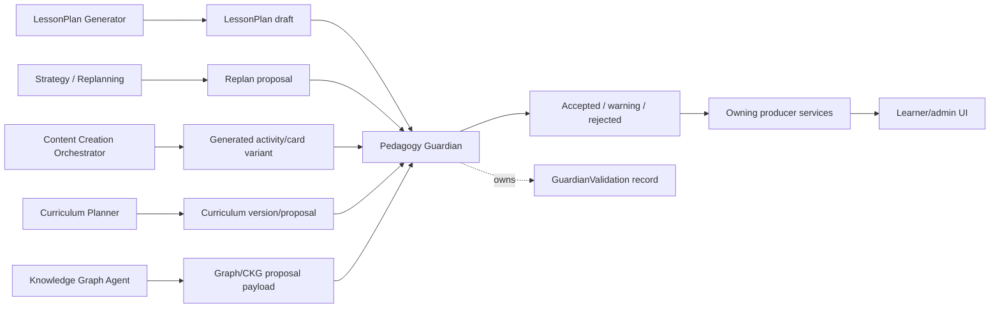

# Pedagogy Guardian

**Functional name:** Pedagogy Guardian  
**Possible display label:** Guardian Review  
**Family:** Governance, validation, and watchtower  
**Primary surface:** Mostly background; review/block states in plan, content, curriculum, graph, and session surfaces  
**Authority class:** Deterministic validation authority  
**Primary truth owner:** `pedagogy-guardian-service` for validation decisions  
**Primary producers:** `session-service`, `content-service`, `curriculum-service`, ingestion/graph proposal paths, agent adapters  
**Main collaborators:** LessonPlan Generator, Strategy / Replanning Agent, Content Creation Orchestrator, Curriculum Planner, Knowledge Graph Agent, AI Mirror / Cognitive Copilot, Watchtower / Governance Layer

## Purpose

Pedagogy Guardian is the independent validation gate for learner-facing pedagogical artifacts.

It exists so that no agent, service, or generator can bypass the rules that make Noema's Step-first learning loop safe, coherent, auditable, and pedagogically meaningful. It accepts, warns, or blocks artifacts before they become active or learner-facing.

The product promise is:

> "Noema can generate and adapt learning experiences, but every learner-facing pedagogical artifact must pass an independent validation gate."

## Product Role

Pedagogy Guardian helps the system answer:

- Is this LessonPlan structurally valid?
- Do these Steps serve the stated goals?
- Is this Activity safe to show?
- Does this generated variant leak the answer?
- Does this replan exceed minimum sufficient change?
- Does this repair mutate already evaluated Steps?
- Is required provenance present?
- Should the producer repair, downgrade, or block the artifact?

Pedagogy Guardian is not a conversational personality. It is a deterministic authority with explainable decisions.

## System Position



Producer services own their artifacts. Guardian owns validation decisions.

## What It Validates

The exact API surface belongs to `pedagogy-guardian-service`, but product architecture should treat the following as Guardian-owned validation domains.

| Artifact | Common producer | Validation purpose |
|---|---|---|
| LessonPlan | LessonPlan Generator / `session-service` | goals, Step sequence, active-goal cap, concept references |
| Step | `session-service` / Strategy | Step objective, activity fit, concept reference, learner-facing safety |
| Activity | `session-service` / `content-service` | prompt validity, scoring/rubric fit, answer leakage |
| Replan | Strategy / Replanning | minimum sufficient scope, no evaluated Step mutation |
| Generated variant | Content Creation Orchestrator / `content-service` | provenance, type fit, leakage, source support |
| Curriculum-bound activation | Curriculum Planner / `curriculum-service` | path constraints where configured |
| Graph proposal payload | Ingestion/KG proposal paths | proposal shape before entering mutation DSL, where configured |

Guardian should not be a universal business-rule bucket. Its core is pedagogical validation for learner-facing artifacts and high-risk proposal payloads.

## When It Appears

Pedagogy Guardian appears:

- before activating a full LessonPlan
- before queueing learner-facing Steps
- before committing Strategy replans
- before storing or making generated activity variants eligible
- before exposing high-risk generated content
- when a curriculum version/proposal requires pedagogical validation
- when graph/ingestion proposal payloads require validation before review
- in UI review states when it blocks or warns
- in audit/provenance details through validation ids

It should not appear as a visible agent in ordinary successful flows unless a surface needs to explain validation status.

## Live Context Pack

Pedagogy Guardian is deterministic, but validation calls still need structured context.

### Artifact Context

- artifact type
- artifact id or draft id
- producer service
- producer agent, if any
- artifact payload
- concept references
- goal references
- source/content references
- provenance references

### Runtime Context

- session id and LessonPlan id, if applicable
- Step queue position
- evaluated versus pending Step status
- active goal count
- replan scope
- prior validation result, if repairing

### Policy Context

- validation rigor level
- enabled rule set/version
- minimum sufficient change constraints
- answer leakage rules
- provenance requirements
- warning versus blocking reason codes
- producer-specific gates

Guardian should receive only the context needed to validate the artifact. It should not need broad learner dossiers.

## Inputs

Guardian may receive:

- LessonPlan/Step/Activity/replan payloads
- generated variant payloads
- source/provenance summaries
- concept and goal references
- producer metadata
- previous Guardian block reason
- validation rigor level

Guardian should not receive:

- authority to mutate producer state directly
- unbounded learner history
- raw private traces unless needed for a specific validation rule
- permission to generate replacement artifacts
- hidden override authority

## Outputs

Guardian produces validation decisions:

- accepted
- accepted with warnings
- rejected/blocked
- reason codes
- repair hints
- validation id
- policy/rule version
- severity
- learner-facing summary, when appropriate
- producer-facing details

More concretely:

| Output | Purpose | Owner |
|---|---|---|
| GuardianValidation record | Durable validation decision | `pedagogy-guardian-service` |
| Reason codes | Explain block/warning | `pedagogy-guardian-service` |
| Producer repair hints | Let generator/producer repair | producer service/agent |
| Learner-facing summary | Explain visible block/change | UI via owning service |
| Rejection event | Observability and audit | event bus/outbox |

Producers should persist or reference the Guardian validation id for accepted and rejected artifacts.

## UI Surfaces

### Session Plan Review

Show Guardian status:

- `Guardian accepted`
- `Guardian blocked`
- `Needs repair`
- `Validated`

Keep details expandable. The learner usually needs "ready/not ready and why", not rule internals.

### Content Workbench

Show item-level validation:

- blocked answer leakage
- weak source support
- invalid activity shape
- missing provenance

Creator/admin views should expose reason codes and repair hints.

### Strategy Plan Change Notice

When a replan is blocked or repaired:

- "The first repair proposal was blocked; Noema generated a smaller repair."
- "Guardian accepted the inserted Step."

### Curriculum / Graph Review

Show Guardian validation as one review dimension, not as the owner of curriculum or graph truth.

## UI Labels

Use compact labels:

- `Guardian accepted`
- `Guardian warning`
- `Guardian blocked`
- `Needs repair`
- `Validation pending`
- `Validated`
- `Rejected`
- `Repairable`
- `Not eligible`
- `Policy block`

## Friendly Why Layer

Plain explanations:

- "This plan is blocked because one Step has no concept reference."
- "This Activity is blocked because the prompt reveals the answer."
- "This replan was too broad for the trigger; a smaller repair is required."
- "This generated item needs stronger source support before session use."
- "Guardian accepted this plan. It is ready for review."

## Technical Provenance Layer

Technical details for audit/debug surfaces:

- GuardianValidation id
- artifact id/type
- producer service
- producer agent/run id
- rule set/version
- validation rigor level
- decision
- reason codes
- warning/block severity
- repair hints
- timestamp
- related events

## Decision Semantics

Guardian decisions should be deterministic and structured.

| Decision | Meaning |
|---|---|
| accepted | Artifact can proceed through owning service workflow |
| warning | Artifact can proceed, but producer/UI should surface caution or metadata |
| rejected | Artifact cannot proceed until repaired or overridden by explicit policy |
| not_applicable | Artifact type is outside Guardian scope |
| error | Validation failed operationally; producer must follow fail-closed/fail-open policy |

Production learner-facing paths should generally fail closed for required Guardian validations.

## Reason Code Families

Suggested reason-code families:

- missing concept reference
- Step does not serve goal
- active-goal cap exceeded
- invalid activity payload
- answer leakage
- unsupported factual claim
- weak source grounding
- missing provenance
- invalid scoring/rubric
- replan exceeds minimum sufficient scope
- evaluated Step mutation
- unsafe learner-facing language
- unsupported graph/curriculum proposal shape

These are product-language suggestions, not final wire schemas.

## Review and Repair Flow

```text
producer draft -> Guardian validation -> accepted/warning/rejected -> producer persists or repairs
```

| Blocked artifact | Repair path |
|---|---|
| LessonPlan | LessonPlan Generator repairs and resubmits |
| Step/replan | Strategy repairs, downgrades scope, or defers |
| Generated content | Content Creation Orchestrator repairs or marks needs human review |
| Curriculum proposal | Curriculum Planner revises or routes to human review |
| Graph proposal payload | Knowledge Graph Agent/Ingestion repairs before graph review |

Guardian should not repair artifacts itself. It should produce enough structured feedback for the producer to repair.

## Authority Boundaries

Guardian may:

- validate artifacts
- accept, warn, or reject
- persist validation decisions
- emit rejection/validation events
- produce reason codes and repair hints
- enforce minimum sufficient replan scope
- enforce learner-facing artifact constraints

Guardian must never:

- generate LessonPlans, Steps, content, or curricula
- own session, graph, content, curriculum, scheduler, or evaluation facts
- mutate producer state directly
- act as a learner-facing personality
- become a generic governance/safety agent
- make hidden product decisions outside validation rules
- silently allow required validations to be bypassed in production

## Validation Ownership

| Fact or decision | Owner |
|---|---|
| Guardian decision | `pedagogy-guardian-service` |
| Session activation and Step queue | `session-service` |
| Generated content provenance/review state | `content-service` |
| Curriculum version/progress | `curriculum-service` |
| Graph canonical state | `knowledge-graph-service` |
| Evaluation and Trigger facts | `metacognition-service` |
| Schedule/readiness state | `scheduler-service` |
| Privacy/intrusion policy | Watchtower / Governance Layer |

## States

Suggested validation states:

```text
not_submitted
pending
accepted
warning
rejected
repair_requested
resubmitted
superseded
error
```

Suggested producer response states:

```text
blocked
repairing
deferred
human_review_required
eligible
activated
archived
```

These are product-language suggestions, not final wire schemas.

## Failure Modes

| Failure mode | Product risk | Mitigation |
|---|---|---|
| Guardian bypass | Invalid artifacts reach learners | Independent service and producer ports |
| Rule drift across producers | Inconsistent validation | Centralized rule owner |
| Over-broad Guardian scope | Business logic dumping ground | Keep scope pedagogical |
| Opaque blocks | Creators cannot repair | Structured reason codes |
| Learner-visible rule noise | UI feels bureaucratic | Friendly summaries and expandable details |
| Fail-open in production | Unsafe exposure | Required validations fail closed |
| Guardian as personality | Confuses agent council | Deterministic authority framing |
| Duplicate fact ownership | Architecture drift | Decisions only, no artifact ownership |

## Example UI Copy

Session:

- "Guardian accepted this plan. It is ready to start."
- "Guardian blocked Step 4 because it has no concept reference."
- "The repair Step was accepted. The remaining plan is unchanged."

Content:

- "Guardian blocked this Activity because the prompt reveals the answer."
- "This generated item needs stronger source support before session use."
- "Accepted with warning: the source is valid, but the explanation should be reviewed."

Replan:

- "This replan was too broad for the trigger. A smaller repair is required."
- "Guardian accepted the local repair. No completed Steps were changed."

## Open Design Notes

- Audit Batch 11 docs for over-broad Guardian calls on curriculum, ingestion, and graph proposal paths; clarify which are hard requirements versus future/configured gates.
- Define the exact learner-facing summaries for each reason-code family.
- Decide where Guardian warnings appear in UI versus admin-only details.
- Define production fail-closed/fail-open behavior for each producer path.
- Clarify how Guardian relates to Watchtower / Governance Layer: Guardian validates pedagogy; Watchtower governs privacy, intrusiveness, audit, and policy.
