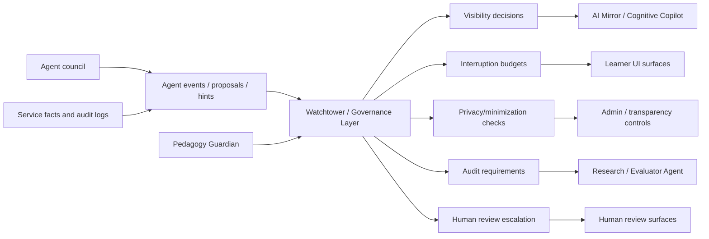

# Watchtower / Governance Layer

**Functional name:** Watchtower / Governance Layer  
**Possible display labels:** Watchtower, Governance Controls, Transparency  
**Family:** Governance, privacy, audit, and policy  
**Primary surface:** Mostly background; transparency controls, admin audit tools, Copilot governance warnings  
**Authority class:** Cross-cutting policy and visibility layer  
**Primary truth owners:** policy owners vary by domain; Watchtower owns governance decisions only where explicitly implemented  
**Primary validators:** privacy policy, audit policy, intrusiveness policy, role/access policy  
**Main collaborators:** Pedagogy Guardian, AI Mirror / Cognitive Copilot, Research / Evaluator Agent, Knowledge Graph Agent, Taxonomy Curator, Strategy / Replanning Agent, all learner-facing agents

## Purpose

Watchtower governs whether Noema's agent council is behaving responsibly across privacy, intrusiveness, auditability, transparency, and policy boundaries.

Pedagogy Guardian validates pedagogical artifacts. Watchtower governs the conditions around agent behavior: what can be shown, when an agent may interrupt, which data can be used, what must be auditable, which actions require review, and how the learner can understand or control agent surfacing.

The product promise is:

> "Noema can be agent-rich without becoming opaque, invasive, noisy, or unaccountable."

## Product Role

Watchtower helps the system and user answer:

- Is this agent allowed to use this data?
- Is this observation safe to show to the learner?
- Is the learner being interrupted too often?
- Has this claim been validated or sourced?
- Which actions need human review?
- Can this proposal be audited later?
- Are sensitive traces minimized?
- Are older/stale hints being hidden?
- Are governance controls visible enough?

It is not a tutor, coach, content creator, or graph curator. It is the layer that keeps those agents within acceptable product and policy behavior.

## Relationship To Pedagogy Guardian

Watchtower and Pedagogy Guardian are related but not interchangeable.

| Concern | Pedagogy Guardian | Watchtower |
|---|---|---|
| LessonPlan/Step validity | Owns validation decision | May audit validation coverage |
| Answer leakage in activity | Blocks/warns | May track rejection patterns |
| Minimum sufficient replan | Validates | Monitors intrusiveness/frequency |
| Privacy of trace detail | Not primary owner | Owns/validates visibility policy |
| Agent interruption budget | Not primary owner | Owns/monitors policy |
| Audit completeness | References validation id | Monitors cross-agent auditability |
| Learner transparency controls | Not primary owner | Owns product/policy surface |

Guardian is a deterministic pedagogical gate. Watchtower is cross-cutting governance.

## System Position



Watchtower can observe Guardian decisions, but it should not replace Guardian validation.

## Governance Domains

Watchtower should cover several domains.

| Domain | Questions |
|---|---|
| Privacy | Is data minimized? Is raw trace exposure necessary? |
| Intrusiveness | Is the learner interrupted too often or at bad moments? |
| Transparency | Can the learner understand why an agent acted? |
| Auditability | Can proposals, validations, overrides, and user actions be traced? |
| Role/access | Is this admin/curator/teacher/learner allowed to see or act? |
| Staleness | Is a hint/proposal still valid? |
| Safety language | Is learner-facing language respectful and non-identifying? |
| Human review | Which proposals require review before activation/promotion? |
| Policy versioning | Which policy version governed this action? |

## When It Appears

Watchtower appears:

- silently before surfacing sensitive Copilot hints
- silently when agents request access to sensitive context
- silently when interruption budgets are checked
- in transparency/audit controls
- in admin governance dashboards
- when a learner opens "why am I seeing this?"
- when a policy blocks or hides an agent suggestion
- when a human review/escalation is required
- when Research / Evaluator flags a governance trend
- when graph/content/curriculum proposals need role-based review

It should not become a chatty visible agent. Most of its value is in making the system calm and accountable.

## Live Context Pack

Every governance decision receives a bounded context pack.

### Action Context

- proposed agent action
- source agent/service
- target surface
- artifact type
- learner-facing text, if any
- requested data classes
- proposed user action
- source provenance

### User and Role Context

- role
- permissions
- learner preferences
- visibility settings
- accessibility settings
- recent dismissals
- opt-outs or reduced-frequency settings

### Session and Surface Context

- active Step/session state
- whether learner is mid-answer
- recent interruption count
- session duration and fatigue signals
- page/surface category
- hint freshness/validity

### Policy Context

- privacy policy version
- intrusion budget rules
- audit requirements
- human review thresholds
- sensitive category rules
- role/access rules
- data retention/minimization rules

Watchtower should use policy-specific context, not broad arbitrary learner data.

## Inputs

Watchtower may use:

- agent events and proposals
- service audit logs
- Guardian validation records
- `agentHints` categories and validity
- user roles and preferences
- privacy classifications
- learner-facing text candidates
- recent interruption/fatigue summaries
- human review state
- policy versions

Watchtower should not receive:

- authority to alter Evaluation truth
- authority to mutate graph/content/curriculum facts directly
- unbounded raw traces without a policy need
- permission to silently override service ownership
- open-ended conversational duties

## Outputs

Watchtower produces governance decisions and UI filters:

- allow/hide/suppress surface decision
- require review decision
- privacy/minimization warning
- interruption budget decision
- audit requirement
- stale/expired hint decision
- role/access denial
- transparency summary
- escalation route

More concretely:

| Output | Purpose | Consumer |
|---|---|---|
| Visibility decision | decide whether a hint/explanation appears | AI Mirror / UI |
| Intrusion budget result | allow, defer, or suppress interruption | learner-facing agents |
| Privacy classification | constrain trace/source exposure | UI/admin surfaces |
| Audit requirement | ensure action is traceable | source services |
| Human review requirement | route to curator/admin/teacher | review workbench |
| Governance warning | notify admin or learner when useful | Copilot/admin dashboard |
| Policy version reference | make behavior auditable | event/log stores |

## UI Surfaces

### Learner Transparency Controls

Learners should be able to see and control:

- why a suggestion appeared
- which source produced it
- whether it is current or expired
- how often this kind of suggestion can appear
- whether a category is hidden/reduced
- what data type was used at a friendly level

### Cognitive Copilot Governance

Watchtower should filter Copilot items:

- hide stale hints
- group low-priority items
- suppress repeated dismissed categories
- elevate important policy/safety warnings
- label privacy-sensitive items carefully

### Admin Governance Dashboard

Admins/curators should see:

- agent action audit trails
- validation coverage gaps
- review queue pressure
- privacy/minimization warnings
- interruption and dismissal trends
- policy version changes
- blocked or escalated actions

### Proposal Review Surfaces

For graph/content/curriculum/taxonomy changes, Watchtower can add review requirements:

- role required
- policy reason
- audit fields
- privacy notes
- escalation state

## UI Labels

Use compact labels:

- `Hidden by policy`
- `Reduced`
- `Needs review`
- `Privacy-sensitive`
- `Audit required`
- `Expired`
- `Too frequent`
- `Deferred`
- `Allowed`
- `Escalated`
- `Role required`

## Friendly Why Layer

Plain explanations:

- "This suggestion is hidden because it uses a sensitive trace detail."
- "Noema is showing fewer repair prompts because this session is already heavy."
- "This graph proposal needs curator review before it can affect shared knowledge."
- "This hint expired because it depended on a previous Step."
- "You are seeing this because it affects the current session plan."

## Technical Provenance Layer

Technical details for audit/admin surfaces:

- governance decision id
- policy version
- source agent/service
- artifact id/type
- surface id
- privacy class
- role/access class
- intrusion budget state
- visibility decision
- review requirement
- audit log reference
- user action/dismissal reference

## Intrusiveness Budget

Watchtower should define and enforce product-level interruption budgets.

Examples:

- no more than one visible repair suggestion after a Step
- no full debugger reflection after every Step
- no Copilot auto-open during active answering except critical events
- defer low-priority repairs when fatigue is high
- suppress repeated hints after dismissal
- group multiple low-priority governance notes

The goal is not silence. The goal is timing, restraint, and learner control.

## Privacy And Data Minimization

Watchtower should treat cognitive traces as sensitive.

Rules to preserve:

- summarize raw traces by default
- expose deeper trace details only on explicit request or appropriate role
- avoid identity-like claims
- keep learner corrections and dismissals private unless needed in aggregate
- ensure generated transparency snippets do not leak other users' data
- require aggregation thresholds for Research/Evaluator outputs

## Review and Handoff Rules

Watchtower should route rather than own domain changes.

| Situation | Handoff |
|---|---|
| pedagogical artifact invalid | Pedagogy Guardian |
| graph proposal needs review | Knowledge Graph admin/curator workflow |
| taxonomy drift | Taxonomy Curator |
| prompt/regression governance | Research / Evaluator and product review |
| privacy-sensitive UI item | Copilot/UI visibility filter |
| repair overload | Patch Planner / Strategy deferral |
| role/access mismatch | owning service access policy |
| audit gap | owning service/admin dashboard |

## Authority Boundaries

Watchtower may:

- filter or defer UI surfacing
- enforce intrusiveness budgets
- require human review
- classify privacy sensitivity
- require audit/provenance references
- surface transparency controls
- flag governance drift
- coordinate policy escalation

Watchtower must never:

- own pedagogical validation decisions that belong to Pedagogy Guardian
- own service facts
- mutate graph/content/curriculum/session/evaluation state directly
- become a general chatbot
- hide critical safety/policy warnings without trace
- expose sensitive raw learner data unnecessarily
- silently change agent prompts or production policy without review
- use governance as a vague catch-all for missing domain logic

## Validation and Review Gates

| Gate | Applied to | Owner |
|---|---|---|
| Privacy visibility | sensitive traces, source data, dashboard snippets | Watchtower |
| Intrusiveness | interruption frequency/timing | Watchtower |
| Pedagogical artifact validity | LessonPlans, Steps, activities, replans | Pedagogy Guardian |
| Role/access | admin/curator/teacher/learner actions | owning service + Watchtower policy |
| Audit completeness | action/proposal/validation traceability | owning service + Watchtower |
| Research transparency | aggregate reports/snippets | Research/Evaluator + Watchtower |

## States

Suggested governance states:

```text
allowed
deferred
suppressed
hidden_by_policy
needs_review
escalated
expired
audit_required
role_denied
privacy_blocked
```

Suggested governance domains:

```text
privacy
intrusiveness
transparency
audit
role_access
staleness
human_review
policy_version
```

These are product-language suggestions, not final wire schemas.

## Failure Modes

| Failure mode | Product risk | Mitigation |
|---|---|---|
| Governance sprawl | Domain logic becomes vague | Route to owning services |
| Over-suppression | Learner misses useful guidance | Explain and allow category controls |
| Under-suppression | Product feels invasive/noisy | Intrusiveness budgets |
| Privacy leakage | Sensitive trace exposure | Minimization and visibility gates |
| Hidden policy decisions | Trust loss | Audit decisions and transparency copy |
| Duplicating Guardian | Confused validation authority | Separate pedagogy validation from governance |
| Stale hints | Bad action suggestions | Freshness and expiry rules |
| Role confusion | Unauthorized review/action | Role/access gates |

## Example UI Copy

Learner:

- "Noema is showing fewer repair prompts because this session is already heavy."
- "This hint expired because it depended on a previous Step."
- "This reflection is hidden by default because it uses detailed trace data. You can open it if you want more detail."
- "You dismissed this category twice, so Noema will keep it quieter for now."

Admin:

- "This graph proposal requires curator review because it affects shared canonical knowledge."
- "Audit required: generated content was edited after Guardian acceptance."
- "Privacy review needed before this Research/Evaluator snippet can be learner-facing."

Copilot:

- "Hidden by policy: this item is stale."
- "Deferred: low-priority repair suggestion during active Step."

## Open Design Notes

- Decide whether Watchtower is implemented as a service, shared policy module, UI layer, or staged combination.
- Define exact interruption-budget thresholds by surface and session type.
- Audit old `Governance Agent` docs and decide which responsibilities belong to Watchtower, Pedagogy Guardian, Knowledge Graph governance, or admin workflows.
- Define the learner-facing transparency controls for muting categories and inspecting data use.
- Define how Watchtower policy decisions are logged without creating excessive audit volume.
