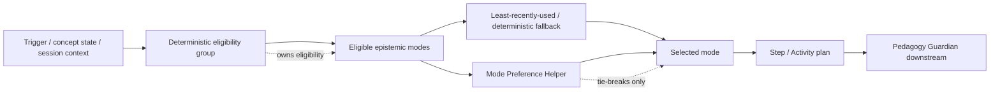

# Mode Preference Helper

**Functional name:** Mode Preference Helper  
**Possible display label:** usually none; occasionally "Mode choice" in details  
**Family:** Helper / routing support  
**Primary surface:** Background; explainable in LessonPlan, Step details, or Copilot when relevant  
**Authority class:** Tie-breaker and preference helper  
**Primary truth owner:** deterministic mode eligibility rules and the service invoking them  
**Primary validators:** shared deterministic mode-routing rules; Pedagogy Guardian downstream for learner-facing Steps  
**Main collaborators:** LessonPlan Generator, Strategy / Replanning Agent, Content Creation Orchestrator, Socratic Tutor, AI Mirror / Cognitive Copilot

## Purpose

The Mode Preference Helper assists with choosing one epistemic mode when deterministic routing has already established the eligible group and more than one mode remains reasonable.

It is intentionally small. It does not decide what the learner needs, invent teaching approaches, override Triggers, or choose arbitrary modes. It helps with preference-sensitive, variety-sensitive, or explanation-sensitive selection inside an already-valid mode set.

The product promise is:

> "When several valid ways to practice are available, Noema can choose the one that best fits the learner, the recent session history, and the current product moment."

## Product Role

The Mode Preference Helper helps the system answer:

- Which eligible mode should this Step use?
- Has this mode been used too recently?
- Is this learner currently overloaded by a certain interaction style?
- Would a quieter mode better fit this moment?
- Is a Socratic mode appropriate, or should the Step use direct application?
- Should a generated variant use comparison, explanation, transfer, or recall?
- How can the system explain the mode choice without pretending it was agent whim?

It is a helper, not a visible personality. Most users should never encounter it by name.

## Relationship To Deterministic Mode Routing

Current ADRs require deterministic routing across all epistemic modes. The helper must respect that.



The helper can only operate after eligibility is established. If deterministic routing says a mode is not eligible, the helper cannot select it.

## When It Appears

The Mode Preference Helper appears:

- during LessonPlan generation when a Step has multiple valid modes
- during Strategy/Replanning when a repair Step needs a mode
- during Content Generation when producing variants for an eligible mode group
- when transformation cycling leaves multiple valid choices
- when recent mode history suggests avoiding repetition
- when learner preference or accessibility context can choose among valid modes
- when the UI needs a concise "why this mode?" explanation

It should not appear as its own sidebar agent, chat assistant, or learner-facing coach.

## Live Context Pack

Every run receives a small context pack.

### Eligibility Context

- eligibility group
- candidate modes
- deterministic fallback choice
- trigger type, if any
- concept state
- Step objective
- allowed transformations

### Recent History Context

- recent modes used
- recent transformations used
- current session mode distribution
- repeated failures with a mode, if service-owned
- learner dismissals or overload signals

### Preference Context

- learner mode preferences
- accessibility constraints
- current study mode
- session goal
- desired interaction intensity
- fatigue/frustration signal

### Policy Context

- deterministic routing constraints
- least-recently-used fallback rules
- forbidden modes
- Guardian constraints for downstream artifact
- explanation requirements

The helper should not need broad learner history. It needs current eligible choices and recent mode context.

## Inputs

The helper may use:

- candidate eligible modes
- deterministic fallback result
- recent mode/transform history
- learner preferences
- Step objective
- session goal
- current Trigger summary
- overload/accessibility signals

The helper should not receive:

- authority to create new eligibility groups
- authority to override Trigger routing
- authority to mutate Step/session state directly
- unbounded learner history
- authority to select ineligible modes

## Outputs

The helper produces:

- selected mode
- tie-break rationale
- fallback reason
- avoided mode reason
- uncertainty note when choices are equivalent

More concretely:

| Output | Purpose | Consumer |
|---|---|---|
| Mode selection | Choose one valid mode | LessonPlan/Strategy/Content Generation |
| Rationale | Explain tie-break | Step details / Copilot |
| Avoidance note | Explain why a mode was skipped | planner/debug details |
| Fallback result | Deterministic default when no preference applies | invoking service |

## UI Surfaces

### Step Details

Mode choice may appear as a small detail:

- "Mode: comparison"
- "Chosen to avoid repeating recall."
- "Chosen because this repair targets a concept boundary."

### LessonPlan Review

Show mode distribution only when useful:

- "This plan uses comparison first, then transfer."
- "Socratic mode appears once, not throughout the session."

### Cognitive Copilot

Only surface if the learner asks "why this?" or if mode choice explains a plan change:

- "This Step uses contrast because two concepts were recently confused."

## UI Labels

Use compact labels:

- `Mode selected`
- `Eligible`
- `Tie-break`
- `Avoided repeat`
- `Learner preference`
- `Accessibility fit`
- `Fallback`
- `Why this mode?`

## Friendly Why Layer

Plain explanations:

- "This mode was eligible, and it has not been used recently."
- "I chose comparison because the repair targets a concept boundary."
- "Socratic mode was available, but a direct application Step fits the current session better."
- "This is the deterministic fallback; the eligible options were otherwise equivalent."
- "This mode was avoided because similar prompts already appeared twice in this session."

## Technical Provenance Layer

Technical details for audit/debug surfaces:

- eligibility group
- candidate modes
- selected mode
- deterministic fallback
- recent mode history window
- trigger type
- Step id / LessonPlan id
- helper rule/prompt version, if any
- invoking service/agent
- rationale

## Decision Rules

The helper should follow a strict order:

1. Respect deterministic eligibility group.
2. Remove ineligible or forbidden modes.
3. Respect hard accessibility and safety constraints.
4. Prefer least-recently-used mode if no stronger local preference exists.
5. Use learner preference only among valid choices.
6. Avoid mode repetition that would reduce learning variety.
7. Prefer the simplest explanation when choices are equivalent.

If the helper cannot improve on deterministic fallback, it should return the fallback.

## User Actions

Most mode choices are not direct user actions. The learner may:

- inspect why this mode was selected
- request less Socratic guidance
- request more direct practice
- mark a mode as tiring
- set accessibility or interaction preferences
- dismiss a mode explanation

User preference should influence future choices only within valid eligibility groups.

## Review and Handoff Rules

Mode selection is not final artifact validation.

```text
eligible group -> helper tie-break -> Step/Activity draft -> Guardian validation downstream
```

| Situation | Handoff |
|---|---|
| LessonPlan Step mode selected | LessonPlan Generator uses it in draft |
| Repair Step mode selected | Strategy/Patch Planner uses it for repair proposal |
| Content variant mode selected | Content Creation Orchestrator drafts matching content |
| Mode explanation needed | AI Mirror/Copilot surfaces source-bound rationale |
| Mode causes repeated dismissal | Research/Evaluator or Watchtower may inspect trend |

## Authority Boundaries

The helper may:

- choose among eligible modes
- explain a mode tie-break
- use recent history and preferences
- recommend deterministic fallback
- flag that choices are equivalent

The helper must never:

- create new modes
- select ineligible modes
- override Trigger routing
- override deterministic eligibility groups
- mutate session state directly
- decide learner diagnosis
- replace Strategy/Replanning or LessonPlan Generator
- become a teaching-approach service without ADR
- use preference to bypass pedagogy constraints

## Validation and Review Gates

| Gate | Applied to | Owner |
|---|---|---|
| Eligibility group | mode candidates | shared deterministic mode rules |
| Recent mode history | repetition/variety | invoking service/read model |
| Step validity | mode fits Step objective/activity | Pedagogy Guardian downstream |
| User preference | preference storage/visibility | user/profile service or invoking surface |
| Intrusiveness | mode explanations and surfacing | Watchtower / Governance Layer |

## States

Suggested helper result states:

```text
selected
fallback_used
preference_used
repeat_avoided
accessibility_constraint_applied
equivalent_choices
no_valid_mode
```

Suggested explanation labels:

```text
trigger_fit
concept_fit
variety
learner_preference
accessibility
fallback
repair_fit
```

These are product-language suggestions, not final wire schemas.

## Failure Modes

| Failure mode | Product risk | Mitigation |
|---|---|---|
| Hidden strategy brain | Architecture drift | Tie-break only |
| Ineligible mode selected | Invalid Step | Deterministic gate first |
| Preference overrides pedagogy | Bad learning fit | Preferences only among valid choices |
| Mode repetition | Rote practice | recent history/LRU |
| Overexplaining mode choices | UI noise | Details on demand |
| Recreating teaching approaches | Old abstraction returns | Use epistemic modes directly |
| Learner loses agency | Frustration | preference controls and dismissals |

## Example UI Copy

Step detail:

- "Mode: comparison. Chosen because the repair targets a concept boundary."
- "Mode: application. Socratic mode was eligible, but this Step is meant to test transfer."
- "Mode: explanation. This avoids repeating recall from the previous Step."

Fallback:

- "The eligible modes were equivalent, so Noema used the deterministic fallback."
- "This mode was selected because it has not appeared recently in this session."

Preference:

- "Your preference for direct practice was used here because both modes were valid."
- "Socratic mode was reduced for this session because you marked it as tiring."

## Open Design Notes

- Decide whether this helper is implemented as pure deterministic rules, a tiny agent prompt, or a hybrid with strict fallback.
- Define where learner mode preferences are stored.
- Audit older teaching-approach docs to make sure they do not reintroduce a high-level TeachingApproach layer above epistemic modes.
- Decide whether mode explanations appear in Step details only or also in Copilot.
- Define how accessibility preferences constrain mode choices.
