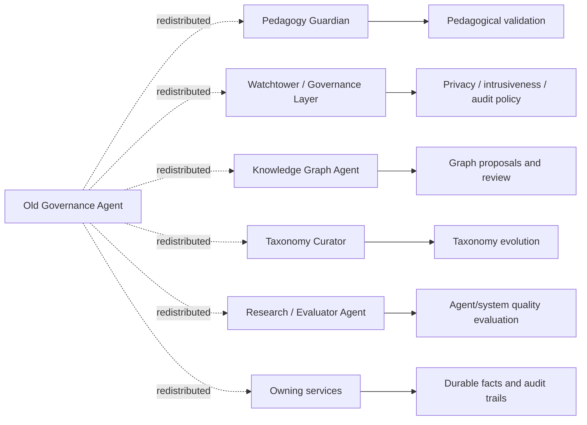

# Governance Agent

**Functional name:** Governance Agent  
**Current status:** Superseded as a broad standalone agent  
**Recommended display label:** none  
**Family:** Historical / redistributed responsibilities  
**Former surface:** background governance, safety, quality control, graph cleanup, audit  
**Current owners:** Pedagogy Guardian, Watchtower / Governance Layer, Knowledge Graph Agent, Taxonomy Curator, Research / Evaluator Agent, service-specific admin workflows  
**Primary validators:** depends on domain; do not route all governance through one agent

## Purpose

Older Noema docs used "Governance Agent" as a broad umbrella for safety monitoring, validation, graph governance, quality control, audit, taxonomy cleanup, and policy enforcement.

That role should not survive as a single agent. It is too broad, and it blurs authority. The useful responsibilities remain, but they are redistributed to narrower owners with explicit boundaries.

The product promise is:

> "Noema can be governed without hiding many unrelated powers inside one vague Governance Agent."

## Why It Is Superseded

The old role conflicts with the current agent council model because it can become:

- a second Pedagogy Guardian
- a vague safety agent
- a graph curator without graph ownership rules
- a hidden policy override layer
- an audit bucket for missing provenance
- a generic "quality control" personality

The current architecture needs sharper boundaries:

- Pedagogy Guardian validates pedagogical artifacts.
- Watchtower governs privacy, intrusiveness, transparency, auditability, and review escalation.
- Knowledge Graph Agent proposes graph changes through graph-owned workflows.
- Taxonomy Curator proposes taxonomy evolution.
- Research / Evaluator studies system and agent quality.
- Owning services persist facts, artifacts, and audit trails.

## Responsibility Redistribution

| Old Governance Agent responsibility | New owner / collaborator |
|---|---|
| Validate LessonPlans, Steps, replans, generated variants | Pedagogy Guardian |
| Enforce minimum sufficient replan scope | Pedagogy Guardian + Strategy / `session-service` |
| Monitor privacy and trace visibility | Watchtower / Governance Layer |
| Manage interruption budgets | Watchtower / Governance Layer |
| Surface transparency/audit controls | Watchtower + AI Mirror / Cognitive Copilot |
| Review graph proposals | Knowledge Graph Agent + graph admin workflows |
| Enforce CKG mutation guardrails | `knowledge-graph-service` |
| Track agent quality/regressions | Research / Evaluator Agent |
| Evolve failure/content/graph taxonomies | Taxonomy Curator |
| Require human review | Watchtower or domain-specific review workflow |
| Persist audit logs | owning service |

No single agent should own all these concerns.

## System Position

## What Still Has A Place

The old Governance Agent pointed at real needs:

- independent validation
- auditability
- agent accountability
- graph proposal review
- privacy controls
- safety and policy surfacing
- human-in-the-loop escalation
- quality monitoring
- taxonomy drift detection

Keep all of those. Do not keep the overloaded agent identity.

## What Must Not Return

Do not rebuild Governance Agent as:

- a super-agent above all other agents
- a general safety chatbot
- a duplicate Guardian
- a graph mutation authority
- a hidden policy override mechanism
- a replacement for service-owned audit logs
- an all-purpose admin assistant that can mutate any domain

## UI Presence

There should be no learner-visible "Governance Agent" persona.

The user-facing value appears through:

- Guardian review states
- Watchtower transparency controls
- Copilot warnings and visibility explanations
- graph review/admin queues
- taxonomy review workbench
- research/admin quality dashboards
- service-specific audit logs

When UI copy needs a governance explanation, use the owning concept:

- "Guardian blocked this Step..."
- "Hidden by policy..."
- "Curator review required..."
- "Audit required..."
- "This graph proposal needs review..."

Avoid:

- "Governance Agent decided..."
- "Governance says..."
- "The system governance personality..."

## Migration Guidance

When older docs mention "Governance Agent", translate as follows:

| Older phrase | New interpretation |
|---|---|
| "Governance Agent validates content" | Pedagogy Guardian validates generated learner-facing artifacts |
| "Governance Agent reviews graph changes" | Knowledge Graph Agent proposes; graph admin workflow reviews |
| "Governance Agent monitors safety" | Watchtower governs privacy/intrusiveness/policy surfacing |
| "Governance Agent audits agents" | Research / Evaluator reports quality; services own audit logs |
| "Governance Agent curates categories" | Taxonomy Curator proposes versioned taxonomy changes |
| "Governance Agent blocks a session" | Guardian or owning service blocks based on explicit policy |

## Live Context Pack Implication

Do not create a broad governance context pack with access to everything.

Route context to the correct owner:

| Need | Context pack target |
|---|---|
| Validate Step/replan/content | Pedagogy Guardian |
| Decide hint visibility | Watchtower |
| Explain governance warning | AI Mirror / Cognitive Copilot using Watchtower source |
| Review graph proposal | Knowledge Graph Agent / graph admin |
| Evaluate prompt regression | Research / Evaluator |
| Propose taxonomy change | Taxonomy Curator |
| Inspect audit trail | owning service/admin surface |

## Authority Boundaries

The redistributed role may:

- explain why the old Governance Agent was split
- map stale docs to current owners
- preserve useful governance concerns
- help audit old contracts and registry entries

It must never:

- be implemented as a current standalone agent
- own all governance facts
- bypass Guardian or Watchtower
- mutate any domain directly
- become an all-purpose admin superuser
- appear to learners as a personality

## Audit Targets

Known stale areas:

- `docs/architecture/AGENT_MCP_TOOL_REGISTRY.md`
- `docs/phases/PHASE_0_CHECKLIST.md`
- `docs/templates/AGENT_CLASS_SPECIFICATION.md`
- `docs/instructions/PROJECT_CONTEXT.md`
- `docs/instructions/FEATURE_knowledge_graph.md`
- knowledge-graph implementation docs that mention governance agents

## Failure Modes

| Failure mode | Product risk | Mitigation |
|---|---|---|
| Super-agent returns | Authority becomes opaque | Split by domain owner |
| Duplicate Guardian | Conflicting validation decisions | Guardian owns pedagogy validation |
| Generic safety bucket | Policy becomes vague | Watchtower owns explicit governance domains |
| Graph governance bypass | Bad CKG changes | Graph workflow owns canonical mutation review |
| Audit not owned | No forensic trail | Services persist audit logs |
| User-facing confusion | Too many agent voices | No Governance Agent persona |

## Example Replacement Copy

Instead of:

- "Governance Agent blocked this artifact."

Use:

- "Guardian blocked this Activity because the prompt reveals the answer."
- "Hidden by policy because this hint uses sensitive trace detail."
- "Curator review is required before this graph proposal can affect shared knowledge."
- "Audit required because generated content was edited after validation."

## Open Design Notes

- Decide whether this historical redistribution doc remains long-term or is folded into Watchtower/Pedagogy Guardian docs.
- Audit all `Governance Agent` registry and contract entries after the agent council docs are complete.
- Decide whether any old governance MCP tools should be renamed to Watchtower, Guardian, graph admin, or evaluator tools.
