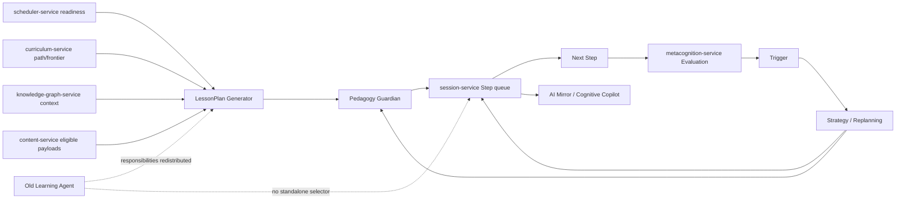

# Learning Agent

**Functional name:** Learning Agent  
**Current status:** Superseded as standalone next-card selector  
**Recommended display label:** none  
**Family:** Historical / redistributed responsibilities  
**Former surface:** background session/card selection  
**Current owners:** `session-service`, `scheduler-service`, LessonPlan Generator, Strategy / Replanning Agent, Mode Preference Helper, AI Mirror / Cognitive Copilot  
**Primary validators:** `pedagogy-guardian-service` for Step/LessonPlan artifacts; deterministic scheduler/mode rules for readiness and routing

## Purpose

The old Learning Agent selected the next card based on learning mode, graph context, and spaced-repetition schedule.

That role should not return as a standalone agent. Noema's realignment moved the product from card-first sessions to Step-first sessions. The runtime learning unit is now the Step, and every session has a LessonPlan.

The useful parts of the old Learning Agent survive, but they are distributed across the architecture.

The product promise is:

> "Noema still chooses what to learn next intelligently, but that choice is now visible through session plans, Steps, scheduler readiness, graph context, and validated replans instead of a hidden next-card agent."

## Why It Is Superseded

The old role conflicts with the current architecture in four ways:

1. It centers cards instead of Steps.
2. It hides planning inside a selector instead of making LessonPlans reviewable.
3. It risks duplicating scheduler, graph, and session truth.
4. It can bypass Guardian if it directly chooses runtime learner-facing artifacts.

Current ADRs establish:

- Step is the atomic learning unit.
- Every session has a LessonPlan.
- `session-service` owns LessonPlans, Steps, Activities, Step queues, and replans.
- `scheduler-service` owns schedule/readiness state.
- `metacognition-service` owns Evaluations and Triggers.
- Pedagogy Guardian validates learner-facing plans, Steps, replans, and generated variants.

## Responsibility Redistribution

| Old Learning Agent responsibility | New owner / collaborator |
|---|---|
| Select next card | `session-service` presents next Step from Step queue |
| Choose what concept to study | `scheduler-service` readiness + Curriculum/LessonPlan inputs |
| Build session intent | LessonPlan Generator |
| Choose Step sequence | LessonPlan Generator, then `session-service` runtime |
| React to failures mid-session | Strategy / Replanning Agent |
| Select repair shape | Patch Planner + Strategy |
| Choose epistemic mode | deterministic eligibility + Mode Preference Helper |
| Query graph context | Knowledge Graph Agent/read models |
| Query content candidates | `content-service` / Content Creation Orchestrator where missing |
| Explain why this is next | LessonPlan Generator, Strategy, AI Mirror / Cognitive Copilot |

This preserves the useful behavior while removing the hidden "one agent decides learning" bottleneck.

## System Position



The "next thing to do" emerges from a validated LessonPlan and Step queue, not a card selector.

## What Still Has A Place

The old Learning Agent had good instincts. Keep these as capabilities:

- integrate schedule readiness and graph context
- avoid presenting material with missing prerequisites
- adapt after learning evidence changes
- explain why the next activity is useful
- detect content coverage gaps
- respect learning mode and epistemic mode constraints
- balance review, repair, transfer, and new material

But each capability should live with the service or agent that owns the relevant truth.

## What Must Not Return

Do not rebuild the old Learning Agent as:

- a next-card selector
- a hidden orchestrator above LessonPlan/session-service
- a service that owns schedule, graph, content, and session decisions together
- a general "learning brain" that bypasses deterministic mode routing
- a runtime actor that queues learner-facing artifacts without Guardian
- a duplicate owner of readiness, mastery, evaluation, or graph state

## UI Presence

There should be no visible Learning Agent persona.

The user-facing value appears through:

- Session Plan Review: "why this session?"
- active Step details: "why this Step?"
- plan-change notices: "why the plan changed"
- Cognitive Copilot summaries
- curriculum frontier/readiness indicators
- scheduler/dashboard readiness explanations

If a user asks "why am I seeing this next?", the answer should come from the owning path:

- LessonPlan Generator for original plan structure
- Strategy/Replanning for runtime plan changes
- scheduler readiness for due/ready state
- Curriculum Planner for path/frontier context
- Knowledge Graph Agent for prerequisite/relationship context

## Live Context Pack Implication

Because there is no standalone Learning Agent, context packs should be routed to the actual owning agent:

| Need | Context pack target |
|---|---|
| Build a session | LessonPlan Generator |
| Adapt active session | Strategy / Replanning |
| Pick among modes | Mode Preference Helper |
| Explain pattern | Mental Debugger / Calibration Coach |
| Explain next action | AI Mirror / Cognitive Copilot |
| Find missing content | Content Creation Orchestrator |
| Resolve graph prerequisite | Knowledge Graph Agent |

Avoid building a monolithic "learning context pack" that recreates the old hidden agent.

## Review and Handoff Rules

Former Learning Agent workflows should be translated:

```text
old: next-card request -> Learning Agent -> card
new: session request -> LessonPlan -> Guardian -> Step queue -> next Step
```

```text
old: failure -> Learning Agent adapts next card
new: Evaluation -> Trigger -> Strategy -> Guardian -> replan/repair Step
```

```text
old: content gap -> Learning Agent asks generator
new: LessonPlan/Curriculum/Content coverage gap -> Content Creation Orchestrator -> content-service review
```

## Authority Boundaries

The redistributed role may:

- explain why old responsibilities moved
- map old tool references to new owners
- help audit stale docs
- preserve useful product capabilities under new ownership

It must never:

- be implemented as a new runtime agent
- select next cards directly
- bypass LessonPlan/Step queue
- own facts from multiple services
- override deterministic mode routing
- bypass Guardian
- appear as a learner-facing personality

## Migration Guidance

When older docs mention "Learning Agent", translate as follows:

| Older phrase | New interpretation |
|---|---|
| "select next card" | `session-service` presents next Step from validated queue |
| "learning agent chooses mode" | deterministic eligibility + Mode Preference Helper |
| "learning agent uses schedule" | scheduler readiness read model informs LessonPlan/session |
| "learning agent uses KG" | KG read models inform planning; KG state remains owned by `knowledge-graph-service` |
| "learning agent requests content" | Content coverage gap routes to Content Creation Orchestrator |
| "learning agent explains next action" | AI Mirror / LessonPlan / Strategy explanation |

## Audit Targets

Known stale areas:

- `docs/architecture/AGENT_MCP_TOOL_REGISTRY.md`
- `docs/instructions/ENTITY_PATTERNS_FOR_NOEMA.md`
- `docs/instructions/PROJECT_CONTEXT.md`
- `docs/phases/PHASE_0_CHECKLIST.md`
- `docs/templates/AGENT_CLASS_SPECIFICATION.md`
- `docs/templates/MCP_TOOL_SPECIFICATION.md`
- Batch 11 content docs that refer to Learning Agent tools

These should be updated after the agent council docs are complete.

## Failure Modes

| Failure mode | Product risk | Mitigation |
|---|---|---|
| Restoring next-card selector | Step-first realignment erodes | Use LessonPlan and Step queue |
| Hidden orchestration | User cannot review session intent | Full plan review and Copilot explanations |
| Duplicate fact ownership | Service boundaries blur | Keep truth with services |
| Agent bypasses Guardian | Invalid artifacts reach learner | Mandatory Guardian validation |
| Over-fragmented replacement | No one explains "why next" | AI Mirror and LessonPlan explanations |
| Old docs mislead implementers | Wrong tools/contracts built | Audit and deprecate old references |

## Example Replacement Copy

Instead of:

- "Learning Agent selected the next card."

Use:

- "The next Step comes from the active LessonPlan and current readiness state."
- "This Step is next because the plan is repairing a prerequisite before continuing."
- "The scheduler marked this concept ready, and the LessonPlan chose a transfer Step."
- "Noema did not choose a new card; it selected the next validated Step."

## Open Design Notes

- Decide whether this historical redistribution doc remains long-term or is folded into README/roster docs later.
- Audit old Learning Agent contracts and registry entries after all agent specs are complete.
- Decide whether any old Learning Agent MCP tools should be renamed, deleted, or mapped to session/content/scheduler tools.
- Clarify Batch 11 content-service references to "Learning Agent query-cards" so they point to the correct current owner.
