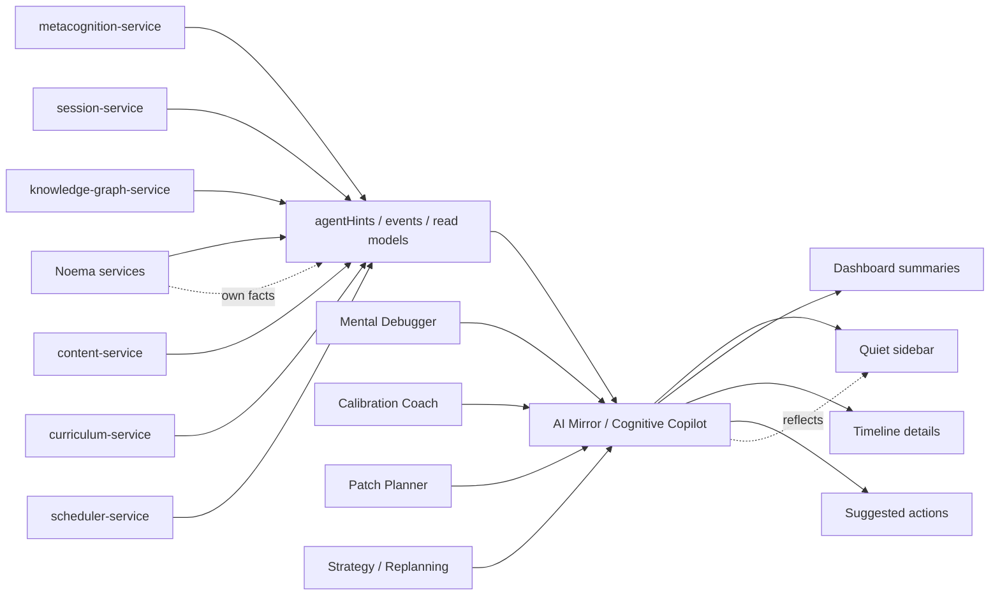

# AI Mirror / Cognitive Copilot

**Functional name:** AI Mirror / Cognitive Copilot  
**Possible display labels:** Cognitive Copilot, AI Mirror  
**Family:** Learner-facing metacognitive and transparency agent  
**Primary surface:** Persistent but quiet sidebar; dashboard summaries; post-Step/session reflection details  
**Authority class:** Structured readout and reflection agent  
**Primary truth owners:** source services that emit facts, events, Evaluations, plans, graph state, content state, and `agentHints`  
**Primary validator:** Watchtower / Governance Layer for intrusiveness and privacy; `pedagogy-guardian-service` for learner-facing pedagogical language where needed  
**Main collaborators:** Mental Debugger, Calibration Coach, Patch Planner, Strategy / Replanning Agent, LessonPlan Generator, Research / Evaluator Agent, Watchtower / Governance Layer

## Purpose

The AI Mirror / Cognitive Copilot reflects Noema's current understanding, reasoning, warnings, and suggested next actions back to the learner in a structured, quiet way.

It is not a general-purpose chatbot, tutor, planner, or diagnostic authority. It is the learner's transparency layer over system observations: why something was suggested, what changed, what is uncertain, what risks exist, and which actions are available.

The product promise is:

> "Noema can show what it is noticing and why it is acting, without turning every observation into an interruption."

## Product Role

The Cognitive Copilot helps the learner answer:

- Why did Noema suggest this?
- What does Noema currently think is important?
- What changed since the last Step/session?
- What is uncertain?
- What should I pay attention to next?
- Which repairs, reviews, or plan changes are available?
- Which system observations are just hints, not facts?
- How can I inspect the reasoning without leaving the task?

The AI Mirror aspect is metacognitive: it reflects the learner's patterns and Noema's observations in careful language. The Cognitive Copilot aspect is product UI: it groups structured hints, warnings, actions, and explanations.

## System Position



The Copilot can aggregate, rank, group, and explain. It does not become a new fact owner.

## Relationship To `agentHints`

Existing plans describe Cognitive Copilot as the UI that consumes structured `agentHints` from API/service responses. That remains the right direction.

`agentHints` are not the agent itself. They are structured service output that the Copilot can surface:

- suggested next actions
- risk factors
- reasoning
- warnings
- alternatives
- confidence/uncertainty
- validity windows
- provenance
- affected concepts/artifacts

The Copilot should also be able to reflect durable read models, timeline events, and agent-authored explanations, but `agentHints` are the core low-friction substrate.

## When It Appears

The AI Mirror / Cognitive Copilot appears:

- as a persistent but quiet sidebar
- when the learner opens "why this?" details
- after a Step with high-signal reflection
- after a session summary
- on dashboards and timelines
- when a plan changes
- when repair suggestions are saved for later
- when generated content/curriculum/graph review requires transparency
- when Watchtower surfaces privacy, overload, or audit controls

It should not interrupt by default. The default stance is available, not pushy.

## Live Context Pack

Every run or rendering pass receives a bounded context pack.

### Surface Context

- current route/page
- active surface type
- whether session is active
- sidebar open/closed state
- active Step/session/curriculum id
- current user action context
- hint validity/freshness

### Hint and Event Context

- current `agentHints`
- recent timeline events
- suggested actions
- warnings and risk factors
- reason strings
- confidence/uncertainty fields
- validity period
- source service
- source agent, if applicable

### Learner Context

- preference for verbosity
- dismissed hints
- hidden categories
- current overload/fatigue signal
- accessibility preferences
- current learning mode

### Agent Reflection Context

- Mental Debugger summaries
- Calibration Coach summaries
- Patch Planner repair availability
- Strategy plan-change rationale
- LessonPlan explanation
- Research/Evaluator high-level transparency snippets

### Policy Context

- privacy visibility rules
- intrusiveness budget
- allowed categories on this surface
- forbidden hidden claims
- Guardian rules for pedagogical explanations
- Watchtower constraints

The Copilot should be educated by live data, but it should not invent new observations beyond what sources provide.

## Inputs

The agent may use:

- `agentHints`
- service read models
- timeline events
- current route/page context
- active Step/session/curriculum references
- validated learner-facing explanations from other agents
- user dismissals and preferences
- governance visibility constraints

The agent should not receive:

- permission to mutate service state directly
- permission to provide open-ended tutoring
- unbounded raw private traces
- authority to produce unvalidated diagnostic claims
- authority to create hidden learner-facing claims

## Outputs

The Copilot produces structured UI artifacts:

- sidebar hint groups
- action cards
- risk/warning summaries
- "why this?" explanations
- timeline annotations
- dashboard summaries
- mirror statements
- quiet reminders
- transparency snippets

More concretely:

| Output | Purpose | Source of truth |
|---|---|---|
| Hint group | Organize related observations | source `agentHints` / service facts |
| Suggested action | Let learner act on a proposal | source service or agent proposal |
| Mirror statement | Reflect a pattern in humane language | metacognition/calibration/debugger summaries |
| Plan explanation | Explain why a session/Step changed | `session-service` / Strategy |
| Risk summary | Surface caution without blocking | source service / Watchtower |
| Transparency snippet | Explain adaptation policy | Research/Evaluator / governance-reviewed source |

## UI Surfaces

### Persistent Sidebar

This is the primary surface.

Recommended structure:

```text
Header: Cognitive Copilot, freshness/status
Sections: Now, Suggested actions, Warnings, Reflections, Provenance
Items: compact title, source, priority, expiry/freshness, action if available
Controls: dismiss, hide category, show why, open related artifact
```

The sidebar should not be a chat box by default. It can include a search/filter or "explain this" action, but its main form is structured readout.

### Post-Step / Post-Session Reflection

The Copilot can summarize other agents:

- "Mental Debugger noticed..."
- "Calibration Coach suggests..."
- "Patch Planner saved..."
- "Strategy changed..."

These should link to the owning agent explanation rather than duplicating it.

### Dashboard

Use dashboard summaries for lower-urgency patterns:

- repeated calibration pattern
- repair inbox items
- plan/curriculum changes
- graph/content review needs
- generated content review burden

### Timeline

Use the timeline for important events only:

- plan generated
- Guardian accepted/blocked
- repair inserted
- learner dismissed a recommendation
- curriculum revision proposed
- graph review accepted/rejected

Ordinary service responses and internal tool calls should not appear.

## UI Labels

Use compact labels:

- `Now`
- `Suggested`
- `Warning`
- `Reflection`
- `Why this?`
- `From session`
- `From graph`
- `From content`
- `From curriculum`
- `Fresh`
- `Expired`
- `Dismissed`
- `Saved`
- `Quiet`

## Friendly Why Layer

Plain explanations:

- "This suggestion comes from the active session plan."
- "This reflection summarizes the last Step; it is not a permanent label."
- "This warning is about review status, not your performance."
- "This repair is saved for later because the current session is already heavy."
- "This generated content is visible here because it still needs review before sessions can use it."

## Technical Provenance Layer

Technical details for audit/debug surfaces:

- source service
- source endpoint/event
- source agent, if applicable
- `agentHints` id/version, if available
- validity period
- priority/category
- related artifact ids
- generated explanation id
- user dismissal/action id
- privacy visibility class
- Copilot rendering run id

The learner should see provenance in a friendly form first. Technical IDs belong in advanced/admin details.

## Mirror Statements

Mirror statements are short reflections. They must be downstream of service-owned evidence.

Good mirror statements:

- "You are recovering faster from cue mismatches this week."
- "The last two repairs were saved for later, so the session stayed focused."
- "Your confidence was cautious today, but the traces were stronger than you expected."
- "Noema is using source-linked content here because this curriculum came from your upload."

Bad mirror statements:

- "You are an overconfident learner."
- "I know why you made that mistake."
- "You should change your study personality."
- "This will definitely fix the problem."

The Mirror should describe observed patterns and system behavior, not identity.

## User Actions

The learner should be able to:

- open/close Copilot
- dismiss hint
- hide category
- show why
- open related Step/session/content/curriculum/graph item
- start suggested repair
- save for later
- mark "not useful"
- request less frequent hints
- inspect provenance
- clear expired hints

Actions should feed future surfacing and Research/Evaluator. Dismissed hints should not be repeated aggressively.

## Review and Handoff Rules

The Copilot surfaces; it does not own decisions.

```text
service/agent output -> hint/reflection candidate -> visibility/governance filter -> Copilot UI
```

| Item type | Source | Handoff/action |
|---|---|---|
| Plan explanation | LessonPlan/Strategy/session-service | open plan details |
| Diagnostic reflection | Mental Debugger/metacognition | open reflection |
| Calibration note | Calibration Coach/metacognition | open calibration detail |
| Repair suggestion | Patch Planner | start/save/dismiss repair |
| Graph review need | Knowledge Graph Agent | open Graph Workbench |
| Content review need | Content Generation/content-service | open Content Workbench |
| Governance warning | Watchtower | open transparency/audit controls |

## Authority Boundaries

The agent may:

- group and rank hints
- summarize validated observations
- explain why a suggestion is visible
- surface suggested actions
- reflect metacognitive patterns in careful language
- manage UI visibility/freshness
- route the learner to owning surfaces

The agent must never:

- own facts
- mutate service state directly
- act as a generic chatbot
- invent new diagnostic claims
- tutor inside Steps unless a Step explicitly invokes another agent
- hide important warnings behind friendly copy
- surface private raw traces unnecessarily
- override Watchtower privacy/intrusion constraints
- present stale hints as current

## Validation and Review Gates

| Gate | Applied to | Owner |
|---|---|---|
| Fact ownership | source data and claims | source service |
| Hint structure | `agentHints` shape and validity | contracts/source services |
| Pedagogical language | learner-facing reflection text | `pedagogy-guardian-service` where applicable |
| Privacy visibility | what can be shown | Watchtower / Governance Layer |
| Intrusiveness | frequency, priority, category surfacing | Watchtower / Governance Layer |
| User actions | state mutation from action cards | owning service endpoint |

## States

Suggested Copilot item states:

```text
fresh
active
seen
dismissed
saved
expired
hidden_by_user
hidden_by_policy
action_taken
needs_refresh
```

Suggested item categories:

```text
suggested_action
warning
reflection
plan_change
repair
calibration
diagnostic
content_review
graph_review
curriculum_update
governance
```

These are product-language suggestions, not final wire schemas.

## Interruption Budget

The Copilot is persistent but quiet.

Suggested defaults:

- no auto-opening during active Steps except for critical policy/safety events
- expire stale hints visibly
- group low-priority hints
- do not resurface dismissed items repeatedly
- prefer dashboard summaries for slow trends
- prioritize current-task relevance over global "helpfulness"
- let the learner reduce categories/frequency

## Failure Modes

| Failure mode | Product risk | Mitigation |
|---|---|---|
| Chatbot sprawl | Product loses structure | Structured readout, no default chat |
| Hint overload | Learner ignores Copilot | Grouping, priority, expiry |
| Stale suggestions | Bad actions | Validity windows and freshness labels |
| Invented advice | Breaks trust | Source-bound claims only |
| Duplicate agent voices | Crowded UI | Copilot summarizes and routes, does not impersonate |
| Hidden warning | Safety/transparency issue | Watchtower categories and priority rules |
| Raw data exposure | Privacy harm | Friendly summaries and visibility controls |
| Overpersonalized mirror | Learner feels labeled | Pattern language, not identity language |

## Example UI Copy

Sidebar:

- "A repair suggestion is saved for later. It targets the same concept as the last Step."
- "This plan changed because one prerequisite repair was inserted."
- "Two generated items need review before they can be used in sessions."
- "A graph mapping is still proposed, so this curriculum node is not fully automated yet."

Mirror:

- "Your confidence was cautious today, but the traces were stronger than you expected."
- "The last Step was a single signal, not a pattern."
- "Noema is keeping this quiet because the current session is already repair-heavy."

Why:

- "This suggestion comes from `metacognition-service` Evaluation data and Patch Planner's repair proposal."
- "This warning is about content review status, not learner performance."
- "This item expires after the current session because it depends on the active Step."

## Open Design Notes

- Decide whether "AI Mirror" and "Cognitive Copilot" are separate display surfaces or one agent with two modes.
- Audit older docs that require every API response to include heavy `agentHints`; decide whether all responses need hints or only meaningful events/results.
- Define how much Copilot state should persist across routes and sessions.
- Decide whether Copilot supports a constrained "ask about this page" interaction later, without becoming a generic chatbot.
- Define category-level user controls for muting or reducing hints.
