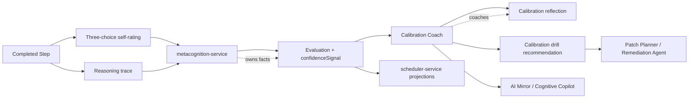

# Calibration Coach

**Functional name:** Calibration Coach  
**Possible display label:** Calibration Coach  
**Family:** Learner-facing metacognitive agent  
**Primary surface:** Post-Step reflection; calibration dashboard; occasional
Step checkpoint  
**Authority class:** Confidence-alignment coaching agent  
**Primary truth owner:** `metacognition-service` for Evaluation/self-rating
facts; `scheduler-service` for concept calibration projections  
**Primary validator:** `pedagogy-guardian-service` for learner-facing coaching
language  
**Main collaborators:** Mental Debugger, Patch Planner / Remediation Agent,
Strategy / Replanning Agent, AI Mirror / Cognitive Copilot, LessonPlan
Generator, Research / Evaluator Agent

## Purpose

The Calibration Coach helps the learner align confidence with evidence.

It watches the relationship between self-rating, reasoning trace quality,
correctness, hesitation, and later outcomes. Its goal is not to make the learner
less confident. Its goal is to help the learner know when confidence is earned,
when uncertainty is useful, and when a check is needed before moving on.

The product promise is:

> "Noema can help you trust your confidence when it is well-grounded, and
> question it when the trace says caution."

## Product Role

The Calibration Coach helps the learner answer:

- Did my confidence match my reasoning quality?
- Was I overconfident, underconfident, or appropriately uncertain?
- Did hesitation mean confusion, carefulness, or low fluency?
- Am I improving at predicting when I understand something?
- Should I use a check-step before continuing?
- Is this a one-time mismatch or a repeated calibration pattern?
- How can I practice confidence without turning it into self-judgment?

It should feel like a quiet coach, not a lie detector or scold. Older docs
mention "Liar Detector" style behavior; that framing should not be used as
learner-facing product language. Noema should coach calibration, not accuse.

## Step-First Position

Calibration starts with Step evidence. It is not a replacement for grading,
scheduling, or metacognitive evaluation.



The three-choice self-rating is evidence, not a grade:

- `KNEW_IT` -> high confidence signal
- `HESITATED` -> middle confidence signal
- `DIDNT_KNOW` -> low confidence signal

Reasoning quality remains dominant. A confident self-rating cannot override weak
reasoning evidence.

## When It Appears

The Calibration Coach appears:

- after a Step when confidence and reasoning trace diverge
- after repeated overconfidence or underconfidence patterns
- after a calibration-specific Step or drill
- in post-session reflection
- in a calibration dashboard
- when LessonPlan Generator includes a calibration checkpoint
- when Patch Planner recommends a calibration drill
- when AI Mirror summarizes a confidence trend

It should not appear after every self-rating. Most self-ratings should feel
lightweight. Coaching appears when there is a useful pattern or a meaningful
mismatch.

## Layered Prompt

The calibration-coach prompt should be layered as:

1. Stable role instructions for calm calibration coaching.
2. Session and concept scope from the active run.
3. Recorded facts from self-rating, reasoning quality, and calibration trends.
4. Learner-facing tone and exposure constraints from governance/pedagogy rules.
5. Output contract for a short coaching note, evidence summary, and suggested
   next adjustment.

## Live Context Pack

Every run receives a bounded live context pack.

### Step Context

- Step id
- LessonPlan id
- Step objective
- target concept ids
- learner answer summary
- three-choice self-rating
- response timing or hesitation signals
- hint usage
- current activity type

### Evaluation Context

- Evaluation id
- reasoning quality
- correctness or rubric outcome, if available
- confidenceSignal
- combinedScore
- trigger type, if any
- frame-level evidence relevant to confidence

### Pattern Context

- recent calibration trend
- concept-specific calibration projection
- repeated overconfidence/underconfidence signals
- changes over time
- prior calibration drills
- learner dismissals or corrections

### Policy Context

- coaching frequency budget
- tone constraints
- dashboard visibility policy
- confidence threshold rules
- Guardian constraints
- privacy constraints

The context pack should use live user data, but it must not turn short-term
mismatch into personality language.

## Inputs

The agent may use:

- Step self-rating
- canonical Evaluation summary
- reasoning quality
- confidenceSignal
- recent calibration summaries
- concept-specific calibration projections
- Mental Debugger explanations
- learner preference for feedback depth
- Patch Planner repair options

The agent should not receive:

- permission to rewrite Evaluation facts
- permission to mutate scheduler state
- unbounded private traces
- authority to label learner traits
- authority to replace deterministic confidence calculations

## Outputs

The Calibration Coach produces coaching artifacts:

- post-Step calibration note
- confidence/evidence mismatch explanation
- calibration trend summary
- check-step recommendation
- calibration drill recommendation
- dashboard insight
- Mirror observation
- handoff to Patch Planner or Strategy

More concretely:

| Output                    | Purpose                            | Owner after handoff                              |
| ------------------------- | ---------------------------------- | ------------------------------------------------ |
| Calibration reflection    | Explain confidence versus trace    | UI projection over `metacognition-service` facts |
| Drill recommendation      | Practice predicting understanding  | Patch Planner / LessonPlan Generator             |
| Check-step recommendation | Add verification before continuing | Strategy / session runtime                       |
| Dashboard trend           | Show pattern across time           | analytics/metacognition read model               |
| Mirror observation        | Quiet learner summary              | AI Mirror / Cognitive Copilot                    |

## UI Surfaces

### Post-Step Reflection

Used when there is a meaningful mismatch.

Recommended layout:

```text
Header: concise calibration observation
Main: confidence, reasoning evidence, one suggested habit
Actions: try check-step, continue, show trend, hide calibration notes
Details: recent pattern and trace evidence
```

### Calibration Dashboard

Used for trends over time.

Show:

- confidence alignment by concept
- overconfidence/underconfidence clusters
- recent improvement
- hesitation versus quality patterns
- calibration drills completed
- examples of well-calibrated reasoning

### Step Checkpoint

Used sparingly before answer reveal or after a difficult Step:

- "Before revealing, choose: knew it, hesitated, or didn't know."
- "Pause and mark how strong that reasoning felt."

This must remain clearly separate from old scheduler grade semantics.

## UI Labels

Use compact labels:

- `Well calibrated`
- `Overconfident signal`
- `Underconfident signal`
- `Confidence matched`
- `Confidence ahead of trace`
- `Trace stronger than confidence`
- `Check-step suggested`
- `Calibration drill`
- `Improving`
- `Single signal`
- `Repeated pattern`

## Friendly Why Layer

Plain explanations:

- "Your confidence was high, but the reasoning trace had a weak check step."
- "You hesitated, but your explanation was strong. That is useful uncertainty,
  not failure."
- "This looks like overconfidence in a familiar-looking problem."
- "Your confidence matched the trace here. That is good calibration."
- "This is one signal, so I would not treat it as a pattern yet."

## Technical Provenance Layer

Technical details for audit/debug surfaces:

- Evaluation id
- Step id
- LessonPlan id
- selfRating
- confidenceSignal
- reasoningQuality
- combinedScore
- trigger id
- calibration projection id, if any
- concept ids
- coach run id
- Guardian validation id
- dashboard aggregation window

Learners should see simplified trend language by default.

## Coaching Patterns

The coach should distinguish several calibration patterns.

| Pattern                   | Meaning                               | Possible response                    |
| ------------------------- | ------------------------------------- | ------------------------------------ |
| Well calibrated           | confidence and trace align            | reinforce the evidence used          |
| Overconfident             | confidence ahead of reasoning quality | suggest check-step or counterexample |
| Underconfident            | trace stronger than self-rating       | reinforce trustworthy evidence       |
| Hesitation with quality   | slow but good reasoning               | frame hesitation as useful care      |
| Fast but fragile          | fluent response with weak trace       | slow-down or verification gate       |
| Confidence drift          | pattern changes over time             | dashboard insight or drill           |
| Concept-specific mismatch | calibration issue tied to a concept   | targeted calibration drill           |

The coach should avoid making high confidence a problem by itself. Confidence is
useful when justified.

## User Actions

The learner should be able to:

- view calibration note
- try a check-step
- start calibration drill
- dismiss note
- mark "this confidence note does not fit"
- see trend
- hide calibration coaching temporarily
- ask for simpler explanation
- compare confidence with trace

Corrections and dismissals should feed Research/Evaluator. They should reduce
overconfident coaching repetition.

## Review and Handoff Rules

Calibration coaching should flow from service-owned facts into validated UI
copy.

```text
Evaluation + self-rating -> coaching draft -> Guardian validation -> UI note/dashboard
```

| Situation                     | Handoff                                                        |
| ----------------------------- | -------------------------------------------------------------- |
| Overconfidence signal         | Patch Planner may suggest check-step or contrast repair        |
| Underconfidence signal        | AI Mirror may surface encouragement grounded in trace evidence |
| Repeated calibration mismatch | LessonPlan Generator may include calibration Step              |
| Confidence drift              | Research/Evaluator may inspect intervention effectiveness      |
| Coaching language blocked     | Calibration Coach repairs from Guardian reason                 |

## Authority Boundaries

The agent may:

- explain confidence/evidence mismatch
- summarize calibration trends
- recommend check-steps
- recommend calibration drills
- produce dashboard insights
- hand off to Patch Planner, Strategy, LessonPlan Generator, or AI Mirror

The agent must never:

- own Evaluation truth
- mutate scheduler or calibration projections directly
- treat self-rating as a grade
- override reasoning quality with confidence
- shame the learner for overconfidence
- call the learner dishonest
- label stable traits from short-term evidence
- interrupt too frequently
- bypass Guardian for learner-facing coaching

## Validation and Review Gates

| Gate                            | Applied to                                      | Owner                              |
| ------------------------------- | ----------------------------------------------- | ---------------------------------- |
| Evaluation and confidence facts | selfRating, confidenceSignal, reasoning quality | `metacognition-service`            |
| Scheduler projection            | concept calibration read models                 | `scheduler-service`                |
| Coaching language               | learner-facing copy                             | `pedagogy-guardian-service`        |
| Repair selection                | check-step or drill insertion                   | Patch Planner / Strategy           |
| Dashboard aggregation           | trend windows and privacy                       | analytics/metacognition read model |
| Intrusiveness                   | coaching frequency                              | Watchtower / Governance Layer      |

## States

Suggested coaching states:

```text
no_signal
single_signal
pattern_detected
reflection_draft
reflection_validated
reflection_blocked
drill_recommended
check_step_recommended
dismissed_by_learner
hidden_due_to_budget
```

Suggested pattern labels:

```text
well_calibrated
overconfident_signal
underconfident_signal
hesitation_with_quality
fast_but_fragile
confidence_drift
concept_specific_mismatch
```

These are product-language suggestions, not final wire schemas.

## Interruption Budget

Calibration coaching must stay quiet unless useful.

Suggested defaults:

- collect self-rating every Step where ADR-016 applies
- do not coach every rating
- show coaching only for meaningful mismatch, repeated trend, or planned
  calibration Step
- do not show more than one calibration note in a short session unless requested
- prefer dashboard summaries for low-severity trends
- pause coaching when frustration or fatigue is high

## Failure Modes

| Failure mode                      | Product risk                      | Mitigation                        |
| --------------------------------- | --------------------------------- | --------------------------------- |
| Shaming overconfidence            | Learner defensiveness             | Neutral, evidence-based language  |
| Treating confidence as grade      | Regresses to old scheduler UI     | Keep self-rating as evidence only |
| Coaching too often                | Reflection fatigue                | Interruption budget               |
| Ignoring underconfidence          | Misses trust-building opportunity | Surface trace-strong patterns     |
| Overriding reasoning quality      | Bad evaluation semantics          | Reasoning remains dominant        |
| Overclaiming trend                | Misleading learner                | Require repeated evidence         |
| Confusing hesitation with failure | Penalizes careful thinking        | Separate speed from quality       |
| Raw metric overload               | Dashboard feels clinical          | Friendly summaries first          |

## Example UI Copy

Well calibrated:

- "Your confidence matched the trace here. You chose the right cue and checked
  the result."
- "This was a good `hesitated`: slower, but the reasoning held together."

Overconfidence:

- "Your confidence was high, but the trace skipped the check step. A quick
  verification habit may help."
- "This looked familiar, but the diagnostic cue was different. That is a classic
  overconfidence spot."

Underconfidence:

- "You marked `hesitated`, but your explanation was strong. The trace supports
  more trust here."
- "Your confidence was lower than the evidence. You may be recognizing the
  concept more reliably than it feels."

Drill:

- "A short calibration drill could help: predict your confidence, answer, then
  compare it with the trace."
- "This does not need a content repair. It needs a confidence check habit."

Uncertainty:

- "This is one signal, not a pattern yet."
- "I will wait for more evidence before calling this a calibration trend."

## Open Design Notes

- Decide whether calibration dashboards live under AI Mirror, metacognition, or
  a dedicated progress surface.
- Define thresholds for repeated overconfidence/underconfidence patterns.
- Decide which calibration drills are generated content versus Step templates.
- Audit older "Liar Detector" language and replace it with learner-respecting
  calibration coaching.
- Define whether pre-answer confidence survives as trace evidence or stays out
  of MVP.
