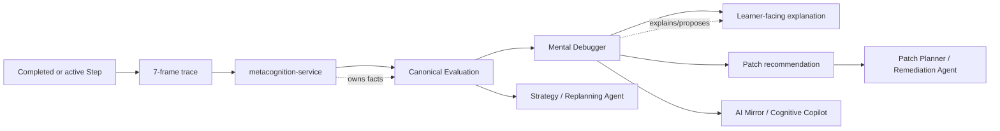

# Mental Debugger / Diagnostic Agent

**Functional name:** Mental Debugger / Diagnostic Agent  
**Possible display label:** Mental Debugger  
**Family:** Learner-facing metacognitive agent  
**Primary surface:** Post-Step reflection; reflective dashboards; optional Step timeline details  
**Authority class:** Diagnostic explanation agent  
**Primary truth owner:** `metacognition-service`  
**Primary validator:** `pedagogy-guardian-service` for learner-facing diagnostic language  
**Main collaborators:** Socratic Tutor, Patch Planner / Remediation Agent, Calibration Coach, AI Mirror / Cognitive Copilot, Strategy / Replanning Agent, Taxonomy Curator

## Purpose

The Mental Debugger helps the learner understand what happened in their reasoning process, not just whether an answer was right or wrong.

It translates service-owned Step traces, 7-frame reasoning signals, evaluations, and failure-taxonomy classifications into humane, actionable explanations. It should make invisible thinking patterns visible without turning the learner into a diagnosis.

The product promise is:

> "Noema can show the shape of your reasoning, where it held, where it slipped, and what to try next."

## Product Role

The Mental Debugger helps the learner answer:

- What part of my reasoning worked?
- Where did the reasoning path become fragile?
- Did I choose a superficial cue instead of a diagnostic cue?
- Did I retrieve the wrong pattern?
- Did I skip a check?
- Did I know the concept but fail to transfer it?
- Was this a knowledge gap, strategy issue, misconception, calibration issue, or task-reading issue?
- What is the smallest useful repair?

The agent should not feel like a judge. It should feel like a careful trace viewer for thinking: specific, provisional, and repair-oriented.

## Step-First Position

The Mental Debugger operates after, or occasionally during, a Step. It consumes traces and evaluations; it does not own them.



The debugger can say what the evaluation suggests. It must not claim absolute access to the learner's mind.

## The 7-Frame Trace

The exact schema belongs to `metacognition-service`, but the product language should preserve the idea of a stack trace of thinking.

Common learner-facing frames:

| Frame | Learner-facing meaning | Example diagnostic question |
|---|---|---|
| Framing | How the task was understood | "Did you identify what the problem was asking?" |
| Cue selection | What features received attention | "Did you use the diagnostic cue or a surface cue?" |
| Retrieval | What prior pattern was brought in | "Did you retrieve the right concept or a nearby one?" |
| Strategy | What method or move was chosen | "Was the chosen strategy suited to this task?" |
| Execution | How the chosen move was carried out | "Did the process slip during execution?" |
| Monitoring | Whether the result was checked | "Did you notice signs the answer needed review?" |
| Reflection | What the learner inferred afterward | "Did your confidence match the trace quality?" |

The UI should not force this whole table into every reflection. Most Step reflections should surface one or two relevant frames.

## When It Appears

The Mental Debugger appears:

- after a Step when the learner opens reflection
- after a failed or fragile Step when a short explanation is useful
- after repeated similar patterns across Steps
- inside reflective dashboards
- in the AI Mirror as a summarized observation
- when Strategy/Patch needs a diagnosis explanation for a repair
- when Calibration Coach needs to connect confidence and trace quality
- in admin/teacher review of reasoning traces

It should not appear after every minor mistake. It should not interrupt active flow unless the session policy has explicitly chosen a diagnostic Step or repair moment.

## Live Context Pack

Every run receives a bounded live context pack. The prompt should distinguish evaluation facts, trace fields, taxonomy labels, and agent inference.

### Step and Trace Context

- Step id
- LessonPlan id
- Step objective
- activity type
- learner response
- expected response/rubric summary
- 7-frame trace summary
- frame-level scores or signals
- timing/hesitation signals, if relevant
- hint usage
- self-rating

### Evaluation Context

- canonical Evaluation id
- reasoning quality
- correctness, if available
- trigger type
- failure taxonomy labels
- uncertainty/confidence of classification
- comparison with recent similar Steps
- whether the pattern is single-instance or repeated

### Concept and Content Context

- target concepts
- prerequisite concepts
- confusable concepts
- source/content references
- curriculum node
- current graph anchor status

### Learner Experience Context

- frustration/overload signals
- preferred feedback depth
- recent debugger exposure
- calibration trend summary
- active repair plan, if any

### Policy Context

- diagnostic language constraints
- learner-facing certainty limits
- interruption budget
- privacy constraints
- Guardian rules for feedback tone
- handoff rules to Patch Planner and Strategy

The context pack should help the debugger be specific without making it overconfident. "This trace suggests" is often better than "you failed because."

## Inputs

The agent may use:

- completed Step trace
- canonical Evaluation summary
- failure taxonomy labels
- concept and prerequisite summaries
- self-rating and confidence data
- recent repeated-pattern summaries
- relevant content/source metadata
- Patch Planner repair options
- Guardian block reasons for feedback repair

The agent should not receive:

- permission to rewrite Evaluations
- permission to mutate graph or curriculum state
- unbounded private history
- authority to diagnose stable traits
- authority to decide final remediation alone

## Outputs

The Mental Debugger produces learner-facing diagnostic artifacts:

- post-Step explanation
- frame-level reasoning summary
- likely failure pattern
- evidence snippet
- "what worked" note
- "where it slipped" note
- repair recommendation
- uncertainty/caveat
- dashboard summary
- handoff note to Patch Planner, Calibration Coach, or AI Mirror

More concretely:

| Output | Purpose | Stored/owned by |
|---|---|---|
| Debugger reflection | Explain a Step outcome | `metacognition-service` read model or UI projection |
| Pattern summary | Connect repeated traces | `metacognition-service` summary |
| Repair recommendation | Suggest next learning move | Patch Planner / Strategy input |
| Mirror observation | Quiet sidebar summary | AI Mirror / Cognitive Copilot |
| Taxonomy feedback | Flag unclear label usage | Taxonomy Curator review path |

## UI Surfaces

### Post-Step Reflection

This is the primary learner-facing surface.

Recommended layout:

```text
Header: Step outcome and concise debugger headline
Main: what worked, where reasoning got fragile, one suggested repair
Details: trace frames, evidence, confidence, related concepts
Actions: try repair, see example, continue, hide this pattern
```

### Reflective Dashboard

Used for patterns across time.

Show:

- repeated reasoning patterns
- strongest frames
- fragile frames
- calibration alignment
- recent improvements
- recommended repair types
- examples from recent Steps, summarized carefully

### Active Step Timeline

Use sparingly:

- "A diagnostic review is available after this Step."
- "This Step triggered a prerequisite check."
- "Reflection saved for after the session."

Avoid large diagnostic explanations mid-Step unless the Step is explicitly diagnostic.

## UI Labels

Use compact labels:

- `Reasoning trace`
- `What worked`
- `Fragile step`
- `Likely pattern`
- `Single-instance`
- `Repeated pattern`
- `Needs repair`
- `Prerequisite gap`
- `Cue mismatch`
- `Skipped check`
- `Transfer issue`
- `Confidence mismatch`

## Friendly Why Layer

Plain explanations:

- "Your method was reasonable, but the first cue you used was not the diagnostic one."
- "The calculation was fine; the fragile part was choosing which concept applied."
- "This looks like a transfer issue: the idea was stable in familiar examples but harder in this new context."
- "This was one Step, so I would treat it as a signal, not a conclusion."
- "The repair should be small: one contrast example before continuing."

## Technical Provenance Layer

Technical details for audit/debug surfaces:

- Evaluation id
- Step id
- LessonPlan id
- trace version
- taxonomy version
- frame scores/signals
- trigger id
- target concept ids
- source/content ids
- debugger run id
- Guardian validation id
- confidence/uncertainty notes

Learners should see only selected details by default. Teachers, admins, and internal QA can inspect deeper provenance.

## Diagnostic Language Rules

The Mental Debugger must use non-identifying, non-shaming language.

Prefer:

- "This trace suggests..."
- "The fragile part seems to be..."
- "One possible pattern is..."
- "This may be a prerequisite gap."
- "This is a single signal, not a stable pattern."

Avoid:

- "You are bad at..."
- "You always..."
- "The cause is definitely..."
- "You failed because..."
- "This proves you have..."

The debugger should describe the reasoning event, not label the learner.

## Handoffs

| Situation | Handoff |
|---|---|
| Small local repair is enough | Patch Planner creates a repair Step or contrast card request |
| Plan structure is wrong | Strategy / Replanning considers local repair or replan |
| Confidence and trace diverge | Calibration Coach receives signal |
| Learner asks for summary | AI Mirror surfaces a quiet observation |
| Taxonomy label is ambiguous | Taxonomy Curator receives drift feedback |
| Graph misconception candidate emerges | Knowledge Graph Agent may propose graph/PKG review through proper paths |

The debugger should not directly create repair content or replan sessions. It explains and recommends.

## Interruption Budget

The Mental Debugger can easily become too much. The default should be quiet availability, not constant commentary.

Suggested defaults:

- do not show full debugger analysis after every Step
- show concise reflection after high-signal Steps
- group repeated minor issues into dashboard summaries
- avoid more than one diagnostic interruption in a short session unless requested
- offer "show me why" instead of forcing trace details
- pause diagnostic surfacing when frustration or fatigue is high

## User Actions

The learner should be able to:

- open reflection
- ask "why did Noema think that?"
- try recommended repair
- dismiss a diagnostic suggestion
- mark "this explanation does not fit"
- request a simpler explanation
- request more detail
- hide repeated pattern notices temporarily
- compare with a previous Step

Dismissals and corrections are important signals. They should feed Research/Evaluator and Taxonomy Curator where appropriate, not be treated as user error.

## Review and Handoff Rules

Learner-facing diagnostic explanations should pass tone and validity checks.

```text
Evaluation -> debugger explanation draft -> Guardian validation -> UI reflection
```

| Artifact | Review model | Downstream path |
|---|---|---|
| Single-Step reflection | Usually automatic after Guardian validation | UI reflection |
| Repeated-pattern summary | May require higher confidence threshold | dashboard / AI Mirror |
| Repair recommendation | Routed to Patch Planner / Strategy | repair proposal |
| Taxonomy ambiguity | Routed to Taxonomy Curator | taxonomy review |
| Sensitive diagnostic language | Blocked or softened by Guardian | repaired explanation |

## Authority Boundaries

The agent may:

- explain service-owned evaluations
- summarize 7-frame traces
- identify likely reasoning patterns
- recommend repair types
- produce learner-facing reflections
- hand off to Patch Planner, Calibration Coach, AI Mirror, Strategy, or Taxonomy Curator

The agent must never:

- own canonical Evaluation facts
- rewrite traces
- mutate session, graph, curriculum, or schedule state
- diagnose stable learner traits from one event
- claim causal certainty from weak evidence
- shame the learner
- expose sensitive raw trace data unnecessarily
- bypass Guardian for learner-facing explanations
- become a generic chat assistant

## Validation and Review Gates

| Gate | Applied to | Owner |
|---|---|---|
| Evaluation truth | canonical Step evaluation and trace scoring | `metacognition-service` |
| Diagnostic taxonomy version | failure/misconception label meaning | `metacognition-service` / Taxonomy Curator |
| Learner-facing tone | reflection language | `pedagogy-guardian-service` |
| Repair routing | whether to patch/replan/continue | Strategy / Patch Planner |
| Graph claims | concept/misconception graph references | `knowledge-graph-service` |
| Privacy | trace detail visibility | Watchtower / Governance Layer |

## States

Suggested debugger states:

```text
evaluation_available
reflection_draft
reflection_validated
reflection_blocked
reflection_available
pattern_detected
repair_recommended
dismissed_by_learner
needs_taxonomy_review
hidden_due_to_overload
```

Suggested pattern labels:

```text
cue_mismatch
retrieval_mismatch
strategy_mismatch
execution_slip
skipped_check
transfer_issue
prerequisite_gap
confidence_mismatch
ambiguous_pattern
```

These are product-language suggestions, not final wire schemas.

## Failure Modes

| Failure mode | Product risk | Mitigation |
|---|---|---|
| Overdiagnosis | Learner feels pathologized | Use provisional language and thresholds |
| Explaining every Step | Reflection fatigue | Interruption budget and on-demand details |
| Confusing correctness with reasoning | Wrong repair | Use 7-frame trace, not answer alone |
| Causal overclaim | Misleading explanation | Evidence labels and uncertainty |
| Raw trace exposure | Privacy and UX harm | Summarize by default |
| Taxonomy drift | Inconsistent explanations | Taxonomy Curator feedback |
| Repair mismatch | Wrong next action | Patch/Strategy handoff and review |
| Shame tone | Trust loss | Guardian tone validation |

## Example UI Copy

Post-Step:

- "The answer was off, but the useful signal is earlier: you chose a surface cue before checking the diagnostic cue."
- "Your method was mostly solid. The fragile point was the final monitoring step."
- "This looks like a transfer issue: the idea worked in the familiar format, but the changed wording shifted the cues."

Uncertainty:

- "This is one signal, not a pattern yet."
- "There are two plausible explanations here. The next Step can help distinguish them."
- "The trace suggests a prerequisite gap, but confidence is low."

Repair:

- "A small repair should be enough: one contrast example before continuing."
- "I recommend a prerequisite refresh before adding new material."
- "This does not need a full replan; it needs a check-step after the next attempt."

Learner correction:

- "Marked. I will treat this explanation as a poor fit and avoid using it as strong evidence."
- "Thanks. That correction helps separate a reading issue from a concept issue."

## Open Design Notes

- Decide which debugger reflections appear automatically versus on demand.
- Define confidence thresholds for repeated-pattern language.
- Decide how learner corrections affect future diagnostic summaries.
- Define how much trace detail teachers can inspect without exposing unnecessary private reasoning data.
- Decide whether "Mental Debugger" is the learner-visible name or an internal/product nickname.
