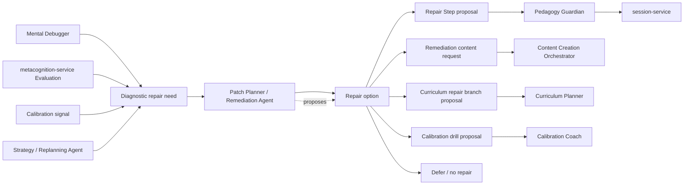

# Patch Planner / Remediation Agent

**Functional name:** Patch Planner / Remediation Agent  
**Possible display label:** Repair Planner  
**Family:** Learner-facing metacognitive and planning agent  
**Primary surface:** Post-Step repair recommendation; session plan change notice; remediation inbox  
**Authority class:** Repair proposal agent  
**Primary truth owners:** `session-service` for repair Steps; `content-service` for remediation content; `curriculum-service` for durable repair branches  
**Primary validators:** `pedagogy-guardian-service`, plus service-specific validation  
**Main collaborators:** Mental Debugger, Strategy / Replanning Agent, Content Creation Orchestrator, LessonPlan Generator, Curriculum Planner, Calibration Coach, AI Mirror / Cognitive Copilot

## Purpose

The Patch Planner converts diagnostic signals into concrete repair options.

Mental Debugger explains what likely happened in the learner's reasoning. Patch Planner answers: "What should we do about it, and how small can the repair be?"

Its purpose is to choose the minimum useful remediation shape: a hint, a contrast question, a repair Step, a short remediation card, a prerequisite refresh, a calibration drill, a session-local plan change, or a durable curriculum repair branch.

The product promise is:

> "When Noema finds a reasoning issue, it can propose a precise repair instead of repeating the same kind of practice."

## Product Role

The Repair Planner helps the learner and system answer:

- Is this worth repairing now?
- What kind of repair best matches the diagnostic pattern?
- Can the repair happen inside the current session?
- Does the repair need new generated content?
- Is this a one-off Step issue or a durable curriculum issue?
- Should the learner see the repair now, later, or only as an option?
- How do we avoid turning every mistake into remediation?

It should feel practical and lightweight. The agent should not punish mistakes with extra work. It should propose repair as a path back to momentum.

## System Position



The Patch Planner does not mutate the active Step queue directly. Strategy/session-service commits session-local repair Steps. Content Generation creates remediation content drafts. Curriculum Planner proposes durable path changes.

## Repair Philosophy

Patch planning should follow minimum-sufficient intervention:

1. Do nothing if the signal is weak or the learner is already recovering.
2. Prefer a tiny local prompt when the issue is shallow.
3. Use a repair Step when the current session can resolve the issue safely.
4. Generate or request content only when existing eligible content is insufficient.
5. Propose a curriculum repair branch only when the pattern is repeated or structural.
6. Defer remediation when the learner is overloaded.

The system should avoid "remediation inflation," where every error creates a backlog of corrective work.

## When It Appears

The Patch Planner appears:

- after Mental Debugger identifies a repairable pattern
- when Strategy needs a candidate repair shape
- after repeated confusion on a concept or prerequisite
- when a Step is failed for a reason that differs from ordinary incorrectness
- when Calibration Coach identifies confidence/trace mismatch requiring practice
- when LessonPlan Generator includes repair slots in a pre-session plan
- in a remediation inbox or post-session review
- when curriculum progress is blocked by a repairable prerequisite gap

It should not appear after every incorrect answer. It should not turn ordinary forgetting into a heavy remediation flow.

## Live Context Pack

Every run receives a bounded live context pack.

### Diagnostic Context

- Evaluation id
- diagnostic pattern label
- frame-level signal summary
- confidence/uncertainty
- single-instance versus repeated pattern
- Mental Debugger explanation
- target concepts
- prerequisite/confusable concepts

### Session Context

- active session id
- active LessonPlan id
- current Step id
- remaining Step queue summary
- session duration remaining
- learner overload/frustration signal
- active repair count
- plan-change policy

### Content Context

- eligible remediation cards/activities
- existing contrast/minimal-pair/assumption-check content
- generated variant availability
- content review status
- source grounding requirements
- content gaps

### Curriculum and Scheduler Context

- curriculum node and stable node key
- active curriculum version
- progress state
- readiness/due summaries
- repeated-gap summaries
- whether a durable repair branch already exists

### Policy Context

- intervention budget
- repair severity thresholds
- Guardian constraints
- learner preference for feedback depth
- auto-insert versus ask-first policy
- deferral policy
- privacy and tone constraints

The context pack should include live user data through the templater, but the agent should preserve authority boundaries in output: service-owned facts versus agent repair proposals.

## Inputs

The agent may use:

- Mental Debugger repair recommendation
- canonical Evaluation summaries
- repeated-pattern summaries
- active session state summary
- content coverage and eligibility summaries
- curriculum node and progress summaries
- calibration mismatch summaries
- learner preference and overload signals
- Guardian block reasons for repair retry

The agent should not receive:

- permission to insert Steps directly
- permission to create active content directly
- permission to change curriculum versions directly
- unbounded raw learner traces
- authority to decide final Evaluation outcomes

## Outputs

The Patch Planner produces repair proposals:

- no-repair recommendation
- micro-prompt recommendation
- repair Step proposal
- content request for remediation card/activity
- contrast/minimal-pair recommendation
- prerequisite refresh recommendation
- calibration drill recommendation
- durable curriculum repair branch proposal
- defer-until-later recommendation
- learner-facing repair explanation

More concretely:

| Output | Purpose | Owner after handoff |
|---|---|---|
| Repair option | Rank possible intervention shapes | Strategy / session runtime |
| Repair Step proposal | Insert or queue local remediation | `session-service` after Guardian |
| Content generation request | Create missing remediation material | Content Creation Orchestrator / `content-service` |
| Curriculum repair branch proposal | Durable structural repair | Curriculum Planner / `curriculum-service` |
| Calibration drill proposal | Address confidence/trace mismatch | Calibration Coach |
| Defer/no repair | Avoid unnecessary intervention | session timeline or dashboard |

## Repair Types

Patch types should map to diagnostic needs, not card-type novelty.

| Diagnostic pattern | Likely repair shape |
|---|---|
| Cue mismatch | contrast card, diagnostic-cue prompt, minimal pair |
| Retrieval mismatch | retrieval cue, concept boundary task |
| Strategy mismatch | strategy reminder, worked-choice comparison |
| Execution slip | verification gate, self-check ritual |
| Skipped monitoring | check-step, counterexample prompt |
| Transfer issue | near-transfer then far-transfer Step |
| Prerequisite gap | short prerequisite refresh or curriculum repair branch |
| Confidence mismatch | calibration drill or post-answer confidence check |
| Confusable concepts | contrast pair, confusable set drill |
| Weak source grounding | source-linked example before practice |

These mappings should be defaults, not rigid rules.

## UI Surfaces

### Post-Step Repair Recommendation

Primary learner-facing moment.

Recommended layout:

```text
Header: short repair headline
Main: why this repair, expected effort, what it will fix
Actions: do it now, save for later, skip, show why
Details: diagnostic pattern, evidence, content/source, confidence
```

### Session Plan Change Notice

When Strategy inserts a repair Step:

```text
Notice: one repair Step was inserted
Why: small diagnostic reason
Actions: continue, inspect change
```

### Remediation Inbox

For deferred or durable repairs:

```text
List: repair items grouped by concept/pattern
Each item: effort, reason, state, source, last triggered
Actions: start, dismiss, merge, add to curriculum
```

### Curriculum Workbench

For structural repairs:

- show as `Repair branch proposed`
- include progress-preservation details
- route through Curriculum Planner, not direct Patch Planner mutation

## UI Labels

Use compact labels:

- `Repair suggested`
- `Tiny repair`
- `Repair Step`
- `Contrast practice`
- `Prerequisite refresh`
- `Calibration drill`
- `Saved for later`
- `Repair inserted`
- `Repair branch proposed`
- `No repair needed`
- `Too much right now`

## Friendly Why Layer

Plain explanations:

- "This repair is small: it checks the cue that led you toward the wrong concept."
- "I am suggesting a contrast example because the trace points to a boundary issue, not a lack of effort."
- "No repair needed now. The signal is weak and the next Step will give better evidence."
- "This looks repeated enough to save as a repair branch, not just a one-off Step."
- "This can wait; adding it now would make the session too heavy."

## Technical Provenance Layer

Technical details for audit/debug surfaces:

- repair proposal id
- Evaluation id
- Step id
- LessonPlan id
- diagnostic label and taxonomy version
- target concept ids
- content candidate ids
- curriculum id/version/stable node key
- intervention budget state
- agent run id
- Guardian validation id
- accepted/deferred/dismissed action

## User Actions

The learner should be able to:

- do repair now
- save repair for later
- skip repair
- ask why this repair
- request a smaller repair
- request direct explanation instead
- mark "this repair does not fit"
- merge with another repair
- add to curriculum, if durable
- hide low-priority repair suggestions temporarily

The system should respect user refusal. A skipped repair can remain a weak signal, but it should not be treated as defiance or failure.

## Review and Handoff Rules

Repair proposals become real through service-owned paths.

```text
diagnostic signal -> repair proposal -> Strategy/session/content/curriculum handoff -> Guardian/service validation -> UI
```

| Repair decision | Handoff |
|---|---|
| Micro-prompt | Strategy/session runtime, Guardian if learner-facing |
| Repair Step | Strategy inserts through `session-service` after Guardian |
| Remediation content needed | Content Creation Orchestrator drafts; `content-service` owns review |
| Durable prerequisite branch | Curriculum Planner proposes revision |
| Calibration drill | Calibration Coach owns coaching moment |
| No repair/defer | timeline/dashboard state only |

Guardian-blocked repair Steps return to Patch Planner or Content Generation depending on what failed.

## Authority Boundaries

The agent may:

- choose and explain repair shapes
- rank repair options
- propose repair Steps
- request remediation content
- recommend curriculum repair branches
- recommend deferral or no repair
- generate learner-facing repair rationale

The agent must never:

- insert Steps directly
- activate generated content
- mutate curriculum paths
- rewrite Evaluations
- claim diagnostic certainty
- create large remediation queues from weak evidence
- punish ordinary mistakes with excessive work
- bypass Guardian
- override learner overload signals
- become the scheduler

## Validation and Review Gates

| Gate | Applied to | Owner |
|---|---|---|
| Diagnostic source | repair need from Evaluation/trace | `metacognition-service` |
| Session mutation | repair Step insertion | `session-service` Strategy |
| Pedagogical validity | repair Step/content | `pedagogy-guardian-service` |
| Content provenance | remediation cards/activities | `content-service` |
| Curriculum revision | durable repair branch | `curriculum-service` |
| Schedule/readiness impact | deferred repair timing | `scheduler-service` |
| Intrusiveness budget | repair frequency and timing | Watchtower / Governance Layer |

## States

Suggested repair proposal states:

```text
candidate
recommended
needs_content
needs_guardian_validation
ready
inserted
saved_for_later
deferred
dismissed
blocked
completed
expired
```

Suggested repair scope labels:

```text
micro_prompt
local_step
session_repair
content_request
curriculum_branch
calibration_drill
defer
no_repair
```

These are product-language suggestions, not final wire schemas.

## Interruption Budget

Patch planning needs restraint.

Suggested defaults:

- no more than one visible repair suggestion after a Step
- avoid stacking multiple repairs during a short session
- prefer "save for later" when fatigue is high
- do not propose durable curriculum repair from a single weak signal
- merge similar repairs into one inbox item
- respect dismissals and reduce repeat surfacing

## Failure Modes

| Failure mode | Product risk | Mitigation |
|---|---|---|
| Remediation inflation | Learner feels punished | Minimum-sufficient intervention |
| Wrong repair type | Wasted time | Diagnostic-to-repair mapping and user feedback |
| Repair loops | Learner cannot progress | Budget, deferral, and Strategy oversight |
| Content unavailable | Repair cannot execute | Content request with clear blocked state |
| Overconfident repair | Misleading learner | Uncertainty labels and optionality |
| Hidden session mutation | Trust loss | Plan-change notices |
| Curriculum overreaction | Path becomes unstable | Repeated-pattern threshold |
| Ignoring overload | Frustration | Watchtower/intrusion budget |

## Example UI Copy

Post-Step:

- "A tiny repair may help here: one contrast example to separate these two concepts."
- "This does not need a full review. The useful fix is a quick self-check step."
- "No repair needed yet. This looks like a single weak signal, and the next Step will clarify it."

Session repair:

- "One repair Step was inserted because the previous answer pointed to a prerequisite cue."
- "The remaining plan is unchanged."
- "This repair should take about two minutes."

Deferred:

- "Saved for later. I will not interrupt the current session with this repair."
- "This pattern has appeared three times, so I recommend adding a short repair branch to the curriculum."

Mismatch:

- "Marked as not fitting. I will lower confidence in this repair suggestion."
- "I can try a smaller repair or switch to direct explanation."

## Open Design Notes

- Decide which repair types can be auto-inserted and which require learner confirmation.
- Define evidence thresholds for promoting a local repair into a curriculum repair branch.
- Decide whether a remediation inbox is learner-facing in MVP or only dashboard/admin-facing.
- Define how repair dismissals affect future Strategy and Patch Planner behavior.
- Audit older docs that imply Mental Debugger or Patch Planner directly owns patch-plan state, and realign them with `session-service`, `content-service`, and `curriculum-service` ownership.
