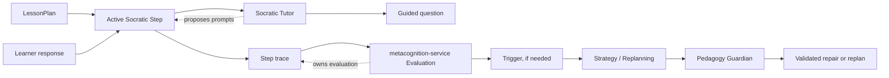

# Socratic Tutor

**Functional name:** Socratic Tutor  
**Possible display label:** Socratic Guide  
**Family:** Learner-facing interaction  
**Primary surface:** Active Step UI  
**Authority class:** Guided-questioning agent  
**Primary truth owner:** `session-service` for Step runtime; `metacognition-service` for evaluations  
**Primary validator:** `pedagogy-guardian-service` for learner-facing prompts and interventions  
**Main collaborators:** LessonPlan Generator, Strategy / Replanning Agent, Content Creation Orchestrator, Mental Debugger, Mode Preference Helper, AI Mirror / Cognitive Copilot

## Purpose

The Socratic Tutor guides the learner through reasoning by asking targeted questions instead of immediately giving explanations or answers.

Its job is not to be a general chat tutor. It appears inside selected Step types where guided questioning is the intended activity mode. It helps the learner inspect assumptions, compare concepts, test reasoning, explain a choice, notice contradictions, and transfer an idea to a new context.

The product promise is:

> "When direct answering would weaken learning, Noema can guide the learner with carefully scoped questions that reveal and strengthen reasoning."

## Product Role

The Socratic Guide helps the learner answer:

- What do I already know that applies here?
- Which assumption am I making?
- What would change if this condition changed?
- Which concept is this most similar to, and where does the similarity break?
- Can I explain why this answer follows?
- What evidence would make me revise my answer?
- Am I stuck because I lack a fact, a strategy, or a distinction?

The agent should feel precise and calm. It should not interrogate, lecture, or perform cleverness. The best Socratic moment is usually one good question, not a long dialogue tree.

## Step-First Position

The Socratic Tutor runs inside a Step. It does not choose the session plan, own the Step queue, or decide final evaluation.



The tutor may produce prompts, hints, and follow-up questions. It must not score the learner as a source of truth. It can say "this response suggests..." only when framing an observation as provisional and service-owned evaluation remains elsewhere.

## When It Appears

The Socratic Tutor appears when the active Step calls for guided questioning:

- confusion repair
- misconception contrast
- prerequisite probing
- transfer Step
- explanation Step
- ambiguity resolution
- graph edge/type tutorial
- learner asks for a hint during a Step
- Strategy inserts a Socratic repair Step
- LessonPlan includes a Socratic mode for a target concept

It should not appear as a persistent free-chat assistant. The AI Mirror / Cognitive Copilot can summarize available observations; the Socratic Tutor should operate inside a concrete learning task.

## Live Context Pack

Every run receives a live context pack. The prompt should be narrow, current, and Step-bound.

### Step Context

- Step id
- Step objective
- current activity type
- target concept ids
- expected reasoning operation
- allowed epistemic mode
- current prompt or problem statement
- current learner answer, if any
- current attempt count
- hint budget

### Learner Context

- relevant concept stability summary
- recent confusion pattern, if relevant
- calibration signal, if relevant
- prior hints used in this Step
- accessibility or tone preferences
- frustration/overload signal, if available

### Content and Graph Context

- source excerpt or card payload
- accepted concept anchors
- confusable concepts
- prerequisite chain summary
- misconception candidates
- allowed examples/counterexamples

### Policy Context

- answer-withholding rules
- maximum follow-up depth
- interruption budget
- Guardian prompt constraints
- safety and tone constraints
- escalation rule for direct explanation

The context pack should not include broad learner dossiers. It should contain just enough live data to ask a better next question.

## Inputs

The agent may use:

- active Step objective and prompt
- learner response in the current Step
- relevant source/content payload
- concept and relation summaries
- metacognitive summaries scoped to the current concept
- hint/interruption budget
- prior questions in the same Step
- Guardian block reasons for prompt repair

The agent should not receive:

- permission to evaluate final correctness
- permission to mutate session state
- unbounded learner history
- raw private traces outside the Step
- authority to introduce off-plan topics

## Outputs

The agent produces bounded learner-facing interaction artifacts:

- Socratic question
- follow-up question
- contrast prompt
- assumption check
- explanation request
- hint ladder item
- direct explanation handoff request
- "unstick" option when questioning is no longer useful

More concretely:

| Output | Purpose | Stored/owned by |
|---|---|---|
| Guided question | Move learner one reasoning step forward | `session-service` Step interaction log |
| Hint | Reduce stuckness without giving answer | `session-service` |
| Follow-up | Respond to learner answer | `session-service` |
| Escalation request | Ask Strategy/session runtime to switch mode | `session-service` / Strategy |
| Interaction trace | Evidence for later evaluation | `metacognition-service` consumes trace |

## Active Step UI

The Socratic Tutor should be embedded in the active Step, not shown as a separate personality panel.

Recommended layout:

```text
Main: task/problem and learner response area
Socratic prompt area: one current question or hint
Controls: answer, ask for hint, reveal explanation if allowed, skip/defer
Details: why this question, source/concept, previous prompts
```

The UI should avoid a chat transcript as the default representation. A transcript can be available in details or timeline, but the primary learning surface should remain the Step.

## UI Labels

Use compact labels:

- `Guided question`
- `Hint`
- `Compare`
- `Check assumption`
- `Explain your step`
- `Try a counterexample`
- `One more question`
- `Explanation available`
- `Questioning paused`

## Friendly Why Layer

Plain explanations:

- "This question checks the assumption your answer depends on."
- "I am asking for a comparison because these two concepts were recently confused."
- "This hint points to the prerequisite without giving the answer."
- "One more question may help; after that, I will switch to explanation."
- "This Step is asking for reasoning, so the goal is to explain the path, not just name the answer."

## Technical Provenance Layer

Technical details for audit/debug surfaces:

- Step id
- LessonPlan id
- agent run id
- prompt template version
- target concept ids
- source/content ids
- prior hint count
- question type
- Guardian validation id
- metacognition Trigger reference, if any
- escalation decision, if any

The learner should rarely see this layer directly. The AI Mirror can surface selected explanations in a calmer, aggregated way.

## Question Types

The tutor should use distinct question types with clear intent.

| Type | Use when | Example |
|---|---|---|
| Assumption check | Learner answer depends on hidden premise | "What are you assuming about the sign here?" |
| Contrast | Two concepts are confusable | "How is this different from conservation of energy?" |
| Evidence request | Learner asserts without support | "What part of the problem tells you that?" |
| Step explanation | Procedural answer lacks reasoning | "Why is that the next operation?" |
| Counterexample | Rule may be overgeneralized | "Can you think of a case where that rule would fail?" |
| Transfer | Concept is stable in familiar context | "Would the same idea work if the numbers changed to variables?" |
| Prerequisite probe | Current task may be blocked | "Before solving this, what does the coefficient represent?" |
| Reflection | Step outcome needs metacognitive signal | "How confident are you in that reasoning path?" |

## Interruption Budget

Socratic dialogue should be budgeted. More questions are not always better.

Suggested defaults:

- one primary question per Socratic prompt
- at most two follow-ups before offering explanation or repair
- immediate direct explanation option when frustration or overload is high
- no Socratic detour when the Step objective is simple recall unless explicitly planned
- avoid repeating the same question type after a failed attempt

The Watchtower / Governance Layer should eventually monitor whether Socratic prompts become too frequent or intrusive.

## User Actions

During a Socratic Step, the learner should be able to:

- answer the question
- ask for a hint
- request a different angle
- request a direct explanation, if allowed
- skip/defer the Step
- mark "I know this; ask harder"
- mark "I need the prerequisite"
- inspect why this question was asked

These actions should become signals, not judgments. "I need the prerequisite" can trigger Strategy/Patch flow; it should not be treated as failure by itself.

## Review and Handoff Rules

Socratic prompts are learner-facing and should be validated according to risk.

```text
Step need -> Socratic prompt draft -> Guardian validation -> Active Step UI
```

| Situation | Handoff |
|---|---|
| Learner answers clearly | session-service records trace; metacognition evaluates |
| Learner remains stuck | Strategy/Patch may insert repair or switch mode |
| Prompt is blocked | Socratic Tutor repairs from Guardian reason |
| Learner asks for explanation | session-service/Step policy decides whether to reveal explanation |
| Misconception emerges | Mental Debugger/metacognition receives trace |
| Dialogue budget exceeded | switch to explanation, example, or repair Step |

## Authority Boundaries

The agent may:

- ask guided questions
- generate hints
- ask for explanation
- prompt comparison or counterexample
- recommend switching to explanation or repair
- explain why a question is being asked

The agent must never:

- score final correctness as source of truth
- mutate Step/session state directly
- bypass Pedagogy Guardian for learner-facing prompts
- continue questioning after overload signals
- hide the answer indefinitely
- shame or diagnose the learner
- introduce unrelated topics
- claim a learner has a stable misconception from one answer
- replace AI Mirror/Cognitive Copilot as a general assistant

## Validation and Review Gates

| Gate | Applied to | Owner |
|---|---|---|
| Step fit | question serves current Step objective | `session-service` / Guardian |
| Pedagogical safety | no answer leakage, no shaming, appropriate guidance | `pedagogy-guardian-service` |
| Content/source fit | prompt references valid source/content | `content-service` / Guardian |
| Concept fit | question targets accepted/proposed concept correctly | `knowledge-graph-service` read model |
| Evaluation | learner reasoning after response | `metacognition-service` |
| Replanning | repair or mode switch | Strategy inside `session-service` |

## States

Suggested Socratic interaction states:

```text
prompt_pending
prompt_validated
awaiting_response
follow_up_available
hint_requested
explanation_requested
budget_exhausted
handoff_to_repair
completed
paused
```

Suggested question labels:

```text
assumption_check
contrast
evidence_request
step_explanation
counterexample
transfer
prerequisite_probe
reflection
```

These are product-language suggestions, not final wire schemas.

## Failure Modes

| Failure mode | Product risk | Mitigation |
|---|---|---|
| Endless questioning | Learner frustration | Strict follow-up budget |
| Hidden answer | Feels manipulative | Offer explanation path after budget |
| Generic questions | Low learning value | Inject Step/concept/context pack |
| Shaming tone | Learner trust loss | Guardian and tone rules |
| Answer leakage | Invalid assessment | Guardian leakage checks |
| Off-plan tutoring | Session loses structure | Step-bound context only |
| Premature diagnosis | Overconfident learner labeling | Route evaluation to metacognition |
| Chatbot sprawl | Product becomes noisy | Embed in Step, not persistent chat |

## Example UI Copy

Assumption check:

- "What are you assuming has to stay constant here?"
- "Which part of your answer depends on that assumption?"

Contrast:

- "How is this different from the concept you used in the previous Step?"
- "These two ideas look similar. What is the boundary between them?"

Hint:

- "Look at the condition in the second sentence. What does it rule out?"
- "Try naming the quantity before calculating with it."

Escalation:

- "One more question may help. After that, I can switch to a direct explanation."
- "It looks like this needs a prerequisite refresh. I can pause this Step and repair that first."

Why:

- "I asked this because your answer used the right formula, but the reason for choosing it was not visible yet."
- "This Step is testing transfer, so I am asking whether the idea still works in a changed context."

## Open Design Notes

- Decide which Socratic prompts require Guardian validation synchronously versus prevalidated templates.
- Define whether learner-requested "direct explanation" should always be available or depend on Step type.
- Decide how Socratic dialogue appears in the post-Step timeline without overwhelming it.
- Define how much of the Socratic Tutor should be authored as templates versus generated live.
- Decide whether the Socratic display label should be visible to learners or only represented as the Step mode.
