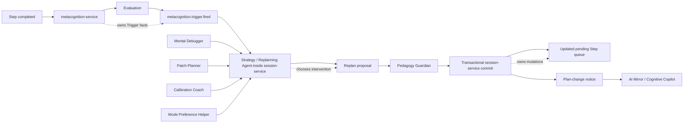

# Strategy / Replanning Agent

**Functional name:** Strategy / Replanning Agent  
**Possible display label:** Session Strategy  
**Family:** Learner-facing planning and runtime adaptation  
**Primary surface:** Session plan-change notice; active session timeline; post-session explanation  
**Authority class:** Runtime intervention planner inside `session-service`  
**Primary truth owner:** `session-service` for LessonPlan, Step, Activity, Step queue, and replan mutations  
**Primary validators:** `pedagogy-guardian-service` for replans and inserted Steps; `metacognition-service` for Trigger facts  
**Main collaborators:** Mental Debugger, Patch Planner / Remediation Agent, Calibration Coach, LessonPlan Generator, Mode Preference Helper, AI Mirror / Cognitive Copilot, Curriculum Planner

## Purpose

The Strategy / Replanning Agent chooses how the active session should respond when learning evidence changes.

It consumes metacognitive Triggers, Step outcomes, repair recommendations, calibration signals, and runtime constraints. It then selects the minimum sufficient intervention: continue, insert a local repair Step, adjust upcoming pending Steps, defer remediation, or request a larger replan.

The product promise is:

> "Noema can adapt during a session without rewriting history, overreacting, or hiding why the plan changed."

## Product Role

The Session Strategy agent helps the learner and system answer:

- Should the session continue as planned?
- Is a small repair enough?
- Should an upcoming Step be replaced or deferred?
- Is this trigger severe enough for a structural replan?
- Should repair happen now or later?
- What changed in the plan, and why?
- Which parts of the original plan remain intact?
- Has Guardian accepted the change?

This agent should be mostly background. It becomes visible only when its decision changes the learner's experience or when the learner asks why the session adapted.

## Realigned Service Position

Current ADRs place Strategy/Replanning inside `session-service` until it owns independent durable state. That is not accidental: replans mutate the active Session aggregate, so the logic must remain close to Step queue transactions.



Strategy should not be modeled as an independent chat agent in the UI. It is a service-owned runtime planner with explainable decisions.

## When It Appears

The Strategy / Replanning Agent appears:

- after `metacognition.trigger.fired`
- after a high-signal Evaluation
- when Patch Planner recommends a repair Step
- when Calibration Coach recommends a check-step
- when a Step outcome invalidates an upcoming pending Step
- when session duration/overload requires deferring adaptation
- when a full plan is blocked or must fallback to structural repair
- in timeline details after a plan change
- in pre-session/post-session review when explaining adaptations

It should not appear for ordinary Step progression. Continuing as planned should usually be silent.

## Live Context Pack

Every run receives a narrow runtime context pack.

### Trigger Context

- Trigger id
- Trigger type
- Trigger severity
- source Evaluation id
- target concept ids
- recommended action from metacognition, if any
- whether trigger is new, repeated, or already handled

### Session Context

- session id
- LessonPlan id
- current Step id
- completed Steps summary
- pending Step queue summary
- evaluated Step immutability constraints
- active goal count
- session time remaining
- current adaptation state
- prior replans in this session

### Diagnostic and Repair Context

- Mental Debugger summary
- Patch Planner repair recommendation
- Calibration Coach signal
- content availability for repair
- eligible mode/transformations
- prerequisite and confusable concept summaries

### Policy Context

- minimum-sufficient-change rules
- allowed replan scopes
- Guardian validation rules
- overload/intrusiveness budget
- learner-visible disclosure rules
- fallback policy when full generation is unavailable
- deferral policy

The context pack should be live and specific. Strategy does not need broad learner history; it needs enough to choose the correct runtime intervention.

## Inputs

The agent may use:

- metacognition Trigger facts
- Evaluation summaries
- current Session/LessonPlan/Step queue state
- Patch Planner recommendations
- Mental Debugger summaries
- Calibration Coach recommendations
- eligible content and activity summaries
- mode eligibility output
- Guardian block reasons for replan repair

The agent should not receive:

- authority to rewrite completed/evaluated Steps
- authority to alter Evaluation facts
- authority to mutate graph/curriculum state directly
- unbounded private histories
- permission to bypass Guardian

## Outputs

The agent produces runtime adaptation artifacts:

- continue-as-planned decision
- local repair Step proposal
- pending Step replacement proposal
- deferred repair decision
- structural replan proposal
- full replan request
- plan-change explanation
- timeline event
- Guardian repair attempt after validation block

More concretely:

| Output | Purpose | Owner |
|---|---|---|
| Replan proposal | Candidate runtime mutation | `session-service` |
| Inserted repair Step | Minimum local intervention | `session-service` after Guardian |
| Superseded pending Step | Replace future, unevaluated Step | `session-service` |
| Deferral decision | Preserve current session flow | `session-service` timeline/read model |
| Full replan request | Escalate beyond local repair | LessonPlan Generator / `session-service` |
| Plan-change notice | Explain visible adaptation | UI / AI Mirror |

## Replan Scopes

Strategy should choose the lowest sufficient scope.

| Scope | Meaning | Typical use |
|---|---|---|
| none | Continue as planned | weak signal or already handled |
| micro | Add prompt/check without Step queue change | small monitoring or confidence issue |
| local_step | Insert one repair Step | immediate repairable issue |
| structural | Replace/defer pending Steps in current plan | prerequisite or repeated issue affects upcoming Steps |
| full | Request a new LessonPlan | current plan no longer fits session goal |
| defer | Save repair for later | overload, low time, or low urgency |

Replans must not mutate evaluated Steps. Step history is evidence and must remain auditable.

## UI Surfaces

### Plan-Change Notice

When Strategy changes the active plan, show a concise notice.

Recommended layout:

```text
Notice: what changed
Why: one-sentence trigger/repair reason
Impact: what stays the same
Actions: continue, inspect details, defer if allowed
```

### Session Timeline

Important events only:

- trigger received
- replan proposed
- Guardian accepted/blocked
- repair Step inserted
- pending Step superseded
- full replan requested
- repair deferred

### Post-Session Explanation

Summarize adaptations:

- what changed
- why it changed
- whether it helped
- which repairs were deferred
- whether curriculum follow-up is recommended

The AI Mirror / Cognitive Copilot can surface this summary quietly.

## UI Labels

Use compact labels:

- `Plan changed`
- `Repair inserted`
- `Step deferred`
- `Pending Step replaced`
- `Replan proposed`
- `Guardian accepted`
- `Guardian blocked`
- `Full replan needed`
- `No change`
- `Saved for later`

## Friendly Why Layer

Plain explanations:

- "One repair Step was inserted because the previous answer showed a prerequisite cue issue."
- "The remaining plan is unchanged."
- "This repair was saved for later because the session is already near its limit."
- "A pending Step was replaced; completed Steps were not changed."
- "Guardian blocked the first repair proposal, so Noema generated a safer version."

## Technical Provenance Layer

Technical details for audit/debug surfaces:

- session id
- LessonPlan id
- replan id
- Trigger id
- Evaluation id
- affected Step ids
- superseded Step ids
- inserted Step ids
- replan scope
- intervention type
- Guardian validation id
- strategy rule/version
- outbox event ids
- learner-visible notice id

Learners should see the friendly layer first. Technical detail belongs in timeline details/admin review.

## User Actions

The learner should be able to:

- continue after plan change
- inspect why the plan changed
- defer a repair, when policy allows
- request a simpler repair
- stop and save session
- mark a plan-change explanation as not useful
- open related Mental Debugger/Patch Planner explanation

The learner should not need to approve every small adaptation. Approval should be reserved for meaningful changes, durable changes, or cases where user agency matters.

## Review and Handoff Rules

Runtime adaptation should follow this path:

```text
Trigger -> Strategy decision -> replan proposal -> Guardian validation -> transaction commit -> learner notice
```

| Situation | Handoff |
|---|---|
| local repair needed | Patch Planner recommends; Strategy inserts via `session-service` |
| repair content missing | Content Creation Orchestrator/content-service path |
| full plan needed | LessonPlan Generator creates new draft |
| durable path issue | Curriculum Planner revision after session or at safe point |
| diagnostic explanation needed | Mental Debugger |
| confidence mismatch | Calibration Coach |
| learner transparency | AI Mirror / Cognitive Copilot |

Guardian-blocked replans return to Strategy for repair or downgrade of scope.

## Authority Boundaries

The agent may:

- choose intervention scope
- propose replans
- propose repair Step insertion
- replace or defer pending unevaluated Steps
- request full replan
- explain plan changes
- publish strategy replan events through `session-service`

The agent must never:

- rewrite evaluated Steps
- own Evaluation or Trigger facts
- mutate graph, content, scheduler, or curriculum state directly
- bypass Pedagogy Guardian
- escalate beyond minimum sufficient change
- silently change learner-visible plan in meaningful ways
- overload the learner with repeated interventions
- act as a standalone strategy-service without a new ADR

## Validation and Review Gates

| Gate | Applied to | Owner |
|---|---|---|
| Trigger facts | trigger type/severity/source | `metacognition-service` |
| Session mutation | Step queue, replan state, LessonPlan changes | `session-service` |
| Replan validation | minimum sufficient scope and Step validity | `pedagogy-guardian-service` |
| Content eligibility | repair activity payloads | `content-service` |
| Mode eligibility | mode/transform rules | shared deterministic rules |
| Learner notice | plan-change explanation | Guardian/Watchtower as needed |
| Intrusiveness | intervention frequency | Watchtower / Governance Layer |

## States

Suggested strategy states:

```text
idle
trigger_received
evaluating_scope
replan_proposed
guardian_pending
guardian_accepted
guardian_blocked
committing
committed
deferred
failed
```

Suggested replan scopes:

```text
none
micro
local_step
structural
full
defer
```

These are product-language suggestions, not final wire schemas.

## Interruption Budget

Strategy is allowed to adapt, but it should not make the session feel unstable.

Suggested defaults:

- continue silently when no visible change is made
- show concise notice for inserted/deferred/replaced Steps
- limit visible replans in short sessions
- downgrade to deferral when fatigue or time pressure is high
- avoid full replans unless local/structural repair is insufficient
- never re-explain the same trigger repeatedly

## Failure Modes

| Failure mode | Product risk | Mitigation |
|---|---|---|
| Overreaction | Session feels chaotic | Minimum-sufficient scope |
| Hidden mutation | Trust loss | Plan-change notices |
| Rewriting history | Evaluation audit breaks | Evaluated Step immutability |
| Guardian bypass | Invalid learner-facing artifacts | Mandatory validation |
| Repair loop | Learner cannot progress | Intervention budget and deferral |
| Full replan too early | Goal drift | Scope hierarchy |
| Trigger duplication | Repeated interventions | handled/active trigger tracking |
| Service ownership drift | Confusing architecture | Keep Strategy inside `session-service` until ADR changes |

## Example UI Copy

Plan change:

- "One repair Step was inserted. The remaining plan is unchanged."
- "A pending Step was replaced because the prerequisite signal affects it."
- "This repair was saved for later; continuing now is the lighter option."

Why:

- "The previous Step triggered a confusion signal, and a local repair is enough."
- "This does not need a full replan."
- "Completed Steps were not changed."

Guardian:

- "Guardian blocked the first repair proposal because it exceeded the minimum needed change."
- "The repaired plan is accepted and ready to continue."

Post-session:

- "The session adapted twice: one repair Step was inserted, and one low-priority repair was deferred."
- "No durable curriculum change was made from this single trigger."

## Open Design Notes

- Audit older docs and registries that refer to a separate `strategy-service` for loadouts and teaching approaches; reconcile with current ADRs where Strategy/Replanning is inside `session-service`.
- Decide whether strategy loadouts remain a future separate product concept or are folded into deterministic mode eligibility and LessonPlan generation.
- Define which plan changes require explicit learner confirmation.
- Define how many replans can occur before a session should offer to stop and save.
- Decide when a full replan should call LessonPlan Generator during an active session versus after the session.
