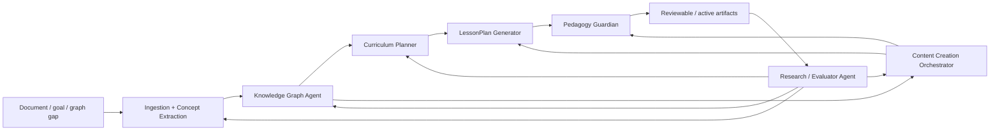

# Creation Agent Loop

The creation loop is how Noema turns raw source material, learner goals, graph gaps, and metacognitive evidence into artifacts that can later be used in Step-first learning.

Creation agents do not silently create truth. They create drafts, proposals, mappings, explanations, and repair attempts. Services validate and commit.

## Equal Entry Corridors

Noema has three first-class creation paths.

### 1. Document to Curriculum and Content

```text
upload source
  -> parse source
  -> extract concepts
  -> map or propose graph anchors
  -> draft curriculum
  -> draft cards / Activities
  -> review
  -> activate for sessions
```

Primary agents:

- Ingestion / Concept Extraction Agent
- Knowledge Graph Agent
- Curriculum Planner
- Content Creation Orchestrator
- LessonPlan Generator

### 2. Goal to Curriculum, Session, and Content

```text
learner states goal
  -> draft curriculum or session plan
  -> identify missing concepts/content
  -> generate supporting artifacts
  -> full LessonPlan review
  -> Guardian validation
  -> begin session
```

Primary agents:

- Curriculum Planner
- LessonPlan Generator
- Content Creation Orchestrator
- Mode Preference Helper

### 3. Graph Gap to Repair, Content, or Curriculum Revision

```text
evaluation / graph / schedule signal
  -> identify gap or misconception
  -> propose graph/content/curriculum repair
  -> generate remediation artifacts
  -> validate
  -> surface as plan change or review item
```

Primary agents:

- Knowledge Graph Agent
- Patch Planner / Remediation Agent
- Curriculum Planner
- Content Creation Orchestrator
- Research / Evaluator Agent

## System Map



## Workbenches

Creation output is reviewed in separate workbenches. There is no single universal AI inbox.

| Workbench | Primary agents | Main reviewer | Main artifacts |
| --- | --- | --- | --- |
| Source Workbench | Ingestion / Concept Extraction | Learner for personal mappings; curator for canonical proposals | Document sections, chunks, concept candidates, mapping suggestions |
| Graph Workbench | Knowledge Graph Agent | Curator/admin for canonical graph; learner for personal mapping decisions | PKG suggestions, CKG proposals, prerequisite gaps, misconception edges |
| Curriculum Workbench | Curriculum Planner | Learner/user | Curriculum versions, node paths, revision proposals |
| Content Workbench | Content Creation Orchestrator | Learner/user, with curator/admin for high-risk shared content | Cards, Activities, variants, transformations, batches |
| Session Plan Review | LessonPlan Generator | Learner/user; Guardian strictly validates | Goals, Steps, epistemic modes, assessment strategy, repair rules |
| Taxonomy Workbench | Taxonomy Curator | Curator/admin | Failure taxonomy diffs, misconception taxonomy changes, category/ontology proposals |
| Evaluation Dashboard | Research / Evaluator Agent | Admin/researcher, with high-level user transparency | Outcome deltas, rejection rates, intervention effectiveness, prompt/version regressions |

## Review Defaults

Creation is draft-first by default.

```text
drafted -> needs_review -> accepted -> active
        -> blocked -> repaired -> needs_review
        -> discarded
```

Canonical graph and taxonomy proposals use a stricter path:

```text
proposed -> curator_review -> accepted -> committed
         -> needs_revision -> repaired
         -> rejected
```

## Review Routing

Review is type-based:

- Personal mappings: learner/user.
- Personal curricula: learner/user.
- Generated personal cards/Activities: learner/user.
- Canonical CKG proposals: curator/admin.
- Global taxonomy changes: curator/admin.
- LessonPlans: learner/user full review before session.
- Guardian-blocked artifacts: originating agent repair, then review again.

## UI Disclosure Model

Creation workbenches should show minimal labels first:

- `Draft`
- `Needs review`
- `Needs metadata`
- `Source-linked`
- `Guardian accepted`
- `Guardian blocked`
- `Graph proposal`
- `Curator review`
- `Ready for session`

One click deeper should show a friendly explanation:

- why the artifact exists
- where it came from
- what confidence/risk means in plain language
- what the recommended next action is

Technical provenance should be one layer below that:

- source document ids and chunks
- CKG/PKG anchors
- agent run id
- Guardian validation id
- prompt/template version when applicable
- service-owned state references

## Creation Milestones

Timelines should show important milestones, not every internal model/tool step:

- source uploaded
- parse completed or uncertain
- concepts extracted
- mapping reviewed
- curriculum drafted
- content batch drafted
- Guardian blocked or accepted
- user accepted/rejected draft
- artifact activated
- artifact revised
- evaluation showed artifact helped or failed

## Anti-Patterns

- Treating extracted concepts as facts.
- Creating canonical graph state directly from an agent.
- Activating generated content without provenance.
- Hiding Guardian rejections.
- Asking for user approval at every tiny internal step.
- Showing every agent action in the main UI.
- Letting a generated LessonPlan start a session without full review.
- Using agent confidence as a substitute for source evidence.
