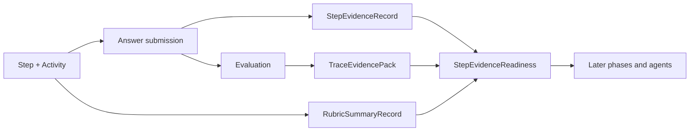

# Phase 1 - Step Evidence and 7-Frame Trace Foundation

## Purpose

This phase anchors the whole Mental Debugger and Calibration Coach refactor in service-owned facts before any agent schema is redesigned. The agents cannot produce informed, personalized, learner-safe reflections until the platform has a deterministic Step evidence record that can answer:

- What Step was the learner attempting?
- What was the Step trying to teach or measure?
- What did the learner answer?
- What was the expected outcome or rubric?
- What happened in each of the 7 reasoning frames?
- Which evidence belongs to recorded facts versus derived signals versus agent inference?

Phase 1 must be completed before changing the agent prompts. If we optimize the prompt first, the model will still be fed thin, inconsistent, and sometimes missing evidence.

## Current Readiness

Status: partially ready.

The codebase already has useful pieces:

- `session-service` persists `Step.objective`, `Step.expectedOutcome`, `Step.evaluationType`, `Step.conceptRefs`, selected mode, transformation, activity prompts, render payloads, and response schema.
- `session-service` accepts `IAnswerStepInput.response`, `correct`, `selfRating`, `evaluationId`, `trace`, and `responseTimeMs`.
- `metacognition-service` persists the full `ISevenFrameTraceDto` as `Evaluation.trace`.
- `metacognition-service` computes `reasoningQuality`, `confidenceSignal`, `combinedScore`, and scheduler rating from evaluation input.
- Web session flow already builds a 7-frame trace preview and sends it during Step answer.

The blocking gaps are structural:

- The learner response is accepted at answer time but is not durably represented as a reusable learner answer artifact.
- The `step.answered` event currently includes trace and evaluation metadata, but not a normalized learner answer summary or rubric summary.
- `get-agent-safe-diagnostic-brief` exposes only a thin signal summary, not a frame evidence pack.
- `get-evaluation-by-step` can return the trace, but the agent context builder does not transform it into learner-safe, human-readable frame evidence.
- There is no explicit readiness contract that says the Step evidence pack is complete enough to call downstream reflective agents.

## Scope

This phase implements the canonical, deterministic evidence substrate for every later phase. It must not introduce LLM reasoning. All fields in this phase are populated from existing Step, activity, response, trace, and evaluation data, or from deterministic formatting rules.

## Owner Services

Primary owners:

- `session-service`: Step objective, activity prompt, learner response artifact, expected outcome, response schema, answer timing, Step lifecycle.
- `metacognition-service`: evaluation facts, trace storage, trace scoring, diagnostic read models, frame evidence projection.
- `packages/contracts` and `packages/api-client`: shared DTO contracts.
- `apps/web`: Step answer submission and trace builder UI contract.

Secondary owners:

- `agents` runtime: must not invent these facts; it only fetches the finalized Step evidence pack.

## Target Data Products

### `StepEvidenceRecord`

Canonical durable record owned by `session-service`.

Required fields:

| Field | Type | Source | Authority | Used by |
|---|---|---|---|---|
| `stepId` | string | Step table | recorded fact | downstream handoff only |
| `sessionId` | string | Step table | recorded fact | downstream handoff only |
| `lessonPlanId` | string | Step table | recorded fact | downstream handoff only |
| `userId` | string | Step table | recorded fact | authorization and handoff only |
| `studyMode` | enum/string | Step table | recorded fact | reasoning context |
| `epistemicMode` | enum/string | Step selected mode | recorded fact | reasoning context |
| `transformationType` | enum/string | Step table | recorded fact | reasoning context |
| `stepObjectiveText` | string | `Step.objective` | recorded fact | model reasoning |
| `expectedOutcomeText` | string | `Step.expectedOutcome` | recorded fact | rubric summary source |
| `activityPromptText` | string | primary activity prompt | recorded fact | model reasoning |
| `activityTypeLabel` | string | activity expected response type and evaluation type | recorded fact | model reasoning |
| `learnerResponseRawRef` | opaque ref or stored JSON | answer input | recorded fact | audit, not prompt by default |
| `learnerAnswerSummaryText` | string | deterministic summarizer for typed response | recorded fact or deterministic projection | model reasoning |
| `responseShape` | object | answer input and activity schema | recorded fact | validation and audit |
| `responseTimeMs` | number | answer input | recorded fact | timing and hesitation signals |
| `hintRequestCount` | number | Step/evaluation input | recorded fact | trace/evaluation context |
| `revisionCount` | number | Step/evaluation input | recorded fact | trace/evaluation context |
| `answeredAt` | ISO string | Step status transition | recorded fact | recency and audit |
| `evidenceCompleteness` | object | deterministic validator | validation result | readiness gate |

Rules:

- The model-facing field is `learnerAnswerSummaryText`, not raw JSON or IDs.
- Raw learner response can be retained for audit or future deterministic summarization, but reflective agents should not receive it unless a policy says it is safe and necessary.
- For free text, the first implementation may store a bounded plain-text answer summary from the learner's own answer. If an abstractive summary is needed later, it belongs to a prerequisite summarizer artifact and must be labeled as agent-generated.
- For structured answers, derive a readable statement from selected choices, labels, and render payload. Do not pass raw choice IDs as reasoning context.

### `RubricSummaryRecord`

Canonical deterministic projection owned by `session-service`, with optional metacognition enrichment after evaluation.

Required fields:

| Field | Type | Source | Authority | Used by |
|---|---|---|---|---|
| `rubricSummaryText` | string | `expectedOutcome`, `evaluationType`, activity response schema | recorded fact or deterministic projection | model reasoning |
| `successCriteriaText` | string[] | expected outcome and response schema | deterministic projection | model reasoning |
| `commonFailureModesText` | string[] | evaluation type plus local heuristics | policy/detected signal | model reasoning |
| `expectedAnswerShapeText` | string | activity expected response type | deterministic projection | model reasoning |
| `rubricVersion` | string | contract constant | recorded fact | audit |

Rules:

- This is not grading. It explains what kind of evidence would count as a good answer.
- Rubric summary must be human-readable and safe for prompts.
- If no explicit rubric exists, fallback to `expectedOutcomeText` plus `activityTypeLabel`.

### `TraceEvidencePack`

Canonical learner-safe projection owned by `metacognition-service`.

Required fields:

| Field | Type | Source | Authority | Used by |
|---|---|---|---|---|
| `evaluationId` | string | Evaluation | handoff only | audit and downstream calls |
| `traceVersion` | string | trace schema | recorded fact | audit |
| `overallReasoningQuality` | number | scoring function | detected signal | model reasoning |
| `frameEvidence` | frame array | evaluation trace | detected signal | model reasoning |
| `strongestFramesText` | string[] | frame scores | deterministic projection | model reasoning |
| `fragileFramesText` | string[] | frame scores | deterministic projection | model reasoning |
| `missingFramesText` | string[] | trace completeness validator | validation result | model reasoning and readiness |
| `traceSummaryText` | string | frame projection | deterministic projection | model reasoning |
| `traceCompleteness` | object | validator | validation result | readiness gate |

Each `frameEvidence` item:

| Field | Type | Required | Source |
|---|---|---|---|
| `frameKey` | enum | yes | trace frame key |
| `frameLabel` | string | yes | deterministic label mapping |
| `learnerReadableMeaning` | string | yes | deterministic label mapping |
| `score` | number or null | yes | trace frame |
| `signalLabel` | string | yes | score bucketing |
| `evidenceText` | string | yes | trace note, answer metadata, or deterministic fallback |
| `confidenceNoteText` | string | yes | deterministic projection |
| `privacyClass` | enum | yes | policy mapping |

Frame labels:

- `framing`: task understanding.
- `cue_selection`: features or cues used.
- `retrieval`: prior concept or pattern brought in.
- `strategy`: method selected.
- `execution`: method carried out.
- `monitoring`: result checked.
- `reflection`: confidence or self-assessment after the attempt.

Rules:

- The trace pack can include frame scores and short evidence text, but it must not expose raw private notes unless Watchtower allows it.
- If a frame is missing, the pack must explicitly say missing instead of letting agents infer a failure.
- If the current frontend trace builder cannot populate meaningful frame evidence, Phase 1 must improve the trace builder or add deterministic defaults labeled as low-evidence.

## Required Functions and Endpoints

### `session-service`

Add or refactor:

- `recordStepAnswerArtifact(stepId, answerInput, ctx)` to persist the learner response shape and answer summary source.
- `getStepEvidenceRecord(stepId, ctx)` to return Step objective, expected outcome, activity prompt, answer summary, response timing, and evidence completeness.
- `buildLearnerAnswerSummary(response, activity)` as a deterministic mapper.
- `buildRubricSummary(step, activity)` as a deterministic mapper.
- `validateStepEvidenceReadiness(record)` to return field-level completeness and blockers.

MCP or tool-facing functions:

- `session.get-step-evidence-record`
- `session.get-step-rubric-summary`

### `metacognition-service`

Add or refactor:

- `getTraceEvidencePack(stepId, ctx)` to return full 7-frame trace projection.
- `buildFrameEvidence(trace, evaluation, stepEvidence)` to convert trace frames to safe human-readable evidence.
- `validateTraceCompleteness(trace)` to identify absent, malformed, or low-evidence frames.
- `getEvaluationEvidenceRecord(stepId, ctx)` to return evaluation facts plus trace pack references.

MCP or tool-facing functions:

- `metacognition.get-trace-evidence-pack`
- `metacognition.get-evaluation-evidence-record`

### Shared Packages

Add DTOs:

- `IStepEvidenceRecordDto`
- `IRubricSummaryRecordDto`
- `ITraceEvidencePackDto`
- `ITraceFrameEvidenceDto`
- `IEvidenceCompletenessDto`

Contracts must distinguish:

- `reasoningText`: safe for agent prompts.
- `serviceReferences`: IDs and raw refs for downstream calls.
- `authority`: recorded fact, detected signal, deterministic projection, validation result.

## Workflow After Phase 1



## Readiness Gate

No Mental Debugger or Calibration Coach run may be considered complete after Phase 5 unless Phase 1 can deterministically provide:

- `stepObjectiveText`
- `activityPromptText`
- `learnerAnswerSummaryText`
- `rubricSummaryText`
- `selfRating`
- `responseTimeMs`
- `fullTraceFrameEvidence`
- `overallReasoningQuality`
- `evidenceCompleteness`

## Mock Data Requirement

Add a seeded test user and Step path that produces all Phase 1 fields.

Recommended seed:

- `userId`: `user_agent_readiness_demo`
- `sessionId`: deterministic fixture ID if the repo supports fixed IDs, otherwise log generated ID in test output.
- Concept: a small algebra or fractions concept already present in KG fixtures, or a new test-only concept in the graph seed if needed.
- Step objective: "Use the distributive property to simplify a linear expression."
- Learner answer summary: "The learner simplified 3(x + 2) as 3x + 2, applying the multiplier to the first term only."
- Rubric summary: "A complete answer distributes 3 to both terms and checks the resulting expression."
- Trace summary: cue selection and monitoring fragile, retrieval and execution partially strong.

## Validation

Required tests:

- `session-service` unit test for `buildLearnerAnswerSummary`.
- `session-service` integration test for answer artifact persistence.
- `session-service` API/tool test for `get-step-evidence-record`.
- `metacognition-service` unit test for `buildFrameEvidence`.
- `metacognition-service` integration test for `get-trace-evidence-pack`.
- `agents/tests/test_composite_tools.py` fixture proving the new tools can be called without agent inference.
- Web session test proving answer submission still sends trace and response data.

Suggested commands:

```bash
pnpm --filter @noema/session-service test
pnpm --filter @noema/metacognition-service test
pnpm --filter @noema/api-client test
python -m pytest agents/tests/test_composite_tools.py
```

## Done Criteria

- Step objective, learner answer summary, rubric summary, and full 7-frame evidence are durable or deterministically reconstructable.
- Missing evidence is explicit and field-level, not silently inferred by an agent.
- Agent runtime can fetch these records through service tools.
- Mock fixture proves all fields can be populated end to end.
- No LLM-generated content is required in Phase 1.
