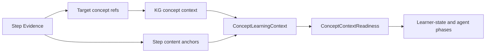

# Phase 2 - Graph, Content, and Concept Context Foundation

## Purpose

Phase 2 makes the conceptual environment around a Step explicit and human-readable. Mental Debugger and Calibration Coach should not reason from bare concept IDs. They need labels, prerequisite summaries, confusable concept summaries, content anchors, curriculum intent, and source references.

The key rule is:

- IDs belong in `service_contract`.
- Human-readable concept, content, and curriculum summaries belong in `reasoning_context`.

## Current Readiness

Status: moderately ready at service/tool level, weak at agent-context level.

Existing strengths:

- `knowledge-graph-service` already exposes tools such as `get-concept-node`, `resolve-concept-reference`, `get-subgraph`, `find-prerequisites`, `find-related-concepts`, `find-contrasts`, `find-confusables`, `find-misconception-links`, `ensure-content-readiness-subgraph`, and `get-learning-path-context`.
- `content-service` exposes tools such as `query-cards`, `get-card-by-id`, `get-card-history`, `get-card-stats`, `get-coverage`, and generated activity variant tools.
- Session Step records include `conceptRefs`, `selectedNodeIds`, activities, card IDs, generated variant IDs, prompts, render payloads, and expected response types.

Blocking gaps:

- Mental Debugger and Calibration Coach context stuffing currently fetches schedule and metacognition summaries, but not KG concept labels, prerequisites, confusables, misconception links, or content anchors.
- `scheduleState:<conceptId>` and `calibrationProjection:<conceptId>` titles use fallback labels because concept labels are not resolved in those builders.
- No unified `ConceptLearningContext` read model exists for agent consumers.
- No clear separation exists between graph IDs for downstream calls and human-readable summaries for model reasoning.
- Content anchors are not explicitly attached to Step evidence packs.

## Scope

This phase implements deterministic graph/content context fetches and projections. It does not ask an LLM to decide why a learner failed. It only gathers and summarizes service-owned graph and content facts.

## Owner Services

Primary owners:

- `knowledge-graph-service`: concept labels, aliases, prerequisites, confusables, contrasts, misconception links, graph anchor status.
- `content-service`: source/card anchors, activity variants, examples, coverage state.
- `curriculum-service`: selected curriculum node context and learning path relation, where available.
- `session-service`: Step to content/activity linkage.

Secondary owners:

- `agents` runtime: composite tool composition only.

## Target Data Product: `ConceptLearningContext`

One record per target concept, owned as a projection assembled from KG, content, scheduler, and Step data.

| Field | Type | Required | Source owner | Refresh mode | Consumer |
|---|---|---|---|---|---|
| `conceptLabelText` | string | yes | KG | prefetched | model reasoning |
| `conceptShortDescriptionText` | string | yes | KG | prefetched | model reasoning |
| `conceptAliasesText` | string[] | optional | KG | prefetched | model reasoning |
| `whyThisConceptMattersText` | string | optional | curriculum/KG | prefetched | model reasoning |
| `prerequisiteSummaries` | object[] | optional | KG | prefetched | debugger, patch planner |
| `confusableConceptSummaries` | object[] | optional | KG | prefetched | debugger, calibration |
| `contrastSummaries` | object[] | optional | KG/content | prefetched | patch planner |
| `misconceptionLinkSummaries` | object[] | optional | KG/metacognition | prefetched | debugger |
| `contentAnchorSummaries` | object[] | optional | content/session | prefetched | debugger, UI provenance |
| `curriculumAnchorText` | string | optional | curriculum/session | prefetched | model reasoning |
| `graphAnchorStatus` | object | yes | KG | prefetched | readiness and audit |
| `serviceReferences` | object | yes | all | prefetched | downstream only |

Prerequisite summary shape:

| Field | Type | Use |
|---|---|---|
| `labelText` | string | model-readable prerequisite name |
| `relationshipText` | string | why it matters for current Step |
| `knownStabilityText` | string | scheduler/metacognition summary if available |
| `riskIfWeakText` | string | deterministic KG relation wording |
| `serviceReferences` | object | IDs for downstream calls only |

Confusable summary shape:

| Field | Type | Use |
|---|---|---|
| `labelText` | string | model-readable nearby concept |
| `confusionReasonText` | string | how learners may mix it up |
| `disambiguatingCueText` | string | what cue separates the concepts |
| `recentEvidenceText` | string | optional metacognition/scheduler evidence |
| `serviceReferences` | object | IDs only |

Content anchor summary shape:

| Field | Type | Use |
|---|---|---|
| `anchorLabelText` | string | human-readable card/source label |
| `sourceKind` | string | card, generated variant, lesson activity, deck item |
| `promptExcerptText` | string | bounded prompt/source excerpt |
| `expectedUseText` | string | why this content was used |
| `coverageStatusText` | string | known coverage/readiness |
| `serviceReferences` | object | content IDs only |

## Required Functions and Endpoints

### `knowledge-graph-service`

If not already exposed consistently through REST and tool registry, standardize:

- `getConceptLearningContext(conceptId, options)`
- `findPrerequisiteSummaries(conceptId, options)`
- `findConfusableConceptSummaries(conceptId, options)`
- `findConceptContrasts(conceptId, options)`
- `findMisconceptionLinkSummaries(conceptId, options)`
- `getGraphAnchorStatus(conceptId)`

MCP/tool names should remain aligned with existing registry names where possible:

- `knowledge-graph.get-concept-learning-context`
- `knowledge-graph.find-prerequisite-summaries`
- `knowledge-graph.find-confusable-concept-summaries`
- `knowledge-graph.find-content-anchor-candidates`

### `content-service`

Add or standardize:

- `getStepContentAnchors(stepId)` to resolve Step activities to cards, generated variants, and source decks.
- `getConceptContentAnchorSummaries(conceptId, options)` to provide examples and source coverage.
- `getContentCoverageSummary(conceptId)` as a prompt-safe summary.

MCP/tool names:

- `content.get-step-content-anchors`
- `content.get-concept-content-anchor-summaries`
- `content.get-content-coverage-summary`

### `session-service`

Add or standardize:

- `getStepActivityContext(stepId)` returning activity prompt, source refs, response schema, expected response type, and generated variant refs.
- `getStepCurriculumAnchor(stepId)` returning curriculum node labels if available.

## Composite Context Changes

Add a shared composite helper:

- `get-step-concept-context`

Inputs:

- `userId`
- `sessionId`
- `stepId`
- `conceptIds`
- `studyMode`

Outputs:

- `conceptLearningContext[]`
- `contentAnchorSummaries[]`
- `curriculumAnchorSummary`
- `serviceInputManifest`
- `readiness`

Then later Mental Debugger and Calibration Coach can consume this helper instead of manually calling KG/content tools.

## Human-Readable Versus ID Boundary

Every graph/content section must have two sibling areas:

```json
{
  "reasoning": {
    "conceptLabelText": "Distributive property",
    "prerequisiteSummaries": [
      {
        "labelText": "Multiplication over addition",
        "relationshipText": "The factor must apply to every term inside the parentheses."
      }
    ]
  },
  "serviceReferences": {
    "conceptId": "concept_distributive_property",
    "prerequisiteConceptIds": ["concept_multiplication_over_addition"],
    "contentCardIds": ["card_distribute_example_01"]
  }
}
```

Rules:

- Agents must reason from `reasoning`.
- IDs are forbidden in model-facing prose unless the prompt explicitly says they are downstream references.
- Downstream services must use `serviceReferences`.

## Workflow After Phase 2



## Readiness Gate

For each concept needed by a reflective agent, the codebase should be able to populate:

- `conceptLabelText`
- `conceptShortDescriptionText`
- at least one content or curriculum anchor
- prerequisite summaries, or an explicit empty state
- confusable summaries, or an explicit empty state
- service references separated from reasoning text

If KG has no concept node, the readiness result must say `missing_concept_node` and the agent call must either defer or use a fallback topic label from Step text with low confidence.

## Mock Data Requirement

Extend the Phase 1 fixture with graph/content data:

- Target concept: "Distributive property"
- Prerequisite: "Multiplication over addition"
- Confusable: "Combining like terms"
- Content anchor: one generated activity or card with prompt and expected outcome.
- Misconception link: "Distributes to first term only"

The fixture must prove that the agent context can show:

- human-readable labels and summaries for all concept roles
- IDs retained only in `serviceReferences`
- content anchor visible in provenance but not overexposed to learner-facing text

## Validation

Required tests:

- KG unit/tool tests for prerequisite and confusable summary functions.
- Content-service tests for Step content anchor resolution.
- Composite tool test for `get-step-concept-context`.
- Agent runtime prompt rendering test proving IDs are placed under service contract, not reasoning text.

Suggested commands:

```bash
pnpm --filter @noema/knowledge-graph-service test
pnpm --filter @noema/content-service test
python -m pytest agents/tests/test_composite_tools.py
python -m pytest agents/tests/test_agent_runtime.py
```

## Done Criteria

- Concept IDs can be deterministically converted to human-readable learning context.
- Prerequisites, confusables, contrasts, misconception links, and content anchors are available as prompt-safe summaries.
- Empty or missing graph data is explicit and testable.
- Later phases can consume one shared context product rather than duplicating graph/content calls.
