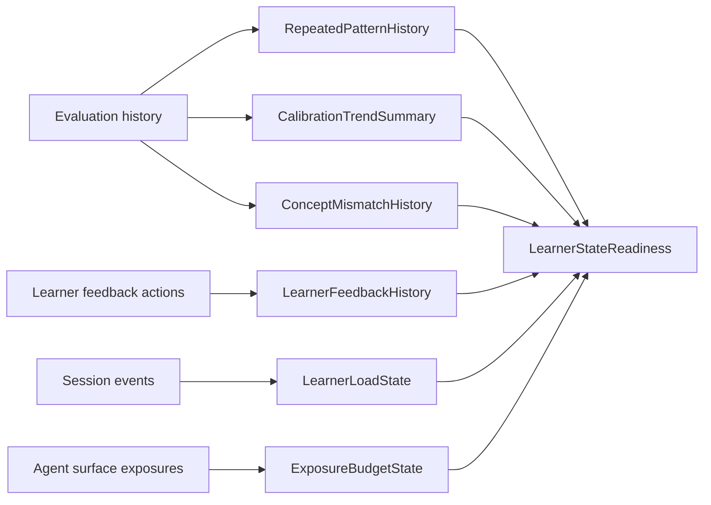

# Phase 3 - Longitudinal Learner State and Calibration Infrastructure

## Purpose

Phase 3 gives the agents memory without giving them unbounded private history. Mental Debugger needs repeated-pattern history, correction and dismissal history, learner feedback depth, frustration/overload, and debugger exposure budget. Calibration Coach needs recent calibration trend, prior drills, concept-specific mismatch history, coaching budget, and confidence/privacy state.

The core design principle:

- Services aggregate and minimize history.
- Agents receive short, human-readable summaries with field-level provenance.
- Agents do not inspect unbounded raw histories.

## Current Readiness

Status: weak to partial.

Existing pieces:

- `metacognition-service` stores evaluations with trace, reasoning quality, confidence signal, concept refs, self-rating, response time, hint count, and revision count.
- `metacognition-service` has `ConceptReasoningRollup`.
- `scheduler-service` has `ConceptEvaluationLog`, `ConceptCalibrationData`, and `ConceptTransformationHistory`.
- Current composite tools fetch `get-reasoning-average`, `get-concept-schedule`, and `get-transformation-history`.
- Agent docs already define user actions like dismissing, correcting, hiding, and asking for more or less detail.

Blocking gaps:

- No explicit repeated-pattern read model exists for debugger consumption.
- No learner action history model exists for dismissals, corrections, "does not fit", "show less", "show more", or temporary hides.
- No explicit frustration or overload signal is computed from session interaction data.
- No explicit debugger exposure budget or coaching frequency budget is enforced.
- No recent calibration trend read model exists beyond reasoning average and schedule projection.
- No prior calibration drill history is fed into Calibration Coach.
- No concept-specific mismatch history exists that summarizes confidence versus reasoning per concept.

## Scope

This phase creates deterministic longitudinal read models. Some summaries can be computed directly from events and evaluations. Any summary requiring natural-language explanation should still be deterministic template text unless a later prerequisite agent is explicitly introduced.

## Owner Services

Primary owners:

- `metacognition-service`: repeated reasoning patterns, calibration trend, concept-specific mismatch history, evaluation aggregates.
- `scheduler-service`: concept schedule, calibration projections, prior intervention/drill outcomes, exposure timing where scheduling owns cadence.
- `session-service`: learner actions on feedback surfaces, session fatigue signals, interruption counts.
- `apps/web`: UI events for dismiss/correct/show more/show less/hide temporarily.

Secondary owners:

- `agents` runtime: consumes summaries and enforces no-call readiness gates.
- `watchtower-governance`: policy interpretation in Phase 4.

## Target Read Models

### `RepeatedPatternHistory`

Owned by `metacognition-service`.

| Field | Type | Source | Authority | Used by |
|---|---|---|---|---|
| `windowLabelText` | string | query parameters | deterministic projection | model reasoning |
| `patternSummaries` | object[] | evaluations, triggers, trace frames | detected signal | debugger |
| `singleSignalWarningText` | string | count threshold | policy/projection | debugger |
| `mostRecentSimilarStepsText` | string[] | minimized eval history | detected signal | debugger |
| `trendDirectionText` | string | aggregate comparison | detected signal | debugger/dashboard |
| `confidenceNoteText` | string | sample count and variance | validation result | debugger |
| `serviceReferences` | object | eval and step IDs | downstream only | audit |

Pattern summary shape:

| Field | Type | Required |
|---|---|---|
| `patternLabelText` | string | yes |
| `learnerSafeDescriptionText` | string | yes |
| `evidenceCount` | number | yes |
| `affectedConceptLabelsText` | string[] | yes |
| `typicalFragileFramesText` | string[] | yes |
| `lastSeenText` | string | yes |
| `recommendedInterpretationText` | string | yes |

### `LearnerFeedbackHistory`

Owned by `session-service` or a shared learner-interaction service if one exists later.

| Field | Type | Source | Authority | Used by |
|---|---|---|---|---|
| `recentDismissals` | object[] | UI actions | recorded fact | debugger, calibration |
| `recentCorrections` | object[] | UI actions | recorded fact | debugger, taxonomy curator |
| `feedbackDepthPreference` | enum | UI actions/profile | user-provided intent and recorded preference | prompt/rendering |
| `temporaryHideState` | object | UI actions | recorded fact | Watchtower and UI |
| `correctionThemesText` | string[] | deterministic clustering rules | detected signal | debugger |
| `serviceReferences` | object | action IDs | downstream only | audit |

Required learner actions:

- `debugger_reflection_dismissed`
- `debugger_reflection_marked_not_fit`
- `debugger_reflection_show_less`
- `debugger_reflection_show_more`
- `debugger_pattern_hidden_temporarily`
- `calibration_note_dismissed`
- `calibration_note_marked_not_fit`
- `calibration_drill_accepted`
- `calibration_drill_declined`
- `calibration_show_trend`

### `LearnerLoadState`

Owned by `session-service`, with optional Watchtower policy interpretation in Phase 4.

| Field | Type | Source | Authority | Used by |
|---|---|---|---|---|
| `frustrationSignalText` | string | hints, retries, corrections, session events | detected signal | debugger, calibration, Watchtower |
| `overloadRiskLevel` | enum | deterministic thresholds | detected signal | Watchtower and runtime gate |
| `fatigueIndicatorsText` | string[] | timing, repeated failures, abandonment | detected signal | agents and UI |
| `recommendedToneText` | string | deterministic policy mapping | policy | model reasoning |
| `shouldDeferReflectiveAgent` | boolean | thresholds | validation result | runtime |

No clinical or trait language is allowed. Use event-scoped wording:

- Good: "This session has several rapid retries and dismissed notes."
- Bad: "The learner is frustrated by nature."

### `ExposureBudgetState`

Owned by `session-service` or `scheduler-service`, depending on whether budgets are session-local or longitudinal.

| Field | Type | Source | Authority | Used by |
|---|---|---|---|---|
| `debuggerExposureCountInSession` | number | UI/render events | recorded fact | runtime gate |
| `calibrationExposureCountInSession` | number | UI/render events | recorded fact | runtime gate |
| `lastDebuggerShownAtText` | string | UI/render events | recorded fact | prompt and UI |
| `lastCalibrationShownAtText` | string | UI/render events | recorded fact | prompt and UI |
| `debuggerExposureBudgetText` | string | product policy | policy | prompt |
| `coachingFrequencyBudgetText` | string | product policy | policy | prompt |
| `remainingBudget` | object | derived counts | validation result | runtime |
| `mustUseQuietSurface` | boolean | derived policy | validation result | UI/routing |

### `CalibrationTrendSummary`

Owned by `metacognition-service`, optionally enriched by `scheduler-service`.

| Field | Type | Source | Authority | Used by |
|---|---|---|---|---|
| `recentCalibrationTrendText` | string | evaluations | detected signal | calibration |
| `alignmentRate` | number | evaluations | detected signal | calibration/dashboard |
| `overconfidenceCount` | number | evaluations | detected signal | calibration |
| `underconfidenceCount` | number | evaluations | detected signal | calibration |
| `hesitationWithQualityCount` | number | evaluations | detected signal | calibration |
| `trendWindow` | object | query | recorded fact | audit |
| `evidenceExamplesText` | string[] | minimized examples | deterministic projection | calibration |
| `confidenceInTrendText` | string | sample count and variance | validation result | calibration |

### `ConceptMismatchHistory`

Owned by `metacognition-service` with scheduler read support.

| Field | Type | Source | Authority | Used by |
|---|---|---|---|---|
| `conceptLabelText` | string | KG or cached concept context | recorded fact/projection | calibration |
| `mismatchPatternText` | string | evaluation aggregates | detected signal | calibration |
| `reasoningVersusConfidenceText` | string | evaluations | deterministic projection | calibration |
| `recentExamplesText` | string[] | minimized evals | deterministic projection | calibration |
| `scheduleProjectionText` | string | scheduler | detected signal | calibration |
| `recommendedCalibrationMoveText` | string | deterministic rules | policy/projection | calibration |
| `serviceReferences` | object | concept/eval IDs | downstream only | patch planner |

### `PriorDrillHistory`

Owned by `scheduler-service` or `metacognition-service`, depending on where drills are persisted.

| Field | Type | Source | Authority | Used by |
|---|---|---|---|---|
| `priorDrillsText` | string[] | drill/intervention records | recorded fact | calibration |
| `lastDrillOutcomeText` | string | drill result | detected signal | calibration |
| `drillFatigueText` | string | declines/repeats | detected signal | Watchtower |
| `recommendedNextDrillTypeText` | string | deterministic rules | policy/projection | patch planner |
| `serviceReferences` | object | drill IDs | downstream only | patch planner |

## Required Functions and Endpoints

### `metacognition-service`

Add:

- `getRepeatedPatternHistory(userId, conceptIds, window)`
- `getCalibrationTrendSummary(userId, conceptIds, window)`
- `getConceptMismatchHistory(userId, conceptId, window)`
- `getRecentEvaluationExamples(userId, conceptIds, window, limit)` returning minimized examples only.
- `recordLearnerCorrectionSignal(input)` if corrections are stored with metacognition rather than session.

Tool names:

- `metacognition.get-repeated-pattern-history`
- `metacognition.get-calibration-trend-summary`
- `metacognition.get-concept-mismatch-history`

### `session-service`

Add:

- `recordLearnerFeedbackAction(input)`
- `getLearnerFeedbackHistory(userId, surface, window)`
- `getLearnerLoadState(sessionId, userId)`
- `getExposureBudgetState(sessionId, userId, surfaces)`
- `recordAgentSurfaceExposure(input)`

Tool names:

- `session.get-learner-feedback-history`
- `session.get-learner-load-state`
- `session.get-exposure-budget-state`
- `session.record-agent-surface-exposure`

### `scheduler-service`

Add or expose:

- `getPriorCalibrationDrillHistory(userId, conceptIds, window)`
- `getConceptCalibrationProjection(conceptId, studyMode)` as an explicit calibration endpoint rather than overloading `get-concept-schedule`.
- `getInterventionCadenceState(userId, conceptIds, surfaces)`

Tool names:

- `scheduler.get-prior-calibration-drill-history`
- `scheduler.get-concept-calibration-projection`
- `scheduler.get-intervention-cadence-state`

## Workflow After Phase 3



## Deterministic Versus Agent-Generated Fields

Deterministic in Phase 3:

- pattern counts
- trend counts
- alignment rate
- overconfidence and underconfidence counts
- exposure counts
- budget remaining
- "single signal" versus "repeated pattern" threshold
- feedback action history
- minimized example selection

Potentially agent-generated later, but not required in Phase 3:

- nuanced natural-language explanation of why a repeated pattern is happening
- abstractive learner-level narrative across many sessions
- research/evaluator interpretation of intervention effectiveness

If those are added later, they must be prerequisite artifacts and must not be silently generated inside Mental Debugger or Calibration Coach.

## Readiness Gate

Before Phase 5, the runtime should be able to fetch:

- repeated-pattern history for the Step concepts
- recent dismissals and corrections for debugger and calibration surfaces
- feedback-depth preference
- overload/frustration state
- debugger exposure budget
- coaching frequency budget
- recent calibration trend
- prior calibration drill history
- concept-specific mismatch history

If no history exists because the user is new, each field must return an explicit empty-state summary:

- "No prior similar Step evidence yet."
- "No prior calibration drills recorded."
- "No corrections or dismissals recorded for this surface."

Agents should receive the empty-state text, not an absent field.

## Mock Data Requirement

Extend the demo user:

- Add at least three evaluation records for the same concept.
- Include one overconfidence signal, one underconfidence signal, and one well-calibrated signal.
- Add one repeated cue-selection or monitoring weakness.
- Add one dismissed debugger note.
- Add one correction: "This was a reading issue, not a concept issue."
- Add one prior calibration drill accepted and completed.
- Add one calibration note declined to test fatigue/budget logic.

## Validation

Required tests:

- Repeated-pattern read model unit test.
- Calibration trend read model unit test.
- Learner feedback action persistence test.
- Exposure budget persistence and threshold test.
- Composite context test proving empty states are explicit.
- Frontend test for sending dismissal/correction actions.

Suggested commands:

```bash
pnpm --filter @noema/metacognition-service test
pnpm --filter @noema/session-service test
pnpm --filter @noema/scheduler-service test
pnpm --filter @noema/web test
python -m pytest agents/tests/test_composite_tools.py
```

## Done Criteria

- The platform can summarize relevant history without raw unbounded traces.
- Learner dismissals and corrections are durable and queryable.
- Frustration/overload and exposure budgets can defer or soften reflective agents.
- Calibration Coach has trend, drill, and mismatch history beyond reasoning average and schedule projection.
