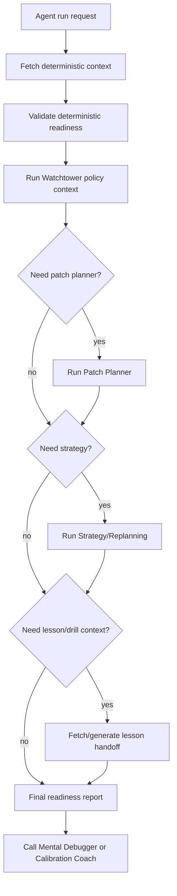

# Phase 4 - Policy, Handoff, and Prerequisite Artifact Workflow

## Purpose

Phase 4 makes the workflow safe and ordered before Mental Debugger and Calibration Coach are called. Some fields can be populated deterministically from services. Other fields require another agent or validator to finalize a prerequisite artifact first. The runtime must know the difference and must not call learner-facing reflective agents while prerequisite inputs are missing, stale, blocked, or policy-hidden.

The main goal:

- Build an orchestration and readiness layer that gathers deterministic facts first, requests prerequisite agent artifacts second, validates policy third, and only then calls Mental Debugger or Calibration Coach.

## Current Readiness

Status: partial.

Existing strengths:

- `WatchtowerGovernanceAgent` exists and can decide visibility states such as allowed, deferred, hidden by policy, needs review, expired, and audit required.
- `PedagogyGuardian` validation exists for learner-facing artifacts.
- `PatchPlannerAgent`, `StrategyReplanningAgent`, `LessonPlanGenerator`, `CognitiveCopilot`, and other collaborators exist.
- `agent_runtime.py` already has composite context builders, tool belts, provider tool catalogs, realtime/batch paths, and output contracts.
- `batch_worker.py` can persist queued provider JSON results through local finalizers.

Blocking gaps:

- Watchtower is not a required prerequisite for Mental Debugger and Calibration Coach prompt readiness.
- Patch Planner and Strategy outputs are not durable prerequisite artifacts required before handoff fields are populated.
- Lesson-plan or patch-planner handoff context is not explicitly stuffed into current debugger/calibration packs.
- No readiness report says which fields were deterministic, which required another agent, which are missing, and which are policy-hidden.
- No runtime state machine prevents Mental Debugger or Calibration Coach from being called with partial inputs.
- Realtime and batch paths are asymmetric, especially Calibration Coach: realtime uses local deterministic coaching while batch can use provider-generated JSON.

## Scope

This phase designs and implements the orchestration layer and prerequisite artifact contracts. It should not yet rewrite Mental Debugger and Calibration Coach prompt schemas. That happens in Phase 5.

## Owner Components

Primary owners:

- `agents/src/agents/agent_runtime.py`: orchestration, readiness gates, prerequisite agent sequencing.
- `agents/src/agents/composite_tools.py`: context assembly and readiness manifests.
- `agents/src/agents/watchtower_governance.py`: privacy, intrusion, visibility, and budget policy artifact.
- `agents/src/agents/patch_planner_remediation.py`: repair plan prerequisite artifact when needed.
- `agents/src/agents/strategy_replanning.py`: strategy/replan prerequisite artifact when needed.
- `agents/src/agents/lesson_planner.py`: lesson-plan context when a calibration drill or repair Step is being considered.
- Service clients and owning services: persistence and retrieval of prerequisite artifacts.

Secondary owners:

- `pedagogy-guardian-service`: language validation after learner-facing draft generation.
- `apps/web`: UI actions and surface contracts.

## Target Artifact: `AgentInputReadinessReport`

The runtime must produce this before calling Mental Debugger or Calibration Coach.

| Field | Type | Required | Source | Used by |
|---|---|---|---|---|
| `targetAgent` | enum | yes | runtime | orchestration |
| `operation` | enum | yes | runtime | orchestration |
| `readinessState` | enum | yes | runtime | gate |
| `blockingReasons` | string[] | yes | runtime validators | gate |
| `missingFields` | object[] | yes | field validator | debugging |
| `policyHiddenFields` | object[] | yes | Watchtower | audit |
| `prefetchedFields` | object[] | yes | composite tools | audit |
| `callableToolFields` | object[] | yes | tool catalog | audit |
| `prerequisiteAgentFields` | object[] | yes | workflow planner | orchestration |
| `inferredFallbackFields` | object[] | yes | runtime | risk disclosure |
| `serviceInputManifest` | object[] | yes | composite tools | audit |
| `humanReadableReasoningSections` | string[] | yes | prompt builder | prompt validation |
| `serviceContractSections` | string[] | yes | prompt builder | downstream validation |

Readiness states:

- `ready`
- `ready_with_empty_history`
- `deferred_missing_deterministic_context`
- `deferred_waiting_for_prerequisite_agent`
- `hidden_by_policy`
- `blocked_by_validation`
- `blocked_by_stale_context`

## Target Artifact: `WatchtowerPolicyContext`

Must be created before prompt assembly.

| Field | Type | Required | Source |
|---|---|---|---|
| `privacyClass` | enum | yes | Watchtower |
| `traceVisibility` | enum | yes | Watchtower |
| `surfaceVisibility` | enum | yes | Watchtower |
| `intrusionRiskLevel` | enum | yes | Watchtower |
| `frustrationOrOverloadPolicyText` | string | yes | Watchtower plus LearnerLoadState |
| `allowedDetailLevelText` | string | yes | Watchtower plus preference |
| `canShowDebuggerNow` | boolean | conditional | Watchtower |
| `canShowCalibrationNow` | boolean | conditional | Watchtower |
| `mustUseQuietDashboardSurface` | boolean | yes | Watchtower |
| `mustMinimizeTraceEvidence` | boolean | yes | Watchtower |
| `learnerFacingPolicyText` | string | yes | Watchtower |
| `serviceReferences` | object | yes | downstream only |

Rules:

- Mental Debugger and Calibration Coach must receive policy text, not raw internal policy IDs as reasoning context.
- Raw trace detail exposure must be denied unless Watchtower explicitly allows a detailed surface.
- If frustration/overload is high, runtime may defer the agent or route to a quiet dashboard summary.

## Prerequisite Agent Inputs

### Patch Planner / Remediation

Needed when:

- Mental Debugger should recommend a repair.
- Calibration Coach should propose a check-step or calibration drill.
- Repeated pattern indicates a content or practice intervention.

Required output artifact:

- `PatchPlannerHandoffContext`

Fields:

| Field | Type | Required | Source |
|---|---|---|---|
| `repairIntentText` | string | yes | Patch Planner |
| `minimumSufficientInterventionText` | string | yes | Patch Planner |
| `candidateRepairMovesText` | string[] | yes | Patch Planner |
| `notRecommendedMovesText` | string[] | optional | Patch Planner |
| `contentNeedText` | string | optional | Patch Planner |
| `schedulerImpactText` | string | optional | Patch Planner/scheduler |
| `serviceReferences` | object | yes | downstream only |

Readiness rule:

- If Mental Debugger output requires `repairRecommendation`, and deterministic remediation brief is missing or too thin, runtime must call Patch Planner first.
- If Patch Planner is blocked, Mental Debugger may still produce an explanation only if the product operation allows "no repair handoff"; otherwise defer.

### Strategy / Replanning

Needed when:

- The recommended action might change session flow.
- Repeated failures suggest the current lesson path is wrong.
- Overload policy suggests deferring, simplifying, or changing surfaces.

Required output artifact:

- `StrategyHandoffContext`

Fields:

| Field | Type | Required | Source |
|---|---|---|---|
| `strategyDecisionText` | string | yes | Strategy Replanning |
| `continueOrRepairOrReplanText` | string | yes | Strategy Replanning |
| `whyThisRoutingText` | string | yes | Strategy Replanning |
| `constraintsText` | string[] | yes | Strategy Replanning/Watchtower |
| `serviceReferences` | object | yes | downstream only |

### Lesson Plan / Drill Context

Needed when:

- Calibration Coach recommends a calibration drill.
- Patch Planner proposes a repair Step.
- Dashboard surfaces need to explain where the recommendation fits in the learning path.

Required output artifact:

- `LessonPlanHandoffContext`

Fields:

| Field | Type | Required | Source |
|---|---|---|---|
| `currentLessonGoalText` | string | yes | session/curriculum/lesson planner |
| `currentStepRoleText` | string | yes | session/lesson planner |
| `availableDrillTypesText` | string[] | optional | lesson planner/patch planner |
| `recommendedInsertionPointText` | string | optional | lesson planner/strategy |
| `serviceReferences` | object | yes | downstream only |

### Mental Debugger as Prerequisite for Calibration

Needed when:

- Calibration Coach must connect confidence mismatch to a trace explanation.
- The calibration note would otherwise say only "confidence ahead of trace" without explaining what the trace evidence was.

Required output artifact:

- `DebuggerSummaryForCalibration`

Fields:

| Field | Type | Required | Source |
|---|---|---|---|
| `traceExplanationText` | string | yes | Mental Debugger |
| `fragileFrameText` | string | yes | Mental Debugger |
| `whatWorkedText` | string | yes | Mental Debugger |
| `uncertaintyText` | string | yes | Mental Debugger |
| `serviceReferences` | object | yes | downstream only |

Rule:

- This is only needed when Calibration Coach needs a trace explanation. For simple trend dashboard notes, Calibration Coach may use `TraceEvidencePack` directly without invoking Mental Debugger.

## Deterministic Versus Prerequisite-Agent Field Classification

Deterministic and must be prefetched:

- step objective
- learner answer summary
- rubric summary
- full 7-frame trace and frame-level evidence
- prerequisite/confusable/content-anchor summaries
- repeated-pattern history
- dismissals/corrections
- feedback-depth preference
- recent calibration trend
- prior drills
- concept-specific mismatch history
- exposure counts and budget state

Requires Watchtower or policy artifact:

- privacy/intrusion policy beyond generic constraints
- trace visibility
- overload policy interpretation
- whether to show, defer, hide, or route quietly

Requires Patch Planner:

- concrete repair move if deterministic remediation brief is not enough
- calibration drill proposal requiring content/session insertion
- minimum sufficient intervention text

Requires Strategy:

- replan versus repair versus continue routing
- session flow impact

Requires Lesson Planner:

- drill/repair placement in the lesson plan
- lesson-plan goal and Step role context when unavailable from session

Should not be inferred by Mental Debugger or Calibration Coach:

- why a repair should be inserted
- whether privacy allows raw trace detail
- whether repeated pattern is strong enough to interrupt
- whether the current session should be replanned
- whether a calibration drill can be scheduled

## Runtime Workflow



## Runtime No-Call Rules

Do not call Mental Debugger or Calibration Coach when:

- `stepObjectiveText` is missing.
- `learnerAnswerSummaryText` is missing for a post-step operation.
- `rubricSummaryText` is missing for a post-step operation.
- `TraceEvidencePack` is missing or malformed.
- Watchtower returns `hidden_by_policy` for the target surface.
- overload state requires deferral and user did not explicitly ask.
- a required Patch Planner or Strategy artifact is pending.
- service references needed by the output contract are absent.

Allowed degraded calls:

- Dashboard operation may run with `ready_with_empty_history` for new users.
- User-requested "explain this Step" may run without repeated history if the single Step evidence is complete.
- Calibration Coach may produce "single signal" only when trend fields explicitly state no prior data.

## Batch and Realtime Symmetry

Phase 4 must define one orchestration path used by both realtime and batch:

- deterministic fetch
- prerequisite artifact fetch/generation
- Watchtower policy
- readiness report
- provider or local agent execution
- Guardian validation
- persistence/handoff

This removes the current asymmetry where Calibration Coach realtime bypasses model JSON while batch can use provider JSON. Phase 5 will decide whether local fallback remains as a fallback, but the readiness path must be shared.

## Required Implementation Units

Agent runtime:

- `AgentInputReadinessOrchestrator`
- `DeterministicContextAssembler`
- `PrerequisiteArtifactPlanner`
- `PrerequisiteArtifactRunner`
- `ReadinessValidator`
- `AgentInputPartitioner`

Composite tools:

- `get-learner-facing-agent-foundation-context`
- `get-mental-debugger-readiness-context`
- `get-calibration-coach-readiness-context`

Persistence:

- Either persist prerequisite artifacts in agent batch results or owning service read models.
- Each artifact needs status, validator, generatedAt, expiresAt, source manifest, and service references.

## Validation

Required tests:

- Runtime test: no-call when Step evidence is missing.
- Runtime test: no-call when Watchtower hides sensitive trace detail.
- Runtime test: Patch Planner runs before Mental Debugger when repair recommendation is required.
- Runtime test: Strategy runs before agent when replan routing is required.
- Runtime test: batch and realtime use the same readiness validator.
- Composite tool test: readiness report lists prefetched, prerequisite-agent, missing, and policy-hidden fields.

Suggested commands:

```bash
python -m pytest agents/tests/test_agent_runtime.py
python -m pytest agents/tests/test_composite_tools.py
python -m pytest agents/tests/test_batch_worker.py
```

## Done Criteria

- The runtime can explain exactly why an agent was called, deferred, hidden, or blocked.
- Deterministic context is fetched before any prerequisite agent.
- Prerequisite agents are called only when their artifacts are needed.
- Mental Debugger and Calibration Coach are never called with silent missing fields.
- Realtime and batch paths share the same readiness contract.
