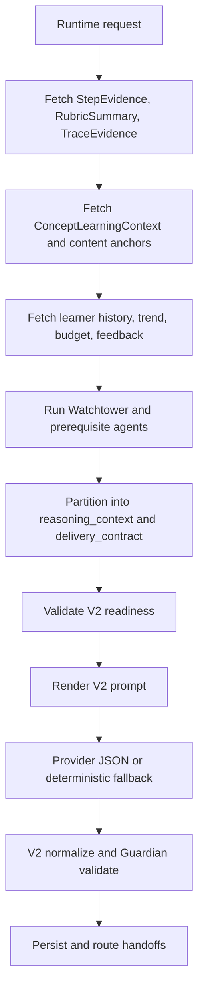

# Phase 5 - Agent Schema, Workflow, and Population Refactor

## Purpose

Phase 5 is where Mental Debugger and Calibration Coach are finally refactored. This phase must happen after the first four infrastructure phases because the agents should not compensate for missing service facts. Their job is learner-facing reasoning and explanation, not hidden data reconstruction.

The final design has two top-level input categories for both agents:

- `reasoning_context`: human-readable, prompt-safe facts and summaries the model may use to produce an informed answer.
- `delivery_contract`: IDs, schemas, routing metadata, validation requirements, persistence targets, and downstream function-call references.

Hard rule:

- The model reasons only from human-readable fields under `reasoning_context`.
- IDs are available only under `delivery_contract` for downstream handoff, collaborating agents, persistence, audit, and service function calls.

## Current State to Replace

Mental Debugger currently receives `MentalDebuggerRequest`:

| Field | Current role |
|---|---|
| `userId` | runtime identity and service fetch |
| `sessionId` | optional context fetch |
| `stepId` | optional evaluation lookup |
| `conceptIds` | optional schedule lookup |
| `studyMode` | optional schedule lookup |
| `userIntent` | optional stuffed section |
| `contextPack` | generic sections with mixed reasoning and service data |
| `provider` | execution metadata |
| `model` | execution metadata |
| `agentRunId` | execution correlation |
| `promptTemplateVersion` | provenance |
| `executionStrategy` | provenance |
| `batchRequested` | provenance |

Current stuffed sections:

- `stepLoopSnapshot`
- `evaluation`
- `diagnosticBrief`
- `remediationBrief`
- `scheduleState:<conceptId>`
- `transformationHistory:<conceptId>`
- optional `userIntent`
- `constraints`

Calibration Coach currently receives `CalibrationCoachRequest` with the same envelope fields and generic `contextPack`.

Current stuffed sections:

- `stepLoopSnapshot`
- `evaluation`
- `diagnosticBrief`
- `reasoningAverage:<conceptId>`
- `calibrationProjection:<conceptId>`

Critical asymmetry:

- Mental Debugger realtime tries provider JSON and falls back to local logic.
- Calibration Coach realtime uses deterministic local coaching and does not use model JSON.
- Batch path can use provider JSON for both before finalization.

This phase replaces both with explicit V2 schemas and a shared readiness-driven execution path.

## Implementation Strategy

Implement new V2 schemas without preserving backward compatibility, as the app is not released.

Required removals or replacements:

- Replace generic `contextPack` as the primary model input.
- Replace ambiguous section arrays with typed fields.
- Replace "concept IDs in reasoning text" with `serviceReferences`.
- Replace fallback inference from thin `diagnosticBrief` with explicit readiness errors.
- Replace Calibration realtime/batch asymmetry with one shared pipeline.

Keep as internal fallback only:

- local deterministic fallback text generators may remain for outage scenarios, but must consume the same V2 input and must label output as fallback.

## Shared V2 Envelope

All learner-facing reflective agents use this outer request shape.

```ts
interface LearnerFacingReflectiveAgentRequestV2<ReasoningContext, DeliveryContract> {
  schemaVersion: 'learner-facing-reflective-agent.v2';
  agentName: 'mental-debugger' | 'calibration-coach';
  operation:
    | 'post_step_reflection'
    | 'dashboard_summary'
    | 'drill_or_check_step_recommendation'
    | 'service_handoff';
  reasoningContext: ReasoningContext;
  deliveryContract: DeliveryContract;
  readinessReport: AgentInputReadinessReport;
}
```

Runtime-added fields remain in `deliveryContract.identity` or `deliveryContract.execution`, not in reasoning context.

## Shared Source Classification

Every field in Phase 5 must declare one of these source classes:

- `prefetched_deterministic`: fetched from services before the model call.
- `runtime_added`: added by agent runtime or wrapper.
- `provider_tool_available`: available through tool belt at call time, but not stuffed by default.
- `prerequisite_agent_artifact`: generated by Watchtower, Patch Planner, Strategy, Lesson Planner, Mental Debugger, or another collaborator before this agent can run.
- `derived`: computed from other prefetched fields by deterministic code.
- `empty_state`: explicitly no data yet.
- `missing_blocking`: required field absent, agent must not run.
- `missing_nonblocking`: optional field absent with safe fallback.

Authority classes:

- `recorded_fact`
- `detected_signal`
- `user_provided_intent`
- `policy`
- `validation_result`
- `agent_inference`
- `deterministic_projection`

## Mental Debugger V2 Input

### Top-Level Shape

```ts
interface MentalDebuggerInputV2 {
  reasoningContext: MentalDebuggerReasoningContextV2;
  deliveryContract: MentalDebuggerDeliveryContractV2;
  readinessReport: AgentInputReadinessReport;
}
```

### `reasoningContext` Groups

Mental Debugger groups:

- `stepContext`
- `evaluationTraceContext`
- `conceptContentContext`
- `learnerStateContext`
- `policyContext`
- `priorAgentContext`

### Mental Debugger `stepContext`

| Field | Type | Required | Source owner | Refresh mode | Consumer | Fallback if missing |
|---|---|---|---|---|---|---|
| `stepObjectiveText` | string | yes | session-service | prefetched deterministic | model reasoning | block post-step operation |
| `stepRoleText` | string | yes | session-service or lesson planner | prefetched deterministic | model reasoning | "This Step was part of the current lesson." |
| `activityPromptText` | string | yes | session-service | prefetched deterministic | model reasoning | block post-step operation |
| `activityTypeText` | string | yes | session-service | prefetched deterministic | model reasoning | "Open response Step." |
| `learnerAnswerSummaryText` | string | yes | session-service | prefetched deterministic | model reasoning | block post-step operation |
| `rubricSummaryText` | string | yes | session-service | prefetched deterministic | model reasoning | block post-step operation |
| `successCriteriaText` | string[] | optional | session-service | prefetched deterministic | model reasoning | empty array with explicit note |
| `responseTimingText` | string | optional | session-service | derived | model reasoning | "No timing signal available." |
| `hintAndRevisionText` | string | optional | session/metacognition | derived | model reasoning | "No hint or revision signal available." |
| `studyModeText` | string | yes | session-service | prefetched deterministic | model reasoning | "Study mode was not specified." |
| `epistemicModeText` | string | yes | session-service | prefetched deterministic | model reasoning | "Reasoning mode was not specified." |

Population rules:

- `stepObjectiveText` comes from `Step.objective`.
- `activityPromptText` comes from the primary Step activity prompt.
- `learnerAnswerSummaryText` comes from `StepEvidenceRecord`.
- `rubricSummaryText` comes from `RubricSummaryRecord`.
- `responseTimingText` is a phrase such as "Answered in 18 seconds; timing alone is not treated as failure."
- Raw response JSON is never included here.

### Mental Debugger `evaluationTraceContext`

| Field | Type | Required | Source owner | Refresh mode | Consumer | Fallback if missing |
|---|---|---|---|---|---|---|
| `evaluationSummaryText` | string | yes | metacognition-service | prefetched deterministic | model reasoning | block |
| `correctnessText` | string | yes | metacognition-service | prefetched deterministic | model reasoning | "Correctness unavailable." only for non-post-step |
| `reasoningQualityText` | string | yes | metacognition-service | prefetched deterministic | model reasoning | block |
| `confidenceAlignmentText` | string | optional | metacognition-service | derived | model reasoning, calibration handoff | "No confidence comparison available." |
| `traceSummaryText` | string | yes | metacognition-service | prefetched deterministic | model reasoning | block |
| `frameEvidence` | `TraceFrameEvidenceForPrompt[]` | yes | metacognition-service | prefetched deterministic | model reasoning | block if malformed |
| `strongestFramesText` | string[] | optional | metacognition-service | derived | model reasoning | empty explicit |
| `fragileFramesText` | string[] | optional | metacognition-service | derived | model reasoning | empty explicit |
| `missingFramesText` | string[] | optional | metacognition-service | validation result | model reasoning | empty explicit |
| `diagnosticPatternCandidatesText` | string[] | optional | metacognition-service | prefetched deterministic | model reasoning | "No repeated diagnostic candidate yet." |
| `uncertaintyText` | string | yes | metacognition-service | derived | model reasoning | "This is one signal, not a settled pattern." |

`TraceFrameEvidenceForPrompt`:

```ts
interface TraceFrameEvidenceForPrompt {
  frameLabelText: string;
  learnerReadableMeaningText: string;
  signalText: string;
  evidenceText: string;
  confidenceNoteText: string;
}
```

Population rules:

- Use all 7 frames when available.
- If policy requires minimization, include only the most relevant frames plus a note that detailed trace is hidden.
- Numeric scores can be converted to phrases in reasoning context, for example "strong", "mixed", "fragile", "not enough evidence".
- Raw trace internals stay in delivery contract or provenance only if policy allows.

### Mental Debugger `conceptContentContext`

| Field | Type | Required | Source owner | Refresh mode | Consumer | Fallback if missing |
|---|---|---|---|---|---|---|
| `targetConceptsText` | string[] | yes | KG/session | prefetched deterministic | model reasoning | use Step topic label with low confidence |
| `conceptLearningSummaries` | object[] | yes | KG/content | prefetched deterministic | model reasoning | explicit missing concept context |
| `prerequisiteSummaries` | object[] | optional | KG/metacognition | prefetched deterministic | debugger, patch planner | empty explicit |
| `confusableConceptSummaries` | object[] | optional | KG | prefetched deterministic | debugger | empty explicit |
| `contentAnchorSummaries` | object[] | optional | content/session | prefetched deterministic | debugger and provenance | empty explicit |
| `misconceptionLinkSummaries` | object[] | optional | KG/metacognition | prefetched deterministic | debugger | empty explicit |
| `curriculumAnchorText` | string | optional | curriculum/session | prefetched deterministic | model reasoning | "No curriculum anchor available." |

Population rules:

- Each concept summary must include human-readable label and short description.
- IDs must be excluded from this group.
- If KG data is missing, the agent may still reason from Step objective if the readiness report marks concept context degraded.

### Mental Debugger `learnerStateContext`

| Field | Type | Required | Source owner | Refresh mode | Consumer | Fallback if missing |
|---|---|---|---|---|---|---|
| `repeatedPatternHistoryText` | string | yes | metacognition-service | prefetched deterministic | model reasoning | "No prior similar pattern recorded." |
| `similarStepExamplesText` | string[] | optional | metacognition-service | prefetched deterministic | model reasoning | empty explicit |
| `learnerCorrectionHistoryText` | string | yes | session/metacognition | prefetched deterministic | model reasoning | "No corrections recorded." |
| `dismissalHistoryText` | string | yes | session-service | prefetched deterministic | model reasoning | "No dismissals recorded." |
| `feedbackDepthPreferenceText` | string | yes | session/profile | prefetched deterministic | prompt style | "Use concise explanation by default." |
| `frustrationOrOverloadText` | string | yes | session-service | prefetched deterministic | prompt tone and runtime gate | "No overload signal detected." |
| `debuggerExposureBudgetText` | string | yes | session/scheduler | prefetched deterministic | prompt/routing | "Default quiet budget applies." |

Population rules:

- These fields must be minimized, not raw event lists.
- Corrections are important evidence, but must be phrased as user feedback, not model truth.
- If overload is high, runtime may not call the agent except on explicit user request.

### Mental Debugger `policyContext`

| Field | Type | Required | Source owner | Refresh mode | Consumer | Fallback if missing |
|---|---|---|---|---|---|---|
| `diagnosticLanguageRulesText` | string[] | yes | agents runtime/product policy | prefetched deterministic | model and Guardian | block if missing |
| `privacyAndTraceVisibilityText` | string | yes | Watchtower | prerequisite agent artifact | model and UI | block if missing |
| `intrusionPolicyText` | string | yes | Watchtower | prerequisite agent artifact | runtime and model | block if missing |
| `certaintyLimitsText` | string | yes | metacognition/product policy | prefetched deterministic | model | default provisional language rules |
| `handoffRulesText` | string[] | yes | runtime/product policy | prefetched deterministic | model and routing | block if missing |

Population rules:

- Generic `constraints` is replaced by explicit policy text.
- Watchtower must generate or validate the privacy/intrusion fields before the debugger prompt is built.

### Mental Debugger `priorAgentContext`

| Field | Type | Required | Source owner | Refresh mode | Consumer | Fallback if missing |
|---|---|---|---|---|---|---|
| `patchPlannerHandoffText` | string | conditional | Patch Planner | prerequisite agent artifact | repair recommendation | explanation-only mode or defer |
| `strategyHandoffText` | string | conditional | Strategy Replanning | prerequisite agent artifact | routing | continue with no replan note only if allowed |
| `lessonPlanHandoffText` | string | optional | session/lesson planner | prefetched or prerequisite | context | empty explicit |
| `guardianPriorFeedbackText` | string | optional | Pedagogy Guardian | prerequisite validation artifact | repair output | no prior feedback |
| `calibrationSignalText` | string | optional | metacognition/Calibration Coach | prefetched or prerequisite | confidence mismatch explanation | no calibration handoff |

Population rules:

- Patch Planner is required if the output operation includes a concrete repair recommendation and deterministic remediation is insufficient.
- Strategy is required if output can affect session flow.
- Guardian prior feedback is only needed when repairing a blocked artifact.

## Mental Debugger Delivery Contract

`deliveryContract` groups:

- `identity`
- `outputSchemaContract`
- `routingSurfaceContract`
- `provenanceAuditContract`
- `validationContract`
- `storageHandoffContract`
- `collaboratingAgentContract`
- `executionContract`

### Mental Debugger `identity`

| Field | Type | Required | Source | Use |
|---|---|---|---|---|
| `userId` | string | yes | runtime | auth and service calls |
| `sessionId` | string | yes | runtime/session | persistence and handoff |
| `stepId` | string | yes for post-step | runtime/session | persistence and service calls |
| `lessonPlanId` | string | optional | session | service calls |
| `agentRunId` | string | yes | runtime | correlation |
| `correlationId` | string | yes | runtime | tracing |

### Mental Debugger `outputSchemaContract`

Required output fields:

| Field | Type | Required | Consumer |
|---|---|---|---|
| `artifactKind` | `'debugger_reflection'` | yes | persistence/UI |
| `state` | enum | yes | UI/runtime |
| `pattern` | enum | yes | UI/dashboard |
| `headlineText` | string | yes | UI |
| `learnerFacingText` | string | yes | UI/Guardian |
| `whatWorkedText` | string | yes | UI |
| `whereItSlippedText` | string | yes | UI |
| `frameEvidenceUsedText` | string[] | yes | UI details |
| `repairRecommendationText` | string | conditional | UI/Patch Planner |
| `uncertaintyText` | string | yes | UI |
| `handoffNotes` | object[] | optional | collaborators |
| `confidenceText` | string | yes | UI/audit |

Pattern enum:

- `cue_mismatch`
- `retrieval_mismatch`
- `strategy_mismatch`
- `execution_slip`
- `skipped_check`
- `transfer_issue`
- `prerequisite_gap`
- `confidence_mismatch`
- `ambiguous_pattern`
- `single_signal`

### Mental Debugger `routingSurfaceContract`

Fields:

- `primarySurface`: `post-step-reflection`, `quiet-dashboard`, `copilot-summary`, or `service-handoff`.
- `allowedDetailLevel`: `brief`, `standard`, `detailed`.
- `showTechnicalProvenanceBelowFold`: boolean.
- `hideInternalToolCalls`: true.
- `deferIfOverBudget`: boolean.
- `learnerActionTargets`: list of allowed actions.

### Mental Debugger `provenanceAuditContract`

Fields:

- `promptTemplateVersion`
- `schemaVersion`
- `contextManifest`
- `serviceInputManifest`
- `readinessReportId`
- `traceVersion`
- `taxonomyVersion`
- `watchtowerDecisionId`
- `guardianValidationId`

### Mental Debugger `validationContract`

Fields:

- `guardianRequired`: true.
- `localBlockedTerms`: list.
- `mustUseProvisionalLanguage`: true.
- `mustNotDiagnoseStableTraits`: true.
- `mustNotExposeRawTrace`: true unless Watchtower allows detailed view.
- `mustNotMutateEvaluationOrSessionState`: true.

### Mental Debugger `storageHandoffContract`

Fields:

- `persistenceOwner`: `metacognition-service`.
- `readModelName`: `debugger_reflection`.
- `serviceReferences`: step, evaluation, trace, concept, content, repair candidate IDs.
- `dashboardAggregationKeys`: concept refs and pattern labels.
- `expirationPolicy`: if surface-specific.

### Mental Debugger Missing Functions to Implement

Agents:

- `MentalDebuggerRequestV2` Pydantic model.
- `MentalDebuggerReasoningContextV2`.
- `MentalDebuggerDeliveryContractV2`.
- `MentalDebuggerAgent.debug_v2()`.
- `MentalDebuggerAgent.finalize_reflection_v2()`.
- `normalize_debugger_output_v2()`.
- `validate_debugger_input_readiness()`.

Composite/runtime:

- `get-mental-debugger-context-v2`.
- `assemble_mental_debugger_reasoning_context()`.
- `assemble_mental_debugger_delivery_contract()`.
- `render_mental_debugger_prompt_v2()`.
- `partition_context_for_prompt_and_contract()`.

Services:

- all Phase 1-4 missing functions used by the assembler.

## Calibration Coach V2 Input

### Top-Level Shape

```ts
interface CalibrationCoachInputV2 {
  reasoningContext: CalibrationCoachReasoningContextV2;
  deliveryContract: CalibrationCoachDeliveryContractV2;
  readinessReport: AgentInputReadinessReport;
}
```

### `reasoningContext` Groups

Calibration Coach groups:

- `stepSelfRatingContext`
- `evaluationCalibrationSignalContext`
- `trendHistoryContext`
- `conceptSchedulerContext`
- `learnerStateContext`
- `policyContext`
- `priorAgentContext`

### Calibration `stepSelfRatingContext`

| Field | Type | Required | Source owner | Refresh mode | Consumer | Fallback |
|---|---|---|---|---|---|---|
| `stepObjectiveText` | string | yes | session-service | prefetched deterministic | model reasoning | block post-step |
| `learnerAnswerSummaryText` | string | yes | session-service | prefetched deterministic | model reasoning | block post-step |
| `selfRatingText` | string | yes | metacognition/session | prefetched deterministic | model reasoning | block post-step |
| `selfRatingMeaningText` | string | yes | metacognition/product policy | derived | model reasoning | deterministic mapping |
| `responseTimingText` | string | optional | session/metacognition | derived | model reasoning | "No timing signal available." |
| `hesitationSignalText` | string | optional | metacognition | derived | model reasoning | "No hesitation signal available." |
| `activityTypeText` | string | yes | session-service | prefetched deterministic | model reasoning | default activity label |
| `rubricSummaryText` | string | yes | session-service | prefetched deterministic | model reasoning | block post-step |

Self-rating meaning mapping:

- `KNEW_IT`: "The learner reported high confidence."
- `HESITATED`: "The learner reported uncertainty or slower confidence."
- `DIDNT_KNOW`: "The learner reported low confidence."

### Calibration `evaluationCalibrationSignalContext`

| Field | Type | Required | Source owner | Refresh mode | Consumer | Fallback |
|---|---|---|---|---|---|---|
| `reasoningQualityText` | string | yes | metacognition-service | prefetched deterministic | model reasoning | block |
| `confidenceSignalText` | string | yes | metacognition-service | prefetched deterministic | model reasoning | block |
| `confidenceReasoningGapText` | string | yes | metacognition-service | derived | model reasoning | block |
| `correctnessText` | string | optional | metacognition-service | prefetched deterministic | model reasoning | "Correctness unavailable." |
| `traceEvidenceRelevantToConfidence` | object[] | yes | metacognition-service | prefetched deterministic | model reasoning | block if post-step |
| `calibrationPatternCandidateText` | string | yes | metacognition-service | derived | model reasoning | "single signal" |
| `recommendedCheckHabitText` | string | optional | deterministic rules/Patch Planner | derived or prerequisite | recommendation | no check habit |

Population rules:

- Calibration Coach should not decide whether confidence is high from raw self-rating alone. It uses `confidenceSignalText` and `confidenceReasoningGapText`.
- The confidence gap should be phrased, for example "confidence was ahead of trace evidence" or "trace evidence was stronger than confidence."
- Trace evidence should include only the frames relevant to calibration, often monitoring, reflection, cue selection, and execution.

### Calibration `trendHistoryContext`

| Field | Type | Required | Source owner | Refresh mode | Consumer | Fallback |
|---|---|---|---|---|---|---|
| `recentCalibrationTrendText` | string | yes | metacognition-service | prefetched deterministic | model reasoning | explicit no-history |
| `alignmentRateText` | string | optional | metacognition-service | derived | dashboard | hidden if low sample |
| `overconfidenceHistoryText` | string | yes | metacognition-service | prefetched deterministic | model reasoning | explicit no-history |
| `underconfidenceHistoryText` | string | yes | metacognition-service | prefetched deterministic | model reasoning | explicit no-history |
| `hesitationWithQualityHistoryText` | string | optional | metacognition-service | prefetched deterministic | model reasoning | explicit no-history |
| `priorCalibrationDrillsText` | string | yes | scheduler/metacognition | prefetched deterministic | drill recommendation | explicit no-history |
| `dismissalAndCorrectionHistoryText` | string | yes | session-service | prefetched deterministic | prompt tone/routing | explicit no-history |

### Calibration `conceptSchedulerContext`

| Field | Type | Required | Source owner | Refresh mode | Consumer | Fallback |
|---|---|---|---|---|---|---|
| `targetConceptsText` | string[] | yes | KG/session | prefetched deterministic | model reasoning | Step topic fallback |
| `conceptSpecificMismatchHistoryText` | string | yes | metacognition-service | prefetched deterministic | model reasoning | explicit no-history |
| `conceptCalibrationProjectionText` | string | yes | scheduler-service | prefetched deterministic | model reasoning | "No calibration projection yet." |
| `scheduleStateSummaryText` | string | optional | scheduler-service | prefetched deterministic | handoff | no schedule summary |
| `availableCalibrationDrillTypesText` | string[] | optional | scheduler/lesson planner | prefetched/prerequisite | drill recommendation | no drill recommendation |

### Calibration `learnerStateContext`

| Field | Type | Required | Source owner | Refresh mode | Consumer | Fallback |
|---|---|---|---|---|---|---|
| `feedbackDepthPreferenceText` | string | yes | session/profile | prefetched deterministic | prompt style | concise default |
| `frustrationOrOverloadText` | string | yes | session-service | prefetched deterministic | runtime and tone | no overload |
| `coachingFrequencyBudgetText` | string | yes | session/scheduler | prefetched deterministic | runtime and prompt | default quiet budget |
| `calibrationCoachingExposureText` | string | yes | session-service | prefetched deterministic | runtime and UI | no exposure yet |
| `privacyPreferenceText` | string | optional | profile/Watchtower | prefetched/prerequisite | UI/policy | default minimization |

### Calibration `policyContext`

| Field | Type | Required | Source owner | Refresh mode | Consumer | Fallback |
|---|---|---|---|---|---|---|
| `coachingLanguageRulesText` | string[] | yes | runtime/product policy | prefetched deterministic | model and Guardian | block if missing |
| `privacyAndDashboardVisibilityText` | string | yes | Watchtower | prerequisite artifact | model/UI | block if missing |
| `intrusionPolicyText` | string | yes | Watchtower | prerequisite artifact | runtime/UI | block if missing |
| `confidenceInterpretationRulesText` | string[] | yes | metacognition/product policy | prefetched deterministic | model | block if missing |
| `drillRecommendationRulesText` | string[] | yes | patch/strategy/product policy | prefetched/prerequisite | model | no drill recommendation |

Key coaching rules:

- Do not call the learner dishonest.
- Do not make high confidence a problem by itself.
- Do not treat self-rating as a grade.
- Reinforce underconfidence when trace evidence is strong.
- Use "single signal" unless repeated evidence exists.
- Defer or quiet the note when coaching budget is exhausted.

### Calibration `priorAgentContext`

| Field | Type | Required | Source owner | Refresh mode | Consumer | Fallback |
|---|---|---|---|---|---|---|
| `debuggerSummaryForCalibrationText` | conditional | Mental Debugger | prerequisite artifact | model reasoning | use trace pack directly if allowed |
| `patchPlannerDrillHandoffText` | conditional | Patch Planner | prerequisite artifact | drill/check-step recommendation | no drill recommendation or defer |
| `strategyHandoffText` | conditional | Strategy Replanning | prerequisite artifact | routing | no flow change |
| `lessonPlanHandoffText` | optional | Lesson Planner/session | prefetched/prerequisite | drill placement | no placement |

Rules:

- If the operation is `drill_or_check_step_recommendation`, Patch Planner or Strategy must provide the actionable handoff before Calibration Coach creates learner-facing recommendation copy.
- If the operation is post-step note only, Calibration Coach can run with deterministic check habit text.

## Calibration Delivery Contract

Required output fields:

| Field | Type | Required | Consumer |
|---|---|---|---|
| `artifactKind` | `'calibration_reflection'` | yes | persistence/UI |
| `state` | enum | yes | UI/runtime |
| `pattern` | enum | yes | dashboard |
| `headlineText` | string | yes | UI |
| `learnerFacingText` | string | yes | UI/Guardian |
| `confidenceEvidenceText` | string | yes | UI |
| `traceEvidenceText` | string | yes | UI |
| `calibrationHabitText` | string | yes | UI |
| `recommendations` | object[] | optional | UI/Patch Planner |
| `trendNoteText` | string | optional | dashboard |
| `uncertaintyText` | string | yes | UI |
| `confidenceText` | string | yes | audit/UI |

Pattern enum:

- `well_calibrated`
- `overconfident_signal`
- `underconfident_signal`
- `hesitation_with_quality`
- `fast_but_fragile`
- `confidence_drift`
- `concept_specific_mismatch`
- `single_signal`

Delivery groups:

- `identity`: user, session, step, lesson, run, correlation.
- `outputSchemaContract`: JSON shape and enum constraints.
- `routingSurfaceContract`: post-step note, calibration dashboard, drill recommendation, mirror handoff.
- `provenanceAuditContract`: evaluation, trend window, projection, readiness, validation.
- `validationContract`: Guardian and local blocked language.
- `storageHandoffContract`: metacognition read model, scheduler drill references, UI projection.
- `collaboratingAgentContract`: patch, strategy, lesson planner, AI Mirror references.
- `executionContract`: provider, model, realtime/batch, fallback status.

## Calibration Missing Functions to Implement

Agents:

- `CalibrationCoachRequestV2`.
- `CalibrationCoachReasoningContextV2`.
- `CalibrationCoachDeliveryContractV2`.
- `CalibrationCoachAgent.coach_v2()`.
- `CalibrationCoachAgent.finalize_coaching_v2()`.
- `normalize_calibration_output_v2()`.
- `validate_calibration_input_readiness()`.

Runtime:

- Replace calibration realtime local-only path with shared provider execution path.
- Keep deterministic fallback only when provider is unavailable or operation explicitly asks for local mode.
- Ensure batch and realtime both call the same V2 finalizer.

Composite/runtime:

- `get-calibration-context-v2`.
- `assemble_calibration_reasoning_context()`.
- `assemble_calibration_delivery_contract()`.
- `render_calibration_prompt_v2()`.

## Prompt Structure

All V2 prompts should render in this order:

1. Agent role and authority boundary.
2. Operation and surface.
3. Human-readable `reasoning_context`.
4. Policy and learner-state constraints.
5. Prior-agent artifacts.
6. Output schema contract.
7. Explicit instruction that IDs and service references are not reasoning evidence.

Prompt must include:

- "Use only `reasoning_context` to explain the learner-facing content."
- "Use `delivery_contract` only to populate IDs, handoffs, routing, provenance, and function-call parameters."
- "If a field says no prior data, say single signal or no prior pattern, not a trend."
- "Do not infer hidden facts from missing data."

## Population Order



## Provider Tools at Call Time

Default should be prefetch, not live tool discovery. Provider tool availability remains useful for exceptional refreshes.

Allowed provider-call tools:

- read-only refresh of already-listed context field.
- retrieval of provenance details for a handoff when the delivery contract already has the relevant reference.
- no mutation tools.

Forbidden provider-call behavior:

- discovering required Step facts during model reasoning.
- fetching raw traces not approved by Watchtower.
- creating repair content directly.
- mutating session, KG, curriculum, schedule, or evaluation state.

## Frontend and API Contract Changes

Frontend:

- Update `apps/web/src/features/agents/agent-capabilities.ts` so Mental Debugger and Calibration Coach require `sessionId` and `stepId` for post-step operation.
- Add explicit operations: `post_step_reflection`, `dashboard_summary`, `drill_or_check_step_recommendation`, `service_handoff`.
- Add UI events for dismiss, correction, show more, show less, hide temporarily, drill accept/decline.
- Surface readiness states in dev/admin UI so missing fields are visible before prompt calls.

API client:

- Update agent request/response types to include V2 schemas.
- Add delivery-contract service reference types.
- Add readiness report DTOs.
- Add operation enums for Mental Debugger and Calibration Coach.

Backend/service APIs:

- Add endpoints or tool routes from Phases 1-4.
- Persist V2 artifacts in metacognition read models or agent execution records.
- Persist learner feedback actions and agent surface exposure events.

Docs:

- Update `docs/architecture/agents/learner-facing/mental-debugger.md`.
- Update `docs/architecture/agents/learner-facing/calibration-coach.md`.
- Add schema examples and readiness examples.
- Document field ownership and no-call rules.

## End-to-End Mock Example Requirements

Before Phase 5 is done, one test must populate every required V2 field for:

- `mental-debugger` post-step reflection.
- `calibration-coach` post-step note.
- `calibration-coach` drill/check-step recommendation.

Recommended demo user:

- `user_agent_readiness_demo`

Required populated evidence:

- Step objective.
- Learner answer summary.
- Rubric summary.
- Full 7-frame trace.
- Frame-level evidence.
- Concept label.
- Prerequisite summary.
- Confusable summary.
- Content anchor summary.
- Repeated pattern history.
- Dismissal history.
- Correction history.
- Frustration/overload state.
- Feedback-depth preference.
- Debugger exposure budget.
- Privacy/intrusion policy.
- Recent calibration trend.
- Prior calibration drill.
- Coaching frequency budget.
- Concept-specific mismatch history.
- Patch Planner handoff context.
- Lesson-plan or Strategy handoff context when drill is recommended.

If any field cannot be populated, the test must fail with a field-level readiness error.

## Verification Matrix

Required tests:

- `agents/tests/test_agent_runtime.py`: V2 readiness gate, runtime/batch symmetry, no-call rules.
- `agents/tests/test_composite_tools.py`: V2 context stuffing and manifest.
- `agents/tests/test_batch_worker.py`: V2 batch finalization.
- `agents/tests/test_batch11_agents.py`: V2 agent normalization and Guardian validation.
- `session-service` tests for Step evidence, answer summary, feedback actions, exposure events.
- `metacognition-service` tests for trace evidence, repeated patterns, calibration trends, mismatch history.
- `scheduler-service` tests for prior drills and calibration projection.
- `knowledge-graph-service` tests for concept context.
- `content-service` tests for content anchors.
- `apps/web` tests for required context and learner feedback events.

Suggested commands:

```bash
python -m pytest agents/tests/test_agent_runtime.py agents/tests/test_composite_tools.py agents/tests/test_batch_worker.py agents/tests/test_batch11_agents.py
pnpm --filter @noema/session-service test
pnpm --filter @noema/metacognition-service test
pnpm --filter @noema/scheduler-service test
pnpm --filter @noema/knowledge-graph-service test
pnpm --filter @noema/content-service test
pnpm --filter @noema/api-client test
pnpm --filter @noema/web test
```

## Highest-Impact Gaps This Phase Closes

- Removes generic context stuffing as the core agent input.
- Makes field ownership explicit.
- Prevents agents from inferring missing Step objective, answer summary, rubric, or trace evidence.
- Forces privacy/intrusion policy to be finalized before learner-facing reasoning.
- Forces prerequisite Patch Planner, Strategy, and Lesson Plan artifacts before downstream recommendations.
- Makes Calibration Coach realtime and batch behavior consistent.
- Preserves the human-readable versus ID boundary the product needs.
- Provides a mock fixture that proves the full schema can be populated before release.

## Done Criteria

- Both agents use V2 typed request models.
- Both agents receive human-readable `reasoning_context` and separate `delivery_contract`.
- Composite tools populate all required fields or return blocking readiness errors.
- Runtime does not call agents unless required deterministic and prerequisite-agent fields are finalized.
- Provider prompts and fallback logic use the same V2 input.
- Guardian validates all learner-facing artifacts.
- Mock user `user_agent_readiness_demo` can produce complete populated examples for both agents.
