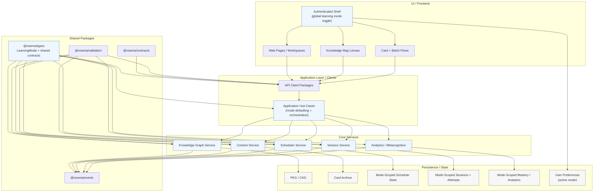

# Mode-Aware Module Graph

## Notes

- `LearningMode` must flow from the shell into all application use-cases.
- Nodes/cards may be shared across modes, but schedule/mastery/attempt state is
  explicitly mode-scoped.
- Graph lenses are UI projections over one shared PKG/CKG substrate, not
  separate graph systems.
- Scheduler read models now provide explicit mode-scoped summaries for:
  - queue/readiness
  - card focus
  - review analytics
- Agent tooling now consumes the same scheduler and graph read models rather
  than inferring progress from frontend-oriented views.
