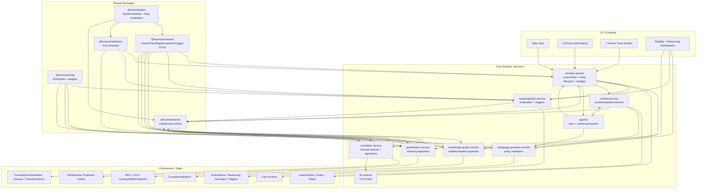
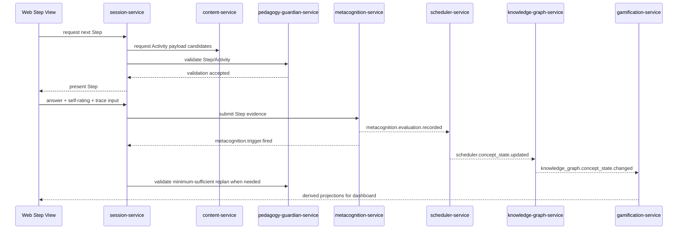
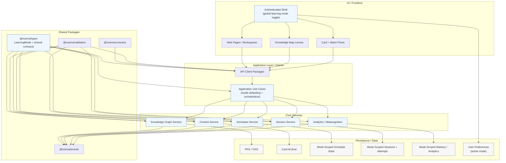
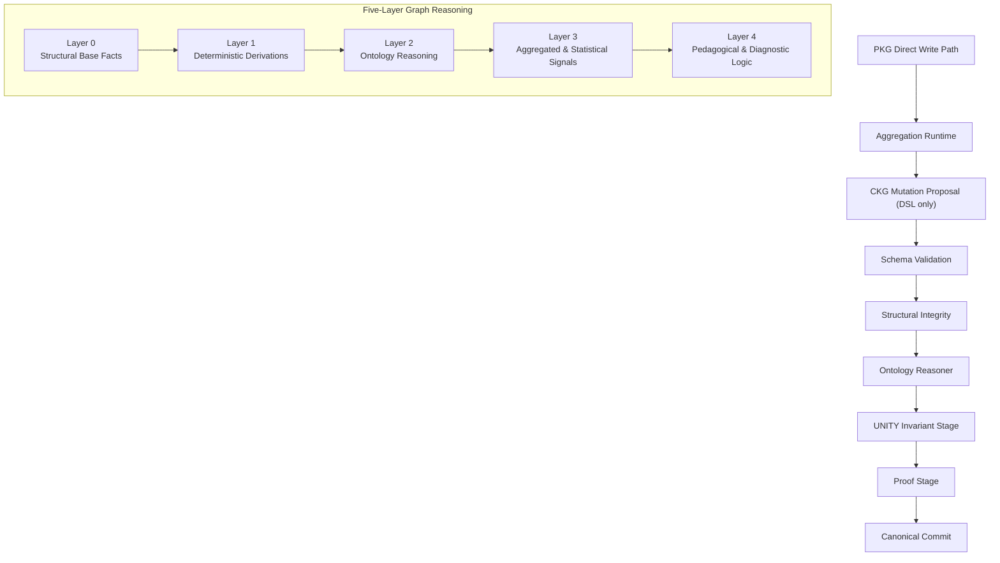
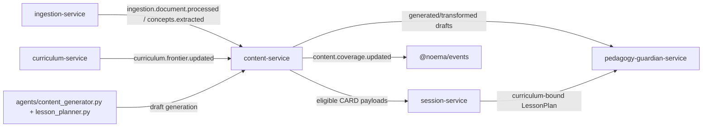

# Noema Realignment Module Graph

## 2026-05-01 Step-First Closed Loop

```mermaid
flowchart TD
  subgraph UI["UI / Frontend"]
    StepView["Step View"]
    SelfRating["3-Choice Self-Rating"]
    TraceBuilder["7-Frame Trace Builder"]
    StabilityDash["Stability + Reasoning Dashboards"]
  end

  subgraph Shared["Shared Packages"]
    Types["@noema/types\nEpistemicMode + Step vocabulary"]
    Contracts["@noema/contracts\nLessonPlan/Step/Evaluation/Trigger DTOs"]
    Validation["@noema/validation\nZod schemas"]
    Events["@noema/events\nclosed-loop events"]
    Config["@noema/config\nthresholds + weights"]
  end

  subgraph Runtime["Core Runtime Services"]
    Content["content-service\ncards/templates/variants"]
    Session["session-service\nLessonPlan + Step lifecycle + strategy"]
    Meta["metacognition-service\nEvaluation + triggers"]
    Scheduler["scheduler-service\nconcept queues + algorithms"]
    KG["knowledge-graph-service\nstable/unstable projection"]
    Guardian["pedagogy-guardian-service\npolicy validation"]
    Game["gamification-service\nderived projections"]
    HLR["hlr-sidecar\nHLR math"]
    Agents["agents/\nplan + variant generation"]
  end

  subgraph State["Persistence / State"]
    Cards["Card Archive"]
    Steps["LessonPlans / Goals / Steps"]
    Evals["Evaluations / Reasoning Averages / Triggers"]
    ConceptSchedule["ConceptScheduleState / Queues / Transformations"]
    Graph["PKG / CKG / ConceptStateProjection"]
    Validations["GuardianValidation"]
    Projections["Gamification Projection Cache"]
  end

  StepView --> Session
  SelfRating --> Session
  TraceBuilder --> Session
  StabilityDash --> KG
  StabilityDash --> Meta
  StabilityDash --> Game

  Session --> Guardian
  Session --> Meta
  Session --> Steps
  Session --> Content
  Session --> Agents

  Content --> Cards
  Content --> Guardian
  Content --> Events
  Content --> Agents

  Agents --> Guardian
  Agents --> Content
  Agents --> Session

  Meta --> Evals
  Meta --> Events
  Events --> Scheduler
  Events --> KG
  Events --> Session
  Events --> Game

  Scheduler --> ConceptSchedule
  Scheduler --> HLR
  Scheduler --> Events

  KG --> Graph
  KG --> Events

  Guardian --> Validations
  Game --> Projections

  Types --> Contracts
  Types --> Validation
  Types --> Events
  Contracts --> Session
  Contracts --> Meta
  Contracts --> Scheduler
  Contracts --> KG
  Contracts --> Guardian
  Contracts --> Game
  Validation --> Session
  Validation --> Meta
  Validation --> Guardian
  Config --> Meta
  Config --> Scheduler
  Config --> KG
  Config --> Game
```

## Realignment Notes

- Step is the atomic learner-visible unit; cards remain content payloads.
- Batch 11 adds `curriculum-service` between session planning and the durable
  curriculum vault. It owns versioned curriculum DAGs, progress by
  `stableNodeKey`, deterministic frontiers, and revision proposals while
  referencing CKG concepts rather than storing curriculum plans in the graph.
- Evaluation is persisted by `metacognition-service` and drives scheduler, KG,
  strategy, and gamification updates.
- Scheduler state is keyed by concept and learner context, not by card.
- KG projects revocable `stable` / `unstable` concept state.
- Pedagogy Guardian is an independent validation service.
- Gamification is a derived projection and does not own learning truth.
- Cohort handshakes are removed in favor of the closed-loop event flow.
- Batches 1-10 are now represented in source. `metacognition-service` owns the
  persisted Evaluation, rolling reasoning average, Trigger facts, and optional
  transformation metadata. `scheduler-service` consumes those Evaluations into
  concept schedule state, evaluation logs, transformation history, and
  `scheduler.concept_state.updated` events. `pedagogy-guardian-service` persists
  GuardianValidation decisions for producer admission gates. `session-service`
  consumes metacognition triggers and commits Guardian-validated Strategy
  replans. The web app exposes the Step view, three-choice self-rating,
  seven-frame trace builder, evaluation summary, and stability/reasoning
  dashboard vocabulary.

## Closed-Loop Sequence Contract

```mermaid
sequenceDiagram
  participant Web as Web Step View
  participant Session as session-service
  participant Content as content-service
  participant Guardian as pedagogy-guardian-service
  participant Meta as metacognition-service
  participant Scheduler as scheduler-service
  participant KG as knowledge-graph-service
  participant Game as gamification-service

  Web->>Session: request next Step
  Session->>Content: request Activity payload candidates
  Session->>Guardian: validate Step/Activity
  Guardian-->>Session: validation accepted
  Session-->>Web: present Step
  Web->>Session: answer + self-rating + trace input
  Session->>Meta: submit Step evidence
  Meta-->>Scheduler: metacognition.evaluation.recorded
  Meta-->>Session: metacognition.trigger.fired
  Scheduler-->>KG: scheduler.concept_state.updated
  KG-->>Game: knowledge_graph.concept_state.changed
  Session->>Guardian: validate minimum-sufficient replan when needed
  Game-->>Web: derived projections for dashboard
```

## Prior Mode-Aware Substrate

```mermaid
flowchart TD
  subgraph UI["UI / Frontend"]
    Shell["Authenticated Shell\n(global learning mode toggle)"]
    WebPages["Web Pages / Workspaces"]
    GraphLens["Knowledge Map Lenses"]
    CardFlows["Card + Batch Flows"]
  end

  subgraph App["Application Layer / Clients"]
    ApiClient["API Client Packages"]
    UseCases["Application Use-Cases\n(mode defaulting + orchestration)"]
  end

  subgraph Domain["Core Services"]
    KG["Knowledge Graph Service"]
    Content["Content Service"]
    Scheduler["Scheduler Service"]
    Session["Session Service"]
    Analytics["Analytics / Metacognition"]
  end

  subgraph Shared["Shared Packages"]
    Types["@noema/types\nLearningMode + shared contracts"]
    Contracts["@noema/contracts"]
    Validation["@noema/validation"]
    Events["@noema/events"]
  end

  subgraph Data["Persistence / State"]
    GraphStore["PKG / CKG"]
    CardStore["Card Archive"]
    ScheduleStore["Mode-Scoped Schedule State"]
    SessionStore["Mode-Scoped Sessions + Attempts"]
    InsightStore["Mode-Scoped Mastery / Analytics"]
    Prefs["User Preferences\n(active mode)"]
  end

  Shell --> WebPages
  Shell --> GraphLens
  Shell --> CardFlows
  Shell --> Prefs

  WebPages --> ApiClient
  GraphLens --> ApiClient
  CardFlows --> ApiClient
  ApiClient --> UseCases

  UseCases --> KG
  UseCases --> Content
  UseCases --> Scheduler
  UseCases --> Session
  UseCases --> Analytics

  KG --> GraphStore
  Content --> CardStore
  Scheduler --> ScheduleStore
  Session --> SessionStore
  Analytics --> InsightStore

  KG --> Events
  Content --> Events
  Scheduler --> Events
  Session --> Events
  Analytics --> Events

  Types --> ApiClient
  Types --> UseCases
  Types --> KG
  Types --> Content
  Types --> Scheduler
  Types --> Session
  Types --> Analytics

  Contracts --> ApiClient
  Validation --> ApiClient
  Validation --> KG
  Validation --> Content
  Validation --> Scheduler
  Validation --> Session

  classDef primary fill:#eef6ff,stroke:#4a78c2,stroke-width:1px;
  classDef state fill:#f7f7f7,stroke:#7a7a7a,stroke-width:1px;
  class Shell,UseCases,KG,Content,Scheduler,Session,Analytics,Types primary;
  class GraphStore,CardStore,ScheduleStore,SessionStore,InsightStore,Prefs state;
```

## Notes

- `LearningMode` must flow from the shell into all application use-cases.
- Nodes/cards may be shared across modes, but schedule/mastery/attempt state is
  explicitly mode-scoped.
- Graph lenses are UI projections over one shared PKG/CKG substrate, not
  separate graph systems.
- Scheduler read models now provide explicit mode-scoped summaries for:
  - queue/readiness
  - card focus
  - review analytics
- Agent tooling now consumes the same scheduler and graph read models rather
  than inferring progress from frontend-oriented views.

## Dual-Graph Guardrails

```mermaid
flowchart TD
  PKG["PKG Direct Write Path"] --> Agg["Aggregation Runtime"]
  Agg --> Proposal["CKG Mutation Proposal (DSL only)"]
  Proposal --> Schema["Schema Validation"]
  Schema --> Structural["Structural Integrity"]
  Structural --> Ontology["Ontology Reasoner"]
  Ontology --> Invariants["UNITY Invariant Stage"]
  Invariants --> Proof["Proof Stage"]
  Proof --> Commit["Canonical Commit"]

  subgraph Stratified["Five-Layer Graph Reasoning"]
    L0["Layer 0\nStructural Base Facts"]
    L1["Layer 1\nDeterministic Derivations"]
    L2["Layer 2\nOntology Reasoning"]
    L3["Layer 3\nAggregated & Statistical Signals"]
    L4["Layer 4\nPedagogical & Diagnostic Logic"]
    L0 --> L1 --> L2 --> L3 --> L4
  end
```

### Guardrail notes

- canonical graph writes remain impossible outside the mutation DSL and guarded
  pipeline
- proof now has an accepted rollout model:
  - `disabled`
  - `observe_only`
  - `soft_block`
  - `hard_block`
- stratified graph dependencies are now an accepted code-level contract and are
  scheduled for CI enforcement

## Batch 11 Content Generation Boundary

```mermaid
flowchart LR
  Ingestion["ingestion-service"] -->|"ingestion.document.processed / concepts.extracted"| Content["content-service"]
  Curriculum["curriculum-service"] -->|"curriculum.frontier.updated"| Content
  Content -->|"generated/transformed drafts"| Guardian["pedagogy-guardian-service"]
  Agents["agents/content_generator.py + lesson_planner.py"] -->|"draft generation"| Content
  Content -->|"eligible CARD payloads"| Session["session-service"]
  Session -->|"curriculum-bound LessonPlan"| Guardian
  Content -->|"content.coverage.updated"| Events["@noema/events"]
```
